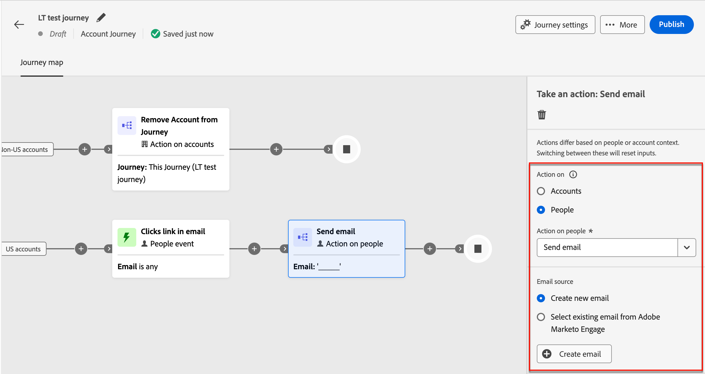

# GenStudio for Performance Marketing을 사용하여 이메일 콘텐츠 생성 {#genstudio-workflow}

>[!CONTEXTUALHELP]
>id="ajo-b2b_genstudio_button"
>title="GenStudio에서 제작된 템플릿 사용하기"
>abstract="Adobe GenStudio for Performance Marketing과의 통합 기능을 사용하여 Adobe AI 기술로 향상된 GenStudio 템플릿을 가져올 수 있습니다."

>[!AVAILABILITY]
>
>[!DNL Adobe Journey Optimizer B2B Edition]의 GenStudio 통합은 현재 **Healthcare Shield** 또는 **Privacy and Security Shield** 추가 기능과 함께 사용할 수 없습니다.
>
>이 통합은 이메일 채널에만 사용할 수 있습니다.

워크플로우 효율성을 높이고 브랜드 일관성을 유지하기 위해 GenStudio for Performance Marketing 경험을 Adobe Journey Optimizer B2B edition 이메일 오케스트레이션과 결합할 수 있습니다. 확장된 워크플로우를 통해 GenStudio의 AI 고급 콘텐츠 생성 도구를 활용하여 계정 여정을 통해 이메일 커뮤니케이션을 확장하고 극대화할 수 있습니다.

예를 들어 Journey Optimizer B2B edition을 사용하여 주요 계정에 대한 이메일 통신을 개발 및 자동화하는 기술 마케터는 GenStudio을 사용하여 콘텐츠를 만드는 성능 마케터와 공동 작업을 수행할 수 있습니다. 이 워크플로를 통해 둘 다 협력하여 GenStudio의 온브랜드 콘텐츠를 Journey Optimizer B2B edition 계정 기반 마케팅 자동화로 결합하여 특정 구매 그룹을 타깃팅하고 판매를 촉진하는 매력적인 이메일을 제공할 수 있습니다.

>[!BEGINSHADEBOX]

## GenStudio 컨텐츠 생성 기능

[Adobe GenStudio for Performance Marketing](https://business.adobe.com/products/genstudio-for-performance-marketing.html){target="_blank"}은(는) 마케팅 팀이 브랜드 표준을 준수하고 엔터프라이즈 정책을 준수하는 영향력 있고 개인화된 광고 및 이메일을 만들 수 있도록 해주는 발전적인 AI 우선 애플리케이션입니다. Adobe AI 기술을 활용함으로써 크리에이티브가 혁신에 집중할 수 있도록 콘텐츠 생성 및 관리의 복잡성을 간소화하는 포괄적인 도구 모음을 제공합니다.

{width="30"} [브랜드 마케팅 이메일 만들기](https://experienceleague.adobe.com/ko/docs/genstudio-for-performance-marketing-learn/tutorials/creating-experiences/creating-on-brand-emails){target="_blank"}

[설명서](https://experienceleague.adobe.com/ko/docs/genstudio-for-performance-marketing/user-guide/home){target="_blank"}에서 GenStudio for Performance Marketing 기능에 대해 자세히 알아보세요

>[!ENDSHADEBOX]

## Journey Optimizer B2B edition에서 HTML 내보내기

먼저 Journey Optimizer B2B edition에서 브랜드의 지침이 포함된 이메일에서 HTML을 내보냅니다.

1. Journey Optimizer B2B edition에서 시각적 디자인 공간의 이메일 콘텐츠에 액세스합니다.

1. 이메일 디자인 스페이스 상단의 _[!UICONTROL 자세히...]_ 메뉴에서 **[!UICONTROL HTML 내보내기]**&#x200B;를 선택합니다.

   {width="600"}

   이 작업은 HTML 및 이미지 파일을 포함하는 다운로드한 .zip 파일을 생성합니다.

## GenStudio for Performance Marketing에서 내보낸 HTML 사용

GenStudio for Performance Marketing은 가져온 이메일 HTML 내의 특정 요소가 인식된 필드 이름으로 식별되면 이를 인식합니다. 특정 유형의 컨텐츠를 생성하려면 GenStudio for Performance Marketing이 필요한 Handlebars 구문을 사용하여 내보낸 HTML에 필드 이름을 추가합니다.

| 필드 | 컨텐츠 유형 |
| ----------------- | ------------------------- |
| `{{pre_header}}` | 사전 머리글 |
| `{{headline}}` | 제목 |
| `{{sub_headline}}` | 하위 헤드라인 |
| `{{body}}` | 본문 텍스트 |
| `{{cta}}` | Call to action (버튼) |
| `{{image}}` | 이미지 |
| `{{link}}` | 이미지의 call to action |

### 템플릿 만들기

HTML 파일을 사용하여 GenStudio for Performance Marketing에서 템플릿을 만듭니다.

HTML 템플릿을 Adobe GenStudio for Performance Marketing의 GenStudio에 업로드하는 방법에 대한 자세한 내용은 GenStudio for Performance Marketing 설명서의 [템플릿 추가](https://experienceleague.adobe.com/en/docs/genstudio-for-performance-marketing/user-guide/content/templates/use-templates#add-a-template)를 참조하십시오.

내보낸 HTML을 템플릿으로 업로드하면 GenStudio for Performance Marketing에서 HTML 파일에서 인식된 필드가 있는지 검사합니다. 미리보기를 사용하여 템플릿 요소를 검토하고 인식된 필드 이름으로 제대로 식별했는지 확인합니다.

### 이메일 경험 생성

GenStudio for Performance Marketing에서 템플릿을 사용하여 여러 이메일 경험 변형을 만들고 저장합니다.

브랜디드 이메일 경험 생성에 대한 자세한 내용은 GenStudio for Performance Marketing 설명서에서 [이메일 경험 만들기](https://experienceleague.adobe.com/en/docs/genstudio-for-performance-marketing/user-guide/create/create-email-experience)를 참조하십시오.

## 생성된 이메일 경험을 Journey Optimizer B2B edition에 추가

>[!NOTE]
>
>GenStudio for Performance Marketing 통합은 이메일 만들기에만 사용할 수 있으며 이메일 템플릿 만들기에는 사용할 수 없습니다.

내보낸 Journey Optimizer B2B edition 이메일 HTML 파일에서 만든 GenStudio 이메일 변형을 사용하려면 다음 단계를 수행합니다.

1. Journey Optimizer B2B edition에서 [작업 수행](./add-email.md) 노드를 사용하여 계정 여정에 _[!UICONTROL 전자 메일을 추가]_&#x200B;합니다.

   * _[!UICONTROL Action on]_ 대상에 대해 **[!UICONTROL 사람]**&#x200B;을 선택하세요.

   * _[!UICONTROL 사용자에 대한 작업]_&#x200B;에 대해 **[!UICONTROL 전자 메일 보내기]**&#x200B;를 선택하세요.

     {width="700" zoomable="yes"}

   * _[!UICONTROL 전자 메일 원본]_&#x200B;에 대해 **[!UICONTROL 새 전자 메일 만들기]**&#x200B;를 선택하여 Journey Optimizer B2B edition에서 기본적으로 전자 메일을 만듭니다.

1. _전자 메일 만들기_ 페이지에서 **[!UICONTROL HTML 가져오기]**&#x200B;를 선택합니다.

1. _[!UICONTROL 전자 메일 가져오기]_ 대화 상자에서 **[!UICONTROL Adobe GenStudio for Performance Marketing]**&#x200B;을 클릭합니다.

   {width="500" zoomable="yes"}

1. 게시된 경험을 찾아봅니다.

   _템플릿_ 및 _작성자_ 등 여러 기준에 따라 경험을 필터링할 수 있습니다.

   {width="600" zoomable="yes"}

1. 경험을 선택하고 **[!UICONTROL 사용]**&#x200B;을 클릭하여 전자 메일 콘텐츠 작성을 시작합니다.

   >[!NOTE]
   >
   >Journey Optimizer B2B edition 또는 Marketo Engage 템플릿에서 만든 GenStudio 경험은 이메일 디자인 공간으로 바로 가져옵니다. Journey Optimizer B2B edition 템플릿 없이 생성된 경험은 호환성 모드로 가져옵니다.

1. [전자 메일 콘텐츠 및 개인화 도구](./email-authoring.md)를 사용하여 필요에 따라 전자 메일을 편집하고 저장합니다.

   {width="800" zoomable="yes"}
