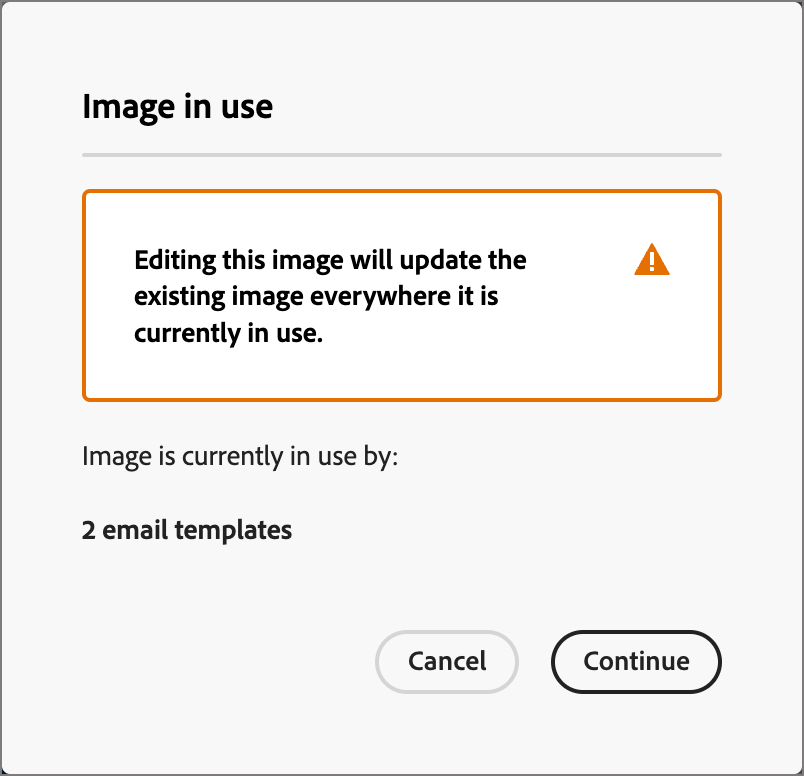

# Adobe Express를 사용하여 이미지 편집 {#edit-images-adobe-express}

>[!CONTEXTUALHELP]
>id="ajo-b2b_assets_edit_adobe_express"
>title="Adobe Express에서 이미지 편집"
>abstract="Adobe Journey Optimizer B2B Edition 내에서 바로 사용할 수 있는 Adobe Express 기반의 쉽고 직관적인 이미지 편집 도구를 사용하면 콘텐츠 속도를 높일 수 있습니다."

Adobe Journey Optimizer B2B edition은 기본적으로 Adobe Express과 통합되므로 Adobe Express 이미지 편집 도구 세트에 액세스할 수 있습니다. 이러한 도구를 사용하여 Journey Optimizer B2B edition 에셋 저장소에 저장된 이미지를 수정할 수 있습니다. 통합은 다음과 같은 주요 이점을 제공합니다.

* Journey Optimizer B2B edition에서 새 이미지 에셋을 편집하고 저장하여 콘텐츠 재사용을 개선했습니다.

* 이미지 에셋을 업데이트하거나 기존 이미지 에셋의 새 버전을 만드는 데 드는 시간과 노력을 단축했습니다.

>[!NOTE]
>
>Adobe Express 편집 기능에 대한 권한은 모든 Journey Optimizer B2B edition 구독에 포함됩니다.

Adobe Express 함수는 PNG 및 JPEG 이미지 파일 형식을 지원합니다.

이미지를 수정하려면(_T):_

1. 왼쪽 탐색으로 이동하여 **[!UICONTROL 콘텐츠 관리]** > **[!UICONTROL Assets]**&#x200B;을 클릭합니다.

이 작업을 수행하면 나열된 모든 자산이 있는 목록 페이지가 열립니다.

1. 수정하거나 원본으로 사용하여 새 에셋을 만들 이미지를 찾습니다.

   * 폴더별 자산을 보려면 왼쪽 상단의 _폴더 표시_ 아이콘을 클릭하여 구조를 엽니다.

   * 열을 기준으로 테이블을 정렬하려면 열 제목을 누릅니다. 제목 행의 화살표는 현재 정렬 열 및 순서를 나타냅니다.

   * 선택한 폴더 내에서 이미지 자산을 검색하려면 검색 막대에 텍스트 문자열을 입력합니다.

   {width="800" zoomable="yes"}

1. 이미지 에셋의 이름을 클릭하여 열고 세부 정보를 확인합니다.

   >[!TIP]
   >
   >이미지 파일 편집을 계속하기 전에 이미지 세부 정보에서 [_[!UICONTROL 사용자]_ 탭](./internal-image-assets.md#view-asset-used-by-references)을(를) 선택하고 현재 이미지가 사용되는 콘텐츠를 검토하는 것이 좋습니다.

1. 오른쪽의 _[!UICONTROL 세부 정보]_ 이미지에서 **[!UICONTROL Adobe Express으로 편집]**&#x200B;을 클릭합니다.

   {width="600" zoomable="yes"}

   이미지가 사용 중이면 변경 사항이 해당 콘텐츠에 영향을 준다는 경고 대화 상자가 나타납니다. Adobe Express 편집기로 진행하려면 **[!UICONTROL 계속]**&#x200B;을 클릭하세요.

   {width="300"}

## Adobe Express Enterprise 라이선스

Adobe Express에 대한 Enterprise 라이선스가 있는 경우 Express 편집기에 액세스하고 사용할 수 있습니다. 이러한 편집 기능에는 색상, 밝기, 선명도, 대비 및 자르기 등의 이미지 조정 작업이 포함됩니다. 또한 배경 제거, 개체 삽입 및 제거, 이미지의 일부 지우기 등의 _AI 매직_ 작업도 포함됩니다.

>[!NOTE]
>
>Adobe Express B2B edition에서 이러한 전체 편집기 기능에 액세스하려면 동일한 IMS 조직에서 Journey Optimizer Enterprise 라이선스를 구매해야 합니다. IMS 조직의 개별 구성원은 Adobe Express 인스턴스에 할당된 라이선스가 필요합니다. 그렇지 않으면 Adobe Express 액세스가 Journey Optimizer B2B edition에서 [Adobe Express에 대한 빠른 작업](#quick-actions-in-adobe-express)으로 제한됩니다.

{width="600" zoomable="yes"}

사용 가능한 편집 기능에 대한 자세한 내용은 [Adobe Express 사용 안내서](https://helpx.adobe.com/kr/express/web.html){target="_blank"}를 참조하세요.

## Adobe Express의 빠른 작업

Adobe Express Enterprise 라이선스가 없는 경우 Adobe Express 빠른 작업 편집기에 액세스할 수 있습니다.

1. Adobe Express 빠른 작업 편집기에서 이미지를 변경할 이미지 수정 기능을 선택합니다.

   * [**[!UICONTROL 이미지 크기 조정]**](#resize-image)
   * [**[!UICONTROL 배경 제거]**](#remove-background)
   * [**[!UICONTROL 이미지 자르기]**](#crop-image)
   * [**[!UICONTROL PNG로 변환]**](#convert-file-format)(JPEG 이미지가 로드될 때)
   * [**[!UICONTROL JPEG으로 변환]**](#convert-file-format)(PNG 이미지가 로드될 때)

   {width="600" zoomable="yes"}

1. 기본 Adobe Express 빠른 작업 편집기로 돌아가면 **[!UICONTROL 저장]**&#x200B;을 클릭하여 수정된 이미지 파일을 동일한 파일 이름을 사용하여 Journey Optimizer B2B edition 자산 저장소에 저장합니다.

## 이미지 크기 조정

1. 크기 조정 설정을 사용하여 이미지를 축소하거나 확장합니다.

   * **[!UICONTROL 종횡비]** 옵션을 선택하십시오. 디지털 콘텐츠의 표준 크기를 사용하거나 **[!UICONTROL 너비]** 및 **[!UICONTROL 높이]**&#x200B;에 대한 값을 입력하여 필요에 맞게 **[!UICONTROL 사용자 지정]**&#x200B;을 선택하세요.

   * 표시된 _[!UICONTROL 원래 크기]_ 및 _[!UICONTROL 압축된 크기]_&#x200B;은(는) 변경 내용을 적용할 경우 발생하는 크기 변경 내용을 보여줍니다. **[!UICONTROL 확대/축소 및 자르기]** 도구를 사용하면 표시된 이미지의 일부를 보다 세밀하게 검사할 수 있습니다.

   * 이미지를 원래 상태로 되돌리려면 **[!UICONTROL 재설정]**&#x200B;을 클릭합니다.

   {width="600" zoomable="yes"}

1. 결과가 만족스러우면 **[!UICONTROL 적용]**&#x200B;을 클릭하세요.

## 배경 제거

{width="600" zoomable="yes"}

Adobe Express은 자동 배경 제거를 수행하여 이미지에서 기본 객체를 분리합니다. 결과가 만족스러우면 **[!UICONTROL 적용]**&#x200B;을 클릭하세요.

## 이미지 자르기

1. 이미지의 모퉁이에서 핸들을 드래그하여 이미지 에셋에 포함하지 않을 외부 영역을 제거합니다.

   {width="600" zoomable="yes"}

1. 결과가 만족스러우면 **[!UICONTROL 적용]**&#x200B;을 클릭하세요.

## 파일 형식 변환

* **[!UICONTROL JPEG으로 변환]** - PNG 이미지의 경우 이미지를 JPEG 이미지 파일로 변환하고 새 자산으로 저장할 수 있습니다.
* **[!UICONTROL PNG로 변환]** - JPEG 이미지의 경우 이미지를 PNG 이미지 파일로 변환하여 새 자산으로 저장할 수 있습니다.

{width="600" zoomable="yes"}

1. **[!UICONTROL 적용]**&#x200B;을 클릭합니다.
