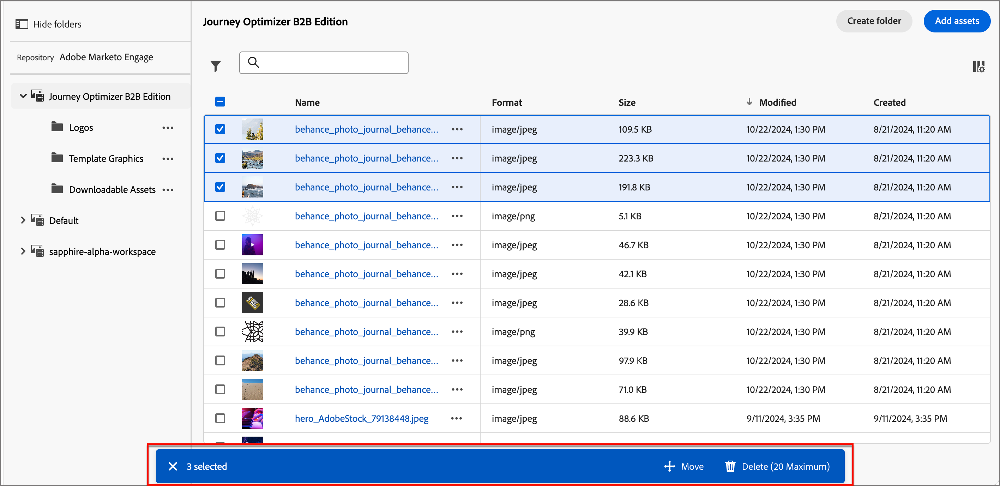

# Marketo Engage 에셋으로 작업

Marketo Engage 디자인 스튜디오는 Journey Optimizer B2B edition의 기본 에셋 소스이며, 계정 여정을 위한 콘텐츠의 사용 가능한 에셋을 쉽게 관리하고 사용할 수 있습니다.

Marketo Engage에서 마케팅 조직은 작업 공간을 사용하여 콘텐츠 에셋을 구성하고 팀이 올바른 에셋에 액세스할 수 있도록 지원합니다. 잘 정의된 작업 공간은 제품 오퍼링의 포트폴리오가 많거나 다른 지역에 대한 마케팅에 대한 요구 사항이 다르며 전 세계적으로 운영되는 대기업에 특히 유용합니다.

## 중앙 자산 관리

기본적으로 계정 여정 콘텐츠용으로 특별히 사용할 수 있는 **_[!UICONTROL Journey Optimizer B2B edition]_** 작업 영역이 있습니다. 이 작업 영역에 추가하는 에셋은 Marketo Engage에 표시되지 않거나 사용할 수 없습니다. 이 작업 영역에 있는 자산의 경우 Journey Optimizer B2B edition에 모든 범위의 자산 관리 기능을 사용할 수 있습니다. 이러한 함수에는 다음이 포함됩니다.

* 바꾸기
* 삭제
* 이동

Marketo Engage 작업 공간에 있는 Assets은 이메일, 이메일 템플릿 및 조각에서 사용할 수 있도록 읽기 전용 액세스로 제한됩니다. 이러한 작업 영역에 새 에셋을 추가하고 에셋의 사본을 다운로드할 수 있습니다.

## 에셋 검색 및 액세스

Journey Optimizer B2B edition 내에서 Adobe Marketo Engage 자산에 액세스하려면 왼쪽 탐색으로 이동한 후 **[!UICONTROL 컨텐츠 관리]** > **[!UICONTROL Assets]**&#x200B;을 클릭합니다. 이 작업을 수행하면 나열된 모든 자산이 있는 목록 페이지가 열립니다.

{width="800" zoomable="yes"}

Journey Optimizer B2B edition 작업 공간이 기본적으로 선택됩니다. 다른 작업 공간은 아래에 나열되어 있습니다.

* 작업 영역 및 폴더별 자산을 보려면 왼쪽 상단의 _폴더 표시_ 아이콘을 클릭하여 구조를 엽니다.

* 열을 기준으로 테이블을 정렬하려면 열 제목을 누릅니다. 제목 행의 화살표는 현재 정렬 열 및 순서를 나타냅니다.

* 선택한 작업 영역 또는 폴더 내에서 이미지 자산을 검색하려면 검색 막대에 텍스트 문자열을 입력합니다.

* 테이블에 표시되는 열을 사용자 지정하려면 오른쪽 상단의 _테이블 사용자 지정_ 아이콘( )을 클릭합니다.

  목록에 표시할 열을 선택하고 **[!UICONTROL 적용]**&#x200B;을 클릭합니다.

## 자산 세부 사항 보기

에셋 이름을 클릭하여 에셋 세부 사항 페이지를 엽니다.

{width="700" zoomable="yes"}

## 참조에서 사용하는 자산 보기

에셋 세부 정보 페이지에서 **[!UICONTROL 사용한 사람]** 탭을 클릭하여 이메일, 이메일 템플릿 및 조각에서 Journey Optimizer B2B edition 내에서 에셋이 현재 사용되는 위치에 대한 세부 정보를 봅니다.

>[!IMPORTANT]
>
>전자 메일, 전자 메일 템플릿 또는 조각 **에서 현재 _사용 중_인 에셋은 삭제할 수 없습니다**.

패널에 카테고리별 참조가 표시됩니다. _이메일_, _이메일 템플릿_ 또는 _조각_. Journey Optimizer B2B edition의 이메일은 여정 내에 임베드되고 작성되므로 자산을 사용하는 이메일의 상위 여정이 참조에 표시됩니다.

링크를 클릭하면 자산이 사용되는 해당 이메일, 이메일 템플릿 또는 조각으로 이동합니다.

{width="700" zoomable="yes"}

## 에셋 추가

Assets 목록 페이지에서 Journey Optimizer B2B edition 작업 영역 또는 Marketo Engage 작업 영역에 이미지 에셋을 추가할 수 있습니다.

1. 오른쪽 상단의 **[!UICONTROL Assets 추가]**&#x200B;를 클릭합니다.

1. _[!UICONTROL 자산 추가]_ 대화 상자에서 시스템에서 하나 이상의 파일을 파일 상자로 끌어서 놓습니다.

   {width="500"}

   _[!UICONTROL 컴퓨터에서 파일 선택]_ 링크를 클릭하여 로컬 파일 시스템을 사용하여 파일을 찾아 선택할 수도 있습니다.

   한 번에 최대 10개의 파일로 구성된 로컬 시스템에서 에셋을 업로드할 수 있습니다. 최대 파일 크기는 100MB입니다.

   선택한 이미지의 파일 이름이 대화 상자에 표시됩니다. 에셋 파일 이름은 폴더 간에 고유해야 하며 이름의 파일이 이미 있는 경우 메시지가 표시됩니다. 이름에는 최대 100자를 사용할 수 있으며 특수 문자(예: `;`, `:`, `\` 및 `|`)를 사용할 수 없습니다.

1. 에셋을 저장할 대상 작업 영역 또는 폴더를 선택합니다.

   >[!NOTE]
   >
   >_[!UICONTROL Journey Optimizer B2B edition]_ 작업 영역에서 위치를 선택하면 앱에서 자산을 관리할 수 있습니다. Marketo Engage 작업 영역에 에셋을 추가하는 경우 Marketo Engage Design Studio에서만 에셋 관리 기능을 사용할 수 있습니다.

1. 하나 이상의 파일을 기존 파일 이름으로 업로드할 때 파일을 덮어쓰려면 **[!UICONTROL 기존 파일 덮어쓰기]** 확인란을 선택합니다.

1. **[!UICONTROL 추가를 클릭합니다]**.

## 에셋 삭제

현재 이메일, 이메일 템플릿 또는 조각에서 사용 중인 에셋은 삭제할 수 없습니다. 에셋 제거를 시작하기 전에 사용한 참조를 확인합니다. 또한 삭제 작업은 실행 취소할 수 없으므로 제거 작업을 시작하기 전에 확인하십시오.

_[!UICONTROL Journey Optimizer B2B edition]_ 작업 영역에 있는 자산을 삭제하려면 다음 방법 중 하나를 사용하십시오.

* 자산 세부 정보로 이동하여 **[!UICONTROL 을(를) 클릭합니다. 오른쪽 상단에서]**&#x200B;을(를) 더 보고 옵션에서 **[!UICONTROL 삭제]**&#x200B;을(를) 선택하십시오.

  {width="600" zoomable="yes"}

* _[!UICONTROL Assets]_ 목록 페이지에서 자산 항목 옆의 _자세히_ 아이콘(**[!UICONTROL ...]**)을 클릭하고 옵션에서 **[!UICONTROL 삭제]**&#x200B;를 선택합니다.

  {width="600" zoomable="yes"}

  >[!NOTE]
  >
  >_[!UICONTROL Journey Optimizer B2B edition]_ 작업 영역에 있는 자산만 _자세히_ 메뉴에서 사용할 수 있는 자산 관리 기능이 있습니다.

이 작업을 수행하면 확인 대화 상자가 열립니다. **[!UICONTROL 취소]**&#x200B;를 클릭하여 프로세스를 중단하거나 **[!UICONTROL 삭제]**&#x200B;를 클릭하여 삭제를 확인할 수 있습니다.

에셋이 현재 사용 중인 경우 작업을 수행하면 삭제할 수 없다는 경고가 표시되는 정보 대화 상자가 열립니다. **[!UICONTROL 확인]**&#x200B;을 클릭하여 제거를 중단합니다.

## 자산 바꾸기

_[!UICONTROL Journey Optimizer B2B edition]_ 작업 영역에 있는 자산을 바꾸려면 다음 방법 중 하나를 사용하십시오.

* 자산 세부 정보로 이동하여 **[!UICONTROL 을(를) 클릭합니다. 오른쪽 상단에서]**&#x200B;을(를) 더 보고 옵션에서 **[!UICONTROL 바꾸기]**&#x200B;을(를) 선택하십시오.

* _[!UICONTROL Assets]_ 목록 페이지에서 자산 항목 옆의 _자세히_ 아이콘(**[!UICONTROL ...]**)을 클릭하고 옵션에서 **[!UICONTROL 바꾸기]**&#x200B;를 선택합니다.

_[!UICONTROL 자산 바꾸기]_ 대화 상자에서 대체 파일을 시스템에서 파일 상자로 끌어서 놓습니다. _[!UICONTROL 컴퓨터에서 파일 선택]_ 링크를 클릭하여 로컬 파일 시스템을 사용하여 파일을 선택할 수도 있습니다. 로컬 시스템에서 여러 파일을 선택하는 경우 선택한 첫 번째 파일이 교체에 사용됩니다.

{width="500"}

계속하려면 **[!UICONTROL 바꾸기]**&#x200B;를 클릭하세요. **[!UICONTROL 취소]**&#x200B;를 클릭하여 프로세스를 중단할 수 있습니다.

대체할 파일이 현재 사용 중인 경우, 정보 대화 상자는 새 이미지 파일이 해당 파일이 사용되는 모든 위치(이메일, 이메일 템플릿 및 조각)의 이미지를 대신한다는 것을 알려줍니다.

## 에셋 다운로드

다음 방법 중 하나를 사용하여 에셋을 다운로드할 수 있습니다.

* 자산 세부 정보로 이동하여 오른쪽 상단의 **[!UICONTROL 다운로드]**&#x200B;를 클릭합니다.

* _[!UICONTROL Assets]_ 목록 페이지에서 자산 항목 옆의 _생략 부호_(**[!UICONTROL ...]**)를 클릭하고 옵션에서 **[!UICONTROL 다운로드]**&#x200B;를 선택합니다.

확인 대화 상자에서 **[!UICONTROL 다운로드]**&#x200B;를 클릭하여 로컬 시스템에 에셋 다운로드를 시작합니다. **[!UICONTROL 취소]**&#x200B;를 클릭하여 프로세스를 중단할 수 있습니다.

## 선택한 자산에 일괄 작업 적용

목록 페이지(_[!UICONTROL 컨텐츠 관리]_ > _[!UICONTROL Assets]_)에서 왼쪽의 각 확인란을 선택하여 한 번에 여러 자산을 선택합니다. 여러 에셋을 선택하면 맨 아래에 메시지 배너가 표시됩니다.

{width="700" zoomable="yes"}

_[!UICONTROL Journey Optimizer B2B edition]_ 작업 영역에 있는 선택한 자산에 대해 다음과 같은 대량 작업을 수행할 수 있습니다.

+++자산 이동

1. 선택 배너에서 **[!UICONTROL 이동]**&#x200B;을 클릭합니다.

   이 작업을 수행하면 선택한 자산의 이름이 나열되고 이러한 자산을 이동할 _대상_ 폴더를 선택할 수 있는 _[!UICONTROL Assets 이동]_ 대화 상자가 열립니다.

1. 폴더를 선택합니다.

   _[!UICONTROL 선택한 자산 옆의 경로 업데이트가]_(으)로 이동합니다.

1. **[!UICONTROL 이동]**&#x200B;을 클릭합니다.

+++

+++자산 삭제

>[!NOTE]
>
>최대 20개의 선택한 에셋에 대해 일괄 삭제를 적용할 수 있습니다.

1. 선택 배너에서 **[!UICONTROL 삭제]**&#x200B;를 클릭합니다.

1. 확인 대화 상자에서 **[!UICONTROL 삭제]**&#x200B;를 클릭합니다.

   선택한 에셋 중 현재 사용 중인 에셋이 있는 경우 해당 에셋 제거가 중단되고 경고 메시지가 표시됩니다.

+++

## 폴더 만들기

1. _[!UICONTROL Assets]_ 목록 페이지에서 오른쪽 상단의 **[!UICONTROL 폴더 만들기]**&#x200B;를 클릭합니다.

1. 대화 상자에서 폴더 이름을 입력하고 새 폴더의 대상(상위) 폴더를 선택합니다.

   폴더 이름은 고유해야 하며 최대 100자이며 `;`, `:`, `\`, `|`과(와) 같은 특수 문자를 포함할 수 없습니다.

   {width="500"}

1. **[!UICONTROL 추가를 클릭합니다]**.

## 폴더 수준 작업 적용

_[!UICONTROL Journey Optimizer B2B edition]_ 작업 영역에서 폴더 또는 폴더 내 자산에 작업을 적용할 수 있습니다. 폴더 옆에 있는 _자세히_ 아이콘(**...**)을 클릭하여 적용할 수 있는 작업을 표시합니다.

{width="700" zoomable="yes"}

폴더 수준에서 다음 작업을 수행할 수 있습니다.

+++에셋 추가

1. 폴더에 이미지 파일을 업로드하려면 **[!UICONTROL 에셋 추가]**&#x200B;를 선택하세요.

1. _[!UICONTROL 자산 추가]_ 대화 상자에서 시스템에서 파일을 끌어서 놓습니다. 링크를 클릭하여 파일 시스템을 사용하여 파일을 선택할 수도 있습니다.

   한 번에 최대 10개의 파일로 이루어진 로컬 시스템에서 에셋을 추가할 수 있습니다. 하나 이상의 파일을 기존 파일 이름으로 업로드할 때 파일을 덮어쓰는 옵션이 있습니다.

   선택한 이미지의 파일 이름이 대화 상자에 표시됩니다. 에셋 파일 이름은 폴더 간에 고유해야 하며 이름의 파일이 이미 있는 경우 오류 메시지가 표시됩니다. 이름에는 최대 100자를 사용할 수 있으며 특수 문자(예: `;`, `:`, `\` 및 `|`)를 사용할 수 없습니다.

1. **[!UICONTROL 추가를 클릭합니다]**.

+++

+++하위 폴더 만들기

1. **[!UICONTROL 폴더 만들기]**&#x200B;를 선택합니다.

1. 대화 상자에서 폴더 이름을 입력합니다.

   폴더 이름은 고유해야 하며 최대 100자이며 `;`, `:`, `\`, `|`과(와) 같은 특수 문자를 포함할 수 없습니다.

1. **[!UICONTROL 추가를 클릭합니다]**.

+++

+++폴더 이름 바꾸기

1. **[!UICONTROL 이름 바꾸기]**&#x200B;를 선택합니다.

1. 대화 상자에서 새 폴더 이름을 입력합니다.

   폴더 이름은 고유해야 하며 최대 100자이며 `;`, `:`, `\`, `|`과(와) 같은 특수 문자를 포함할 수 없습니다.

1. **[!UICONTROL 저장]**&#x200B;을 클릭합니다.

+++

+++폴더 이동

1. 폴더를 다른 상위 폴더로 이동하려면 **[!UICONTROL 이동]**&#x200B;을 선택하세요.

1. 대화 상자에서 대상 폴더를 하위 폴더의 새 상위 폴더로 선택합니다.

1. **[!UICONTROL 이동]**&#x200B;을 클릭합니다.

   선택한 폴더의 구조 내에서 폴더를 하위 폴더 중 하나로 이동하려고 하면 오류 메시지가 표시되고 이동이 취소됩니다.

+++

+++폴더 삭제

1. **[!UICONTROL 삭제]**&#x200B;를 선택하세요.

1. 확인 대화 상자에서 **[!UICONTROL 삭제]**&#x200B;를 클릭합니다.

폴더의 에셋이 현재 사용 중인 경우 작업을 수행하면 삭제할 수 없음을 알리는 경고 대화 상자가 열립니다. **[!UICONTROL 확인]**&#x200B;을 클릭하여 제거를 중단합니다.

+++

+++보관 폴더로 변환

폴더를 보관하면 해당 폴더 내의 파일을 검색할 수 없게 됩니다. 오래된 이벤트 프로모션 배지 또는 시즌 콘텐츠와 같이, 팀원이 사용하지 않았으면 하는 에셋 파일에 대해 아카이브 기능을 사용합니다. 나중에 컨텐츠를 다시 사용할 수 있도록 하려면 폴더의 보관을 해제할 수 있습니다.

* **[!UICONTROL 보관 폴더로 변환]**&#x200B;을 선택하세요. 폴더 상태가 보관됨으로 변경되었음을 확인하는 확인 배너가 표시됩니다.

* **[!UICONTROL 폴더 보관 해제]**&#x200B;를 선택하세요. 폴더 상태가 보관 해제로 변경되었음을 확인하는 확인 배너가 표시됩니다.

+++

## 콘텐츠에서 에셋 사용

Assets은 팀의 이메일, 이메일 템플릿 또는 시각적 콘텐츠 편집기에서 시각적 조각 작성에 사용할 수 있습니다.

시각적 디자이너 UI의 왼쪽 사이드바에서 _자산 선택기_ 아이콘()을 선택합니다.

이 작업은 선택한 작업 영역에서 사용 가능한 에셋의 구조화된 목록을 표시하는 도구 패널을 변경합니다. 자산을 선택하기 위해 표시할 작업 영역을 선택합니다.

{width="700" zoomable="yes"}

이미지 에셋을 시각적 캔버스에 추가하는 방법에는 여러 가지가 있습니다.

* 왼쪽 탐색에서 이미지 썸네일을 끌어서 놓습니다.

* 캔버스에 이미지 구성 요소를 추가하고 **[!UICONTROL 찾아보기]**&#x200B;를 클릭하여 _[!UICONTROL Adobe Marketo Engage에서 에셋 선택]_ 대화 상자를 엽니다.

  {width="700" zoomable="yes"}

  대화 상자에서 선택한 저장소에서 이미지를 선택할 수 있습니다. 자산을 추가하려면 **[!UICONTROL 선택]**&#x200B;을 클릭합니다.

  필요한 에셋을 찾는 데 도움이 되는 도구가 있습니다.

   * 조건에 따라 표시된 항목을 필터링하려면 왼쪽 상단의 _필터_ 아이콘을 클릭하십시오.

   * 표시된 항목을 자산 이름과 일치하도록 필터링하려면 _검색_ 필드에 텍스트를 입력하십시오.

  {width="700" zoomable="yes"}
