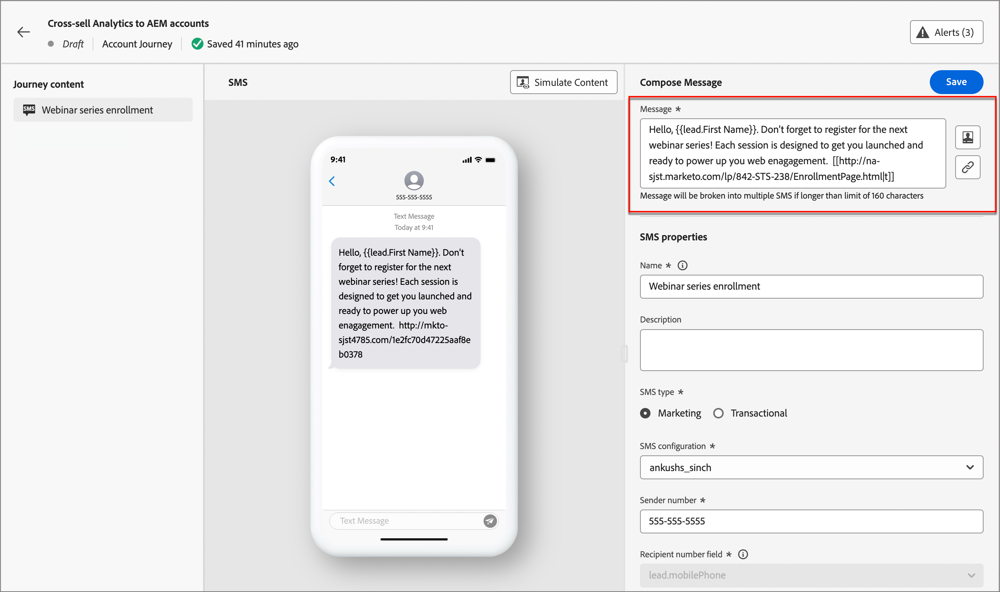

# SMS 작성

Adobe Journey Optimizer B2B edition을 사용하여 모바일 장치에서 고객에게 문자 메시지(SMS)를 보냅니다. SMS 편집기에서 텍스트 형식으로 메시지를 만들고 개인화하고 미리 볼 수 있습니다.

계정 여정에 대한 SMS 메시지를 만들기 전에 _[!UICONTROL 관리자]_ 설정에서 [SMS 서비스 공급자가 구성](../admin/configure-channels-sms.md)되어 있는지 확인하십시오.

## 계정 여정에 SMS 작업 추가

_[!UICONTROL 작업 수행]_ 노드를 추가하고 다음을 수행하면 계정 여정에서 문자 메시지 게재를 설정할 수 있습니다.

1. _[!UICONTROL Action on]_ 대상에 대해 **[!UICONTROL 사람]**&#x200B;을 선택하세요.

1. _[!UICONTROL 사용자에 대한 작업]_&#x200B;에 대해 **[!UICONTROL SMS 보내기]**&#x200B;를 선택하세요.

   {width="800" zoomable="yes"}

1. _[!UICONTROL 작업 수행]_ 패널 아래쪽에서 **[!UICONTROL SMS 만들기]**&#x200B;를 클릭합니다.

1. 대화 상자에서 SMS 메시지의 고유한 **[!UICONTROL 이름]**&#x200B;을 입력합니다.

   {width="400"}

1. **[!UICONTROL 만들기]**&#x200B;를 클릭합니다.

   _여정 맵_&#x200B;이 열리고 메시지를 만들고 메시지를 보내기 위한 SMS 속성을 설정할 수 있습니다.

### SMS 메시지 만들기

>[!IMPORTANT]
>
>**SMS 동의 관리** 
>
>업계 표준 및 규정에 따라 모든 SMS 마케팅 메시지에는 수신자가 간편하게 구독을 취소할 수 있는 방법이 포함되어야 합니다. 이를 위해 SMS 수신자는 옵트인 및 옵트아웃 키워드로 회신할 수 있습니다. 모든 표준 옵트인 및 옵트아웃 키워드가 지원되며 적용됩니다. 또한 SMS 서비스 공급자 계정에 대해 구성된 모든 사용자 지정 키워드가 지원되고 적용됩니다.

**[!UICONTROL 메시지]** 필드에 보낼 텍스트를 입력하십시오.

160자마다 하나의 SMS 메시지로 간주하여 최대 1600자의 메시지를 만들 수 있습니다.

{width="800" zoomable="yes"}

#### 문자 메시지 개인화

1. 언제든지 텍스트 메시지를 작성하는 동안 텍스트 메시지 상자 오른쪽에 있는 _개인 설정_ 아이콘()을 클릭합니다.

   표시된 페이지에서는 Adobe Marketo Engage Lead 및 시스템 토큰에 액세스할 수 있습니다. 표준 및 사용자 지정 토큰이 모두 포함됩니다. _검색_ 막대를 사용하여 필요한 토큰을 찾거나 폴더 트리를 탐색하여 리드/시스템 토큰을 찾아 선택할 수 있습니다.

1. 메시지를 통해 토큰을 추가할 위치에 커서를 놓습니다.

1. 토큰 옆에 있는 더하기(**+**) 기호를 클릭하여 토큰을 추가합니다.

   대체 항목이 있는 토큰을 추가하려면( 잠재 고객에 대해 해당 필드를 사용할 수 없는 경우 나타나는 기본값) _자세히_ 아이콘(**...**)을 클릭하고 **[!UICONTROL 대체 텍스트를 사용하여 삽입]**&#x200B;을 선택합니다.

   {width="700" zoomable="yes"}

1. _[!UICONTROL 대체 값 입력]_ 대화 상자에서 대체 값으로 나타나는 텍스트를 입력한 다음 **[!UICONTROL 추가]**&#x200B;를 클릭합니다.

   {width="400"}

1. 개인화 토큰이 배치되면 **[!UICONTROL 저장]**&#x200B;을 클릭하여 변경 내용을 저장하고 기본 SMS 작성 작업 영역으로 돌아갑니다.

   필요에 따라 토큰으로 메시지를 계속 편집할 수 있습니다.

#### 텍스트 메시지에 링크(URL) 추가

1. 메시지 텍스트를 입력한 후 텍스트 메시지 상자 오른쪽에 있는 _링크_ 아이콘()을 클릭합니다.

1. 대화 상자에서 연결할 URL 유형을 선택합니다.

   * **[!UICONTROL 랜딩 페이지]** - Marketo Engage 인스턴스에서 승인된 Adobe Marketo Engage 랜딩 페이지를 선택하려면 이 옵션을 선택하십시오. 작업 영역을 선택한 다음 랜딩 페이지를 선택합니다.

   * **[!UICONTROL 외부 URL]** - 이 형식은 텍스트 상자에 입력하는 모든 외부 URL입니다.

1. 랜딩 페이지를 사용하도록 선택하는 경우 추적 옵션을 설정합니다.

   * **[!UICONTROL 추적 사용]** - 이 확인란을 선택하여 추적을 사용하도록 설정합니다. 이렇게 하려면 URL을 _단축_&#x200B;해야 합니다. 랜딩 페이지의 경우, 단축된 URL에 Marketo Engage 하위 도메인을 사용합니다. 단축된 URL 형식의 샘플이 표시됩니다. 실제 URL은 SMS가 수신자에게 전송될 때 만들어집니다.

   * **[!UICONTROL mkt_tok 포함]** - 이 확인란을 선택하여 사용자에 대한 활동을 추적합니다.

     >[!NOTE]
     >
     >추적을 허용하지만 _[!UICONTROL mkt_tok 포함]_&#x200B;을 사용하지 않도록 설정하는 경우 리디렉션 후 대상 URL에 `mkt_tok` 쿼리 문자열 매개 변수가 포함되지 않습니다. 이 매개 변수는 Marketo Engage 랜딩 페이지 및 Munchkin에서 개인 활동 추적을 보장하기 위해 사용합니다(예: 개인이 이메일에서 가입 해지하는 경우). 매개 변수로 인해 웹 사이트에서 문제가 발생하지 않는 한 이 옵션을 비활성화하지 마십시오. 
     >웹 사이트에서 Munchkin 추적 코드를 사용하는 방법에 대한 자세한 내용은 [Marketo Engage 설명서](https://experienceleague.adobe.com/en/docs/marketo/using/product-docs/administration/additional-integrations/add-munchkin-tracking-code-to-your-website){target="_blank"}를 참조하세요.

   {width="470"}

1. 링크 옵션이 완료되면 **[!UICONTROL 추가]**&#x200B;를 클릭하여 변경 내용을 저장하고 SMS 메시지에 URL 링크를 추가합니다.

### SMS 속성 설정

1. _[!UICONTROL SMS 속성]_ 섹션에서 메시지에 대해 **[!UICONTROL 이름]**(필수, 최대 100자)과 **[!UICONTROL 설명]**(선택 사항, 최대 300자)을 입력합니다.

   이러한 필드에는 Alpha, 숫자, 특수 문자가 허용됩니다. 다음 예약 문자는 **허용되지 않음**: `\`, `/`, `:`, `*`, `?`, `"`, `<`, `>` 및 `|`입니다.

1. **[!UICONTROL SMS 유형]** 선택:

   * 사용자 동의가 필요한 홍보용 문자 메시지에 `Marketing`을(를) 사용합니다.
   * 주문 확인, 암호 재설정 알림 또는 게재 정보와 같은 비상업적인 메시지에 `Transactional`을(를) 사용합니다.

1. **[!UICONTROL SMS 구성]**&#x200B;의 경우 미리 정의된 API 구성 중 하나를 선택하십시오.

   이 설정은 메시지를 전달하는 데 사용할 SMS 게이트웨이 서비스 공급자 및 계정을 결정합니다.

1. 통신에 사용할 **[!UICONTROL 발신자 번호]**&#x200B;을(를) 입력하십시오.

   {width="700" zoomable="yes"}

   받는 사람 번호는 항상 Marketo Engage의 `Lead.mobilePhone` 필드에 매핑됩니다.

### 문자 메시지 내용 시뮬레이션 {#preview-test}

>[!CONTEXTUALHELP]
>id="ajo-b2b_sms_preview_simulate"
>title="콘텐츠 렌더링 방식 확인"
>abstract="콘텐츠가 정의되면 이를 미리 보고 사용 중인 채널에 대한 렌더링을 확인해 볼 수 있습니다."

메시지 콘텐츠가 정의된 경우 테스트 프로필을 사용하여 콘텐츠를 시뮬레이션(미리 보기)할 수 있습니다. 개인화된 콘텐츠를 삽입했다면 테스트 프로필 데이터를 이용해 이 콘텐츠가 메시지에 어떻게 표시되는지 확인할 수 있다.

>[!IMPORTANT]
>
>문자 메시지를 시뮬레이션하려면 먼저 SMS 메시지를 저장해야 합니다.

1. SMS 작성 작업 영역의 상단에서 **[!UICONTROL 콘텐츠 시뮬레이션]**&#x200B;을 클릭합니다.

1. _[!UICONTROL 콘텐츠 시뮬레이션]_ 페이지에서 **[!UICONTROL 사람 추가]**&#x200B;를 클릭합니다.

1. _콘텐츠 시뮬레이션_ 페이지를 사용하여 테스트 프로필에 사용되는 리드를 관리하십시오.

   표시된 목록에서 Marketo Engage 리드 데이터베이스에서 리드를 검색하고 추가할 수 있습니다(한 번에 최대 10개의 리드).

   검색하려면 전체 전자 메일 주소를 입력하고 _Enter_&#x200B;를 누르십시오. 선택을 위해 해당 리드 프로파일이 표시됩니다.

   미리보기가 선택한 프로필의 개인화 필드로 업데이트됩니다.

   추가된 모든 리드가 왼쪽에 나타납니다.

   더 많은 직원을 추가하고 프로필 목록에서 개별 리드를 삭제하여 이 목록을 관리할 수 있습니다(데이터베이스에서 제거되지 않음).

1. 선택한 리드에 대한 콘텐츠를 시뮬레이션합니다.

   왼쪽에 나열된 잠재 고객 중 하나를 선택합니다. 페이지의 SMS 미리보기가 선택한 리드에 대해 업데이트됩니다.

   미리보기 공간 위의 선택기에서 리드를 선택하여 해당 리드에 대한 페이지의 SMS 미리보기를 업데이트할 수도 있습니다.

1. _[!UICONTROL 콘텐츠 시뮬레이션]_ 페이지를 종료하고 SMS 작성 작업 공간으로 돌아가려면 오른쪽 상단의 **[!UICONTROL 닫기]**&#x200B;를 클릭합니다.

## SMS 동의 관리

수신자가 브랜드로부터 커뮤니케이션 수신을 거부할 수 있는 기능을 제공하고 이러한 선택을 준수하는 것은 법적 요구 사항입니다. 이러한 규정을 준수하지 않으면 브랜드에 대한 법적 위험이 발생합니다. 또한 이 기능을 사용하면 원하지 않는 커뮤니케이션을 수신자에게 보내지 않아 메시지를 스팸으로 표시하고 명성을 손상시킬 수 있습니다.

이 옵션을 제공하면 SMS 수신자는 옵트인 및 옵트아웃 키워드로 회신할 수 있습니다. 모든 표준 옵트인 및 옵트아웃 키워드는 SMS 서비스 공급자에서 구성된 모든 사용자 지정 키워드와 지원됩니다. 구독을 취소하면 향후 마케팅 메시지 대상자에서 프로필이 자동으로 제거됩니다.

Journey Optimizer B2B edition은 다음 논리를 사용하여 SMS 메시지에서 옵트아웃을 관리하는 기능을 제공합니다.

* 기본적으로 잠재 고객이 사용자로부터 커뮤니케이션 수신을 옵트아웃한 경우 해당 프로필은 후속 SMS 게재에서 제외됩니다

* 다른 소스(예: AEP 또는 SMS 서비스 공급자)에서 전송된 이 잠재 고객 동의는 Journey Optimizer B2B edition에 동기화됩니다. 현재 인스턴스 수준에서 리드당 단일 동의 상태만 지원합니다(&#39;John Doe&#39; 리드가 인스턴스의 모든 프로모션 SMS에 구독되거나 구독 취소됨). 현재 브랜드 수준/개별 구독 목록 수준 동의에 대한 이중 옵트인을 지원하지 않습니다.
