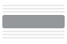
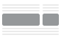

# 구조 구성 요소 {#structure-components}

>[!CONTEXTUALHELP]
>id="ajo-b2b_structure_components_email"
>title="구조 구성 요소 정보"
>abstract="구조 구성 요소는 이메일의 구조를 디자인하는 데 사용할 수 있는 레이아웃 요소입니다."

>[!CONTEXTUALHELP]
>id="ajo-b2b_structure_components_landing_page"
>title="구조 구성 요소 정보"
>abstract="구조 구성 요소는 페이지의 구조를 디자인하는 데 사용할 수 있는 레이아웃 요소입니다."

>[!CONTEXTUALHELP]
>id="ajo-b2b_structure_components_fragment"
>title="구조 구성 요소 정보"
>abstract="구조 구성 요소는 조각의 구조를 디자인하는 데 사용할 수 있는 레이아웃 요소입니다."

>[!CONTEXTUALHELP]
>id="ajo-b2b_structure_components_template"
>title="구조 구성 요소 정보"
>abstract="구조 구성 요소는 템플릿의 구조를 디자인하는 데 사용할 수 있는 레이아웃 요소입니다."

시각적 디자인 공간에서 _구조 구성 요소_&#x200B;를 사용하여 콘텐츠의 구조를 정의합니다. 간단한 드래그 앤 드롭 작업으로 구조 요소를 추가 및 이동하여 콘텐츠 레이아웃의 모양을 빠르게 정의할 수 있습니다. 각 구조 구성 요소는 가로 공간에 걸쳐 있으며 이를 스택하여 레이아웃을 세로로 작성할 수 있습니다. 각 구성 요소를 열로 나누어 필요한 각 콘텐츠 블록을 만듭니다.

## 구조 라이브러리

_[!UICONTROL 구성 요소]_ 라이브러리의 맨 위에 있는 **[!UICONTROL 구조]** 섹션에 사용 가능한 구조 구성 요소가 표시됩니다.

| 아이콘 | 구성 요소. | 설명 |
| ----- | ----------- | ----------- |
|  | [!UICONTROL 1:1 열] | 스페이스의 너비를 채우는 단일 열 컨테이너입니다. |
|  | [!UICONTROL 1:2 열 왼쪽] | 1:2 비율을 사용하여 공간의 너비를 채우는 2열 컨테이너입니다. 첫째 열(왼쪽)은 너비의 3분의 1을, 둘째 열(오른쪽)은 나머지 3분의 2를 차지한다. |
|  | [!UICONTROL 1:3 열 왼쪽] | 1:3 비율을 사용하여 공간의 너비를 채우는 2열 컨테이너입니다. 첫 번째 (왼쪽) 열은 너비의 4분의 1을 차지하고 두 번째 (오른쪽)열은 나머지 3/4을 차지합니다. |
|  | [!UICONTROL 2:1 열 오른쪽] | 2:1 비율을 사용하여 공간의 너비를 채우는 2열 컨테이너입니다. 첫째 열(왼쪽)은 폭의 2/3를 차지하고 둘째 열(오른쪽)은 나머지 1/3을 차지한다. |
|  | [!UICONTROL 2:2 열] | 2:2 비율을 사용하여 공간의 너비를 채우는 2열 컨테이너입니다. 왼쪽 열과 오른쪽 열의 너비는 같습니다. |
|  | [!UICONTROL 3:1 열 오른쪽] | 3:1 비율을 사용하여 공간의 너비를 채우는 2열 컨테이너입니다. 첫 번째(왼쪽) 열은 너비의 3/4(75%)를 차지하고 두 번째(오른쪽)는 나머지 1/4(25%)를 차지합니다. |
|  | [!UICONTROL 3:3 열] | 3:3 비율을 사용하여 공간의 너비를 채우는 3열 컨테이너입니다. 세 열 모두 너비가 같습니다. |
|  | [!UICONTROL 4:4 열] | 4:4 비율을 사용하여 공간의 너비를 채우는 4열 컨테이너입니다. 네 개의 열 너비는 모두 같습니다. |
|  | [!UICONTROL n:n 열] | 사용자가 정의하는 열에 따라 공간을 채우는 사용자 지정 가능한 열 구조입니다. 열의 수(2~10개)를 설정하고 각 열의 너비를 개별적으로 설정합니다. [자세히 알아보기](#change-nn-columns) |

## 구조 구성 요소 추가

이메일, 랜딩 페이지 또는 조각에 대한 콘텐츠를 디자인할 때 각 구조 구성 요소를 추가하여 레이아웃을 구성합니다. 왼쪽의 **[!UICONTROL 구조]** 섹션에서 항목을 드래그하여 캔버스에 놓습니다. 도구 모음을 사용하여 열을 선택하고 오른쪽 패널의 _설정_ 및 _스타일_ 탭을 사용하여 선택한 구성 요소 또는 열의 매개 변수를 정의할 수 있습니다.

{width="800" zoomable="yes"}

### 구성 요소 도구 모음

도구 모음은 캔버스에서 선택하면 캔버스에 표시됩니다. 사용 가능한 도구를 사용하여 열을 선택하고 구성 요소 함수를 적용하는 간편한 방법을 제공합니다.

{width="150"}

| 도구 | 이름 | 사용 |
| ---- | ---- | ----- |
| {width="40"} | 조건부 콘텐츠 활성화 | 구성 요소에 대해 조건부 변형을 활성화합니다. [자세히 알아보기](./conditional-content.md) |
| {width="100"} | 열 선택 | 숫자로 열을 선택합니다. 열을 선택하면 열 설정 및 스타일을 적용할 수 있습니다. |
| {width="40"} | 복제 | 구성 요소의 복사본을 만들고 바로 아래에 추가합니다. |
| {width="40"} | 삭제 | 구성 요소를 제거합니다. |

### 구성 요소 설정

구성 요소를 추가하면 시각적 디자인 공간에서 해당 구성 요소가 선택되고 오른쪽 패널에 해당 속성이 표시됩니다. 기본적으로 _[!UICONTROL 설정]_ 탭이 표시됩니다. 언제든지 구조 구성 요소를 선택하여 설정을 변경할 수도 있습니다.

#### 옵션 표시

데스크톱 또는 모바일 장치 표시에서 구성 요소를 제외하려면 **[!UICONTROL 표시 옵션]** 설정을 변경합니다. 기본값인 _[!UICONTROL 모든 장치에서 표시]_&#x200B;를 사용하면 모든 장치에서 표시할 수 있습니다.

{width="400" zoomable="yes"}

장치 유형별로 구성 요소를 배타적으로 설정하려면 다른 설정을 선택하십시오.

* _[!UICONTROL 데스크톱 장치에서만 표시]_ - 데스크톱 장치에서는 구성 요소를 표시하고 모바일 장치에서는 제외하려면 이 설정을 선택합니다.
* _[!UICONTROL 모바일 장치에서만 표시]_ - 휴대폰, 태블릿과 같은 모바일 장치에서 구성 요소를 표시하고 데스크톱 장치에서는 제외하려면 이 설정을 선택합니다.

#### 머리글 및 바닥글

구조 구성 요소를 이메일 메시지 또는 랜딩 페이지에서 HTML 머리글 또는 바닥글로 지정할 수 있습니다. 캔버스에서 구조 구성 요소를 선택한 상태에서 **[!UICONTROL 머리글]** 또는 **[!UICONTROL 바닥글]** 옵션을 클릭합니다. 머리글이나 바닥글은 하나만 있을 수 있으며 다른 구성 요소가 할당되면 이 옵션을 사용할 수 없습니다.

{width="600" zoomable="yes"}

구성 요소를 선택하고 옵션을 클릭하여 머리글 또는 바닥글 지정을 제거할 수 있습니다.

### 누적 열

작은 화면이나 표시 창의 경우 기본 설정을 변경하지 않는 한 구조 구성 요소의 열이 스택되어 표시됩니다. 다중 열 구조 구성 요소를 선택한 상태에서 토글 슬라이더를 오른쪽으로 이동하여 **[!UICONTROL 모바일에서 열을 스택하지 않음]** 설정을 변경합니다.

{width="250"}에서 열을 스택하지 마십시오.

## 구성 요소 스타일

구성 요소를 추가하면 시각적 디자인 공간에서 해당 구성 요소가 선택되고 오른쪽 패널에 해당 속성이 표시됩니다. 언제든지 구성 요소를 선택하여 설정 및 스타일을 변경할 수도 있습니다.

### 배경

오른쪽 패널에서 _[!UICONTROL 스타일]_ 탭을 선택한 상태에서 **[!UICONTROL 배경]** 섹션을 사용하여 구조 구성 요소의 배경으로 사용할 색상 및 선택적 이미지를 정의합니다.

#### [!UICONTROL 배경색]

확인란을 선택하고 색상 사각형을 클릭하여 선택기에서 색상을 선택합니다. 알려진 RGB, HSL, HSB 또는 16진수 값을 입력하여 색상을 선택할 수 있습니다. 또는 색상 슬라이더와 색상 필드를 사용하여 색상을 선택합니다.

{width="300"}

#### [!UICONTROL 배경 이미지]

토글 선택기를 이동하여 배경 이미지 설정을 활성화합니다.

{width="250"}

[자산 원본 유형](./assets-overview.md)을(를) 선택하고 이미지 파일을 선택하십시오.

+++[!UICONTROL Marketo Engage 자산]

{{me-dam}}

+++

+++[!UICONTROL Experience Manager Assets]

{{aem-assets-dam}}

+++

+++[!UICONTROL 미디어 가져오기]

{{image-upload}}

+++

**[!UICONTROL 이미지 배치]** 옵션을 사용하여 이미지가 구조 구성 요소를 채우는 방법을 선택하십시오. 배치 설정은 표준 [HTML 배경 이미지 채우기 및 맞춤 특성](https://www.w3schools.com/html/html_images_background.asp){target="_blank"}을(를) 따릅니다.

{width="250"}

### 기타 스타일

다른 구조 구성 요소 스타일을 적용하여 이메일 메시지 또는 랜딩 페이지에서의 표시를 조정할 수 있습니다.

+++테두리

{{styles-border}}

+++

+++여백

{{styles-margin}}

+++

+++고급

{{styles-advanced}}

+++

## 열

구성 요소 도구 모음의 _열 선택_ 도구를 사용하여 열을 선택합니다. 그런 다음 열 도구 모음을 사용하여 열 선택을 변경하거나 열을 제거하거나 열에 대한 조건부 콘텐츠 변형을 적용할 수 있습니다. 열의 매개 변수는 오른쪽의 _[!UICONTROL 설정]_ 및 _[!UICONTROL 스타일]_ 탭에 표시됩니다.

{width="500"}

| 도구 | 이름 | 사용 |
| ---- | ---- | ----- |
| {width="40"} | 열 지우기 | 열에서 콘텐츠를 지웁니다. |
| {width="40"} | 조건부 콘텐츠 활성화 | 열에 대해 조건부 변형을 활성화합니다. [자세히 알아보기](./conditional-content.md) |
| {width="100"} | 열 선택 | 숫자로 열을 선택합니다. 열을 선택하면 설정 및 스타일을 적용할 수 있습니다. |

### n:n개 열 변경

대부분의 구조 구성 요소에서 열 너비는 정적입니다. _[!UICONTROL n:n 열]_ 구성 요소를 추가할 때 열 수와 열 크기 조정을 변경할 수 있습니다. n:n 열 구성 요소는 동일한 너비(20%)의 5개 열로 시작합니다.

>[!NOTE]
>
>각 열 크기는 구조 구성 요소의 전체 너비의 10%보다 작을 수 없습니다. 빈 열만 제거할 수 있습니다.

캔버스에서 구성 요소를 선택한 상태에서 오른쪽 패널의 **[!UICONTROL 열 개수]** 옵션을 사용하여 열 수를 변경합니다. 위쪽 및 아래쪽 화살표 아이콘을 클릭하여 열 수를 늘리거나 줄이거나 필드에 숫자를 입력합니다.

{width="650" zoomable="yes"}

캔버스에서 열 크기 조정 아이콘을 이동하여 선택한 열의 너비를 조정합니다. 너비를 늘리거나 줄이면 인접한 열도 조정되어 모든 열이 구성 요소 너비의 100%를 차지합니다.

{width="500" zoomable="yes"}

### 열 스타일

캔버스에서 열을 선택하면 해당 열에 적용할 스타일을 설정할 수 있습니다.

+++배경

* **[!UICONTROL 배경색]** - 확인란을 선택하고 색 사각형을 클릭하여 선택기에서 색을 선택합니다. 알려진 RGB, HSL, HSB 또는 16진수 값을 입력하여 색상을 선택할 수 있습니다. 또는 색상 슬라이더와 색상 필드를 사용하여 색상을 선택할 수 있습니다.

  {width="300"}

* **[!UICONTROL 배경 이미지]** - 배경 이미지 설정을 활성화하려면 토글 선택기를 이동합니다.

  {width="250"}

  자산 원본 유형을 선택하고 [이미지 파일을 선택](#background-image)합니다.

+++

+++테두리

{{styles-border}}

+++

+++정렬

{{styles-alignment-v}}

+++

+++여백

{{styles-margin}}

+++

+++고급

{{styles-advanced}}

+++

## 탐색 트리

시각적 디자인 공간에서 탐색 트리를 사용하여 열 및 콘텐츠를 포함한 구조 구성 요소에 액세스할 수 있습니다. 왼쪽의 _[!UICONTROL 탐색 트리]_ 아이콘()을 클릭하여 트리를 표시합니다.

{width="800" zoomable="yes"}

_[!UICONTROL Body]_ 요소는 트리 구조의 루트입니다. 트리에서 구성 요소 또는 열 하위 요소를 클릭하여 캔버스에서 선택합니다. 오른쪽의 _[!UICONTROL 설정]_ 및 _[!UICONTROL 스타일]_ 탭에는 해당 구성 요소 또는 열의 매개 변수가 표시됩니다.

{width="800" zoomable="yes"}
