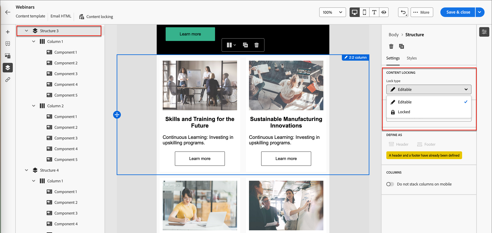

# 템플릿 콘텐츠 거버넌스

많은 마케팅 조직 내에는 이메일 캠페인을 디자인하는 콘텐츠 전문가가 있습니다. 지정된 디자인은 조직 전체에서 사용자 지정 계정 여정의 기반으로 사용할 수 있습니다. 승인된 콘텐츠 디자인을 준수하기 위해 콘텐츠 거버넌스 기능을 사용하여 템플릿 구성 요소를 잠글 수 있습니다. 이메일 템플릿에서 콘텐츠 잠금이 활성화되면 마케터는 허용된 요소만 변경하여 콘텐츠 전략과 일치하도록 할 수 있습니다.

예를 들어 브랜드 통신 연속성을 위해 디자인된 머리글과 바닥글을 잠글 수 있습니다. 본문 섹션이 포함된 열을 잠글 수도 있지만 작성자가 계정 여정 디자인 내에서 목적에 맞게 텍스트를 수정할 수 있도록 할 수도 있습니다.

## 템플릿에 대한 콘텐츠 거버넌스 활성화

비주얼 디자이너를 사용하여 전자 메일 템플릿에 대한 [구조 및 콘텐츠 구성 요소를 작성](./email-template-authoring.md)한 후 거버넌스를 활성화하고 필요에 따라 특정 콘텐츠 잠금을 적용합니다.

1. 비주얼 디자이너에서 _탐색 트리_&#x200B;를 사용하여 레이어/컨테이너 및 요소에 액세스합니다.

   캔버스 왼쪽에 있는 _탐색 트리_ 아이콘()을 클릭하여 트리를 표시합니다.

1. 트리에서 루트 **[!UICONTROL Body]** 구성 요소를 선택하십시오.

   캔버스 오른쪽의 속성 패널에는 기본적으로 _[!UICONTROL 설정]_ 탭이 표시됩니다.

1. **[!UICONTROL Governance]** 옵션을 사용하도록 설정합니다.

   {width="800" zoomable="yes"}

   이 옵션을 사용하면 기본 _[!UICONTROL 모드]_&#x200B;는 **[!UICONTROL 읽기 전용]**&#x200B;입니다. 이 모드가 루트 수준에서 설정되면 템플릿의 모든 요소가 잠깁니다. 왼쪽의 트리 구조에는 루트 및 모든 하위 요소 옆에 _읽기 전용_ 아이콘()이 표시됩니다.

1. 템플릿 내에서 특정 콘텐츠 잠금을 활성화하려면 **[!UICONTROL 모드]**&#x200B;를 **[!UICONTROL 콘텐츠 잠금]**(으)로 변경하십시오.

   루트 수준에서 이 모드를 설정하면 템플릿의 모든 요소가 잠금 해제됩니다. 왼쪽의 트리 구조에는 루트 요소 옆에 _콘텐츠 잠금_ 아이콘()이 표시됩니다. 필요에 따라 포함된(구조적) 및 개별 콘텐츠 구성 요소에 콘텐츠 잠금을 적용합니다.

   여정 전자 메일 작성자가 구조적 또는 콘텐츠 요소를 추가할 수 있도록 하려면 **[!UICONTROL 콘텐츠 추가 활성화]**&#x200B;를 설정하십시오. 허용할 추가 유형을 선택합니다.

   * **[!UICONTROL 구조 및 콘텐츠 추가 허용]** - 작성자가 구조 및 콘텐츠 요소를 모두 추가할 수 있도록 하려면 이 옵션을 선택합니다.

   * **[!UICONTROL 콘텐츠 추가만 허용]** - 작성자가 콘텐츠 요소만 추가하도록 허용하려면 이 옵션을 선택합니다.

   {width="600" zoomable="yes"}

   이 모드가 루트 수준에서 설정되면 템플릿의 모든 요소가 잠깁니다. 왼쪽의 트리 구조에는 루트 및 모든 하위 요소 옆에 _읽기 전용_ 아이콘()이 표시됩니다.
<!-- 

   
- 
- 
- 
- 
-  -->

## 구조에 잠금 적용

구조적 상속 모델을 사용하여 적용하려는 거버넌스에 따라 이메일 템플릿의 레이아웃 및 구조를 계획합니다. 구조적 구성 요소를 컨테이너로 사용하여 항목을 잠김 또는 편집 가능으로 쉽게 지정할 수 있도록 그룹화합니다. 이메일 템플릿 디자인이 갖추어지면 구조를 검토하고 계획에 따라 잠금 기능을 적용하십시오.

구조 수준에서 잠금 유형을 적용하면 하위 구성 요소에 기본 설정이 제공됩니다. 그런 다음 필요에 따라 열 또는 콘텐츠 요소 수준에서 특정 잠금 설정을 적용할 수 있습니다.

1. 캔버스 왼쪽에 있는 _탐색 트리_ 아이콘()을 클릭하여 트리를 표시합니다.

1. 트리에서 구조를 선택합니다.

   캔버스 오른쪽의 속성 패널에는 기본적으로 _[!UICONTROL 설정]_ 탭이 표시됩니다.

1. **[!UICONTROL 잠금 유형]** 설정:

   * **[!UICONTROL 잠김]** - 이 설정을 사용하면 기본적으로 모든 하위 구성 요소가 잠깁니다. 왼쪽의 트리 구조에는 모든 하위 구성 요소 옆에 _읽기 전용_ 아이콘()이 표시됩니다.

   * **[!UICONTROL 편집 가능]** - 이 설정을 사용하면 기본적으로 모든 하위 구성 요소를 편집할 수 있습니다. 왼쪽의 트리 구조에 하위 구성 요소 옆에 아이콘이 표시되지 않습니다.

   {width="800" zoomable="yes"}

## 하위 구성 요소에 대한 잠금 설정

1. 트리에서 구성 요소를 선택합니다.

   캔버스 오른쪽의 속성 패널에는 기본적으로 _[!UICONTROL 설정]_ 탭이 표시됩니다.

1. **[!UICONTROL 특정 잠금 사용]** 옵션을 사용하도록 설정합니다.

1. 적용할 거버넌스 유형을 선택합니다.

   * **[!UICONTROL 편집 가능]** - 전자 메일 작성 중에 구성 요소의 전체 편집 제어를 허용합니다.
   * **[!UICONTROL 편집 가능한 콘텐츠 전용]** - 이메일 작성자는 콘텐츠를 변경할 수 있지만 구성 요소 자체는 변경할 수 없습니다.
   * **[!UICONTROL 잠김]** - 전자 메일을 작성하는 동안 구성 요소를 변경할 수 없습니다.

     잠긴 구성 요소의 경우 **[!UICONTROL 삭제 허용]** 옵션을 설정하여 전자 메일 작성 중에 구성 요소 제거를 허용할 수 있습니다.

   {width="800" zoomable="yes"}
