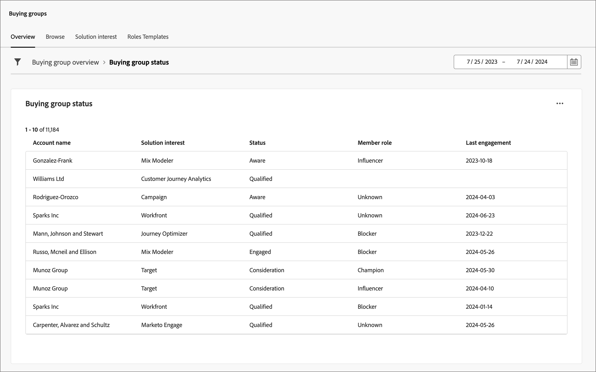

# 구매 그룹 개요 대시보드

구매 그룹 개요 대시보드는 B2B 판매 전달 프로세스를 위해 설계되었습니다. 이를 통해 마케팅 팀은 _준비_ 구매 그룹 및 해당 멤버와 필수 데이터를 영업팀에 공유하여 실행할 수 있습니다. 이 프로세스를 통해 마케팅에서 영업으로 간편하게 전환할 수 있습니다.

판매 핸드오프는 다음과 같습니다.

* **데이터 전달**: 마케팅은 _준비_ 대상 데이터를 식별하고 CSV 형식으로 영업부에 액세스할 수 있도록 합니다. 
* **판매 수락**: 판매에서 수동으로 _준비_ 대상을 파이프라인에 통합합니다.

## 구매 그룹 상태

구매 그룹 상태 보기를 통해 구매 그룹의 진행 상황에 대한 통찰력을 얻으십시오. 이 시각화는 지정된 기간 내의 가장 최근 상태 업데이트로 분류된 구매 그룹의 분포를 보여 줍니다.

{width="800" zoomable="yes"}

**[!UICONTROL 상태]**(y축): 다양한 단계를 통해 구매 그룹의 여정을 추적합니다.
**[!UICONTROL 구매 그룹 수]**(x축): 각 상태의 구매 그룹 수를 수량화하여 단계 상태 및 활동에 대한 명확한 지표를 제공합니다.
<!-- To generate a shareable PDF of your current view, click **[!UICONTROL Export]** at the top-right corner of the page. -->

### 데이터 필터링

* **데이터 필터** - 구매 그룹의 마지막 상태 변경 날짜를 반영하는 _[!UICONTROL 날짜 필터]_&#x200B;을(를) 사용합니다. 시작 날짜는 조정할 수 있습니다. 종료 일자는 기본적으로 현재 일자로 설정됩니다.

  {width="400"}

* **특성 필터** - 다음 특성을 사용하여 데이터 표시를 필터링하려면 왼쪽 상단의 _필터_ 아이콘을 클릭합니다.

   * 솔루션 관심 분야
   * 상태
   * 구매 그룹 상태
   * 계정 영역
   * 계정 산업
  <!-- * Account's Industry -->

  {width="500"}

## 데이터 활용

데이터에 참여하려면 오른쪽 상단의 작업 메뉴를 사용합니다.

{width="400"}

### [!UICONTROL 드릴스루]

개별 그룹 상태를 자세히 분석하려면 **[!UICONTROL 드릴스루]**&#x200B;를 선택하십시오.

{width="600" zoomable="yes"}

대시보드에 적용된 전역 필터는 이월되며 이 페이지에서 변경할 수 없습니다.

오른쪽 상단의 작업 메뉴 아이콘을 클릭하고 **[!UICONTROL 자세히 보기]**&#x200B;를 선택하여 [확장 데이터 및 인사이트 보기](#view-more)를 선택합니다.

### [!UICONTROL 자세히 보기]

확장 데이터 및 인사이트를 보려면 **[!UICONTROL 자세히 보기]**&#x200B;를 선택하세요. 표시되는 팝업에는 구매 그룹 상태의 분류를 보여 주는 차트와 테이블이 포함됩니다.

* [!UICONTROL 계정 ID ]
* [!UICONTROL 계정 이름]
* [!UICONTROL 계정 지역]
* [!UICONTROL 계정 업계]
* [!UICONTROL 그룹 이름 구매]
* [!UICONTROL 솔루션 관심]
* [!UICONTROL 상태]
* [!UICONTROL 참여 점수]
* [!UICONTROL 완성도 점수]
* [!UICONTROL 구성원 역할]
* [!UICONTROL 구성원 등록/만든 날짜]
* [!UICONTROL 개인 ID]
* [!UICONTROL 이름]
* [!UICONTROL 이메일]
* [!UICONTROL Title]
* [!UICONTROL 인바운드 참여 활동 수]
* [!UICONTROL 마지막 참여 날짜]

{width="600" zoomable="yes"}

데이터를 다운로드하려면 오른쪽 상단의 **[!UICONTROL CSV 다운로드]**&#x200B;를 클릭하십시오.
