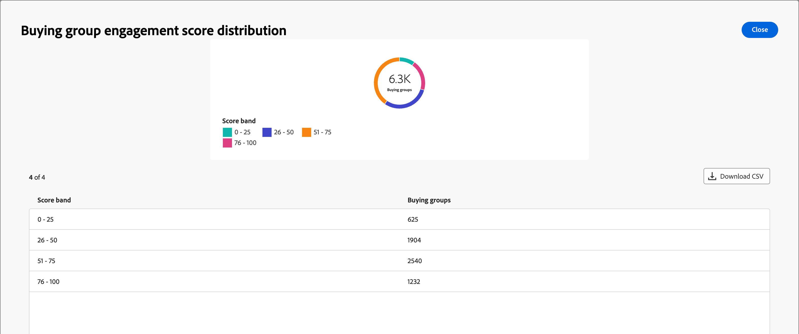

# 구매 그룹 개요 대시보드

구매 그룹에 대한 개요 대시보드는 B2B 판매 전달 프로세스를 위해 설계되었습니다. 이를 통해 마케팅 팀은 _준비_ 구매 그룹 및 해당 멤버와 필수 데이터를 영업팀에 공유하여 실행할 수 있습니다. 이 프로세스를 통해 마케팅에서 영업으로 간편하게 전환할 수 있습니다.

판매 핸드오프는 다음과 같습니다.

* **데이터 전달**: 마케팅은 _준비_ 대상 데이터를 식별하며 CSV 형식으로 영업에 액세스할 수 있도록 합니다. 
* **판매 수락**: 판매에서 수동으로 _준비_ 대상을 파이프라인에 통합합니다.

이 대시보드에 액세스하려면 왼쪽 탐색에서 **[!UICONTROL 계정]**&#x200B;을 확장한 다음 **[!UICONTROL 구매 그룹]**&#x200B;을 선택하십시오. 기본적으로 표시되지 않으면 **[!UICONTROL 개요]** 탭을 선택하십시오.

{width="800" zoomable="yes"}
<!--
## Buying Group Status

Gain insights into your buying groups' progression with the Buying Group Status view. This visualization showcases the distribution of your buying groups categorized by their most recent status update within a specified time frame.

{width="800" zoomable="yes"}

**[!UICONTROL Status]** (y-axis): Track the journey of buying groups through various stages.
**[!UICONTROL Number of Buying Groups]** (x-axis): Quantify the number of buying groups at each status, providing a clear metric of your funnel's health and activity.

To generate a shareable PDF of your current view, click **[!UICONTROL Export]** at the top-right corner of the page. -->

## 구매 그룹 완료 점수 분포

이 시각화는 완료 점수를 기반으로 구매 그룹의 분포를 보여 주며, 4개의 개별 점수 밴드로 분류됩니다. 중앙 그림은 총 구매 그룹 수를 나타내며 전반적인 진행에 대한 빠른 스냅샷을 제공합니다. 세분화된 색상은 각 점수범위 내 구매군 비중을 나타내므로 완급추세를 한눈에 파악할 수 있다.

자세한 정보를 보려면 오른쪽 상단의 **..** 메뉴 아이콘을 클릭합니다.

{width="500"}

## 구매 그룹 참여 점수 분포

이 시각화는 참여 점수를 기반으로 한 구매 그룹의 분포를 보여 주며 4개의 개별 점수 밴드로 분류됩니다. 중앙 그림은 총 구매 그룹 수를 나타내며 전반적인 진행에 대한 빠른 스냅샷을 제공합니다. 세분화된 색상은 각 점수범위 내 구매군 비중을 나타내므로 완급추세를 한눈에 파악할 수 있다.

자세한 정보를 보려면 오른쪽 상단의 **..** 메뉴 아이콘을 클릭합니다.

{width="500"}

## 솔루션 관심 분야별 구매 그룹

이 시각화는 솔루션 관심사별 구매 그룹 분포를 보여 주며, 어떤 솔루션이 가장 많은 관심을 유발하는지 식별하는 데 도움이 됩니다. 각 막대는 특정 솔루션을 나타내며, 해당 길이는 해당 관심사와 연관된 구매 그룹의 수를 나타냅니다. 이 막대 차트는 솔루션 수요 트렌드를 명확하고 즉시 파악할 수 있게 해 줍니다.

자세한 정보를 보려면 오른쪽 상단의 **..** 메뉴 아이콘을 클릭합니다. **드릴스루** 또는 **자세히 보기**&#x200B;를 선택하십시오.

{width="500"}

## 데이터 필터링

다음 특성 중 하나를 사용하여 표시된 데이터를 필터링하려면 왼쪽 상단의 _필터_( ) 아이콘을 클릭하십시오.

* 현재 단계
* 업종
* 지역
* 솔루션 관심 분야

{width="500"}

데이터를 필터링하는 데 사용할 각 특성의 값을 선택하고 **[!UICONTROL 적용]**&#x200B;을 클릭합니다.

## 데이터 활용

데이터에 참여하려면 각 차트의 오른쪽 상단에 있는 _자세히_(**...**) 메뉴를 사용하십시오.

### [!UICONTROL 드릴스루]

개별 그룹 점수 또는 분포를 자세히 분석하려면 **[!UICONTROL 드릴스루]**&#x200B;를 선택하십시오.

{width="700" zoomable="yes"}

대시보드에 적용된 전역 필터가 이월됩니다. 드릴스루 보기에 대해 왼쪽 상단의 _필터_( ) 아이콘을 클릭하여 [특성 필터를 변경](#filter-the-data)합니다.

오른쪽 상단의 _자세히_(**...**) 메뉴를 클릭하고 **[!UICONTROL 자세히 보기]**&#x200B;를 선택하여 [확장 데이터 보기](#view-more)를 선택할 수 있습니다.

### [!UICONTROL 자세히 보기]

확장된 데이터와 통찰력을 보려면 **[!UICONTROL 자세히 보기]**&#x200B;를 선택하세요.

{width="700" zoomable="yes"}

표시되는 팝업에는 구매 그룹 분포의 분류를 보여 주는 차트 및 테이블이 포함됩니다.

데이터를 다운로드하려면 데이터 테이블 오른쪽 상단의 **[!UICONTROL CSV 다운로드]**&#x200B;를 클릭합니다. 개요 대시보드로 돌아가려면 **[!UICONTROL 닫기]**&#x200B;를 클릭합니다.
