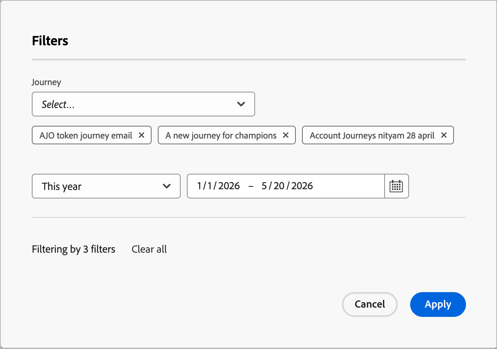

# 이메일 성과 보고서

**이메일 성과** 보고서를 통해 마케터는 Adobe Journey Optimizer B2B edition의 모든 여정에서 이메일 활동을 통합적으로 볼 수 있습니다. 전송, 게재, 참여 및 옵트아웃 지표를 집계합니다. 원시 수와 계산된 비율을 모두 표시함으로써 캠페인 상태를 모니터링하고, 이메일 성능을 비교하고, 전달성 또는 참여 문제를 한 눈에 파악할 수 있습니다. 전자 메일 및 SMS 채널에 걸친 여정 수준 지표는 [계정 여정 대시보드](./journeys-dashboard.md)를 참조하십시오.

## 보고서 액세스

1. 왼쪽 탐색에서 **[!UICONTROL 대시보드]**&#x200B;를 선택합니다.
1. 보고 대시보드 상단에서 **[!UICONTROL 이메일 성능]** 탭을 선택합니다.

{width="800" zoomable="yes"}

## 데이터 필터링

지원되는 두 가지 필터 유형을 사용하여 데이터 표시를 필터링하려면 왼쪽 상단의 _필터_( ) 아이콘을 클릭하십시오. 이 필터는 모든 패널에 동시에 적용됩니다.

* **[!UICONTROL 여정]** - 하나 이상의 선택한 여정에 대한 데이터를 표시하도록 보고서를 필터링합니다. 이 필터를 사용하여 캠페인이나 프로그램에 중요한 여정의 성능을 격리합니다.

* **날짜 범위** - 모든 지표를 지정된 기간 내에 전송된 전자 메일로 제한합니다. 사전 설정된 범위 및 사용자 지정 날짜 선택기를 지원합니다. 날짜 범위 선택기는 대시보드의 오른쪽 상단 모서리에 있습니다.

{width="500"}

필터 대화 상자에서 필터를 변경하면 **[!UICONTROL 적용]**&#x200B;을 클릭합니다.

## 카운트 및 비율 지표 차트

이메일 성능 보고서의 상단 섹션에는 선택한 날짜 범위 및 여정에 걸쳐 전체 이메일 프로그램 상태에 대한 시각적 요약을 제공하는 두 개의 가로 막대형 차트가 포함되어 있습니다.

**지표 계산** — 전자 메일 활동의 절대 볼륨을 표시합니다. 각 막대는 필터링된 범위의 모든 이메일(보냄, 배달됨, 열림, 클릭됨, 반송됨 및 가입 해지)에 있는 주요 이메일 이벤트의 총 수를 나타냅니다.

**비율 지표** — 게재율, 열람율, 클릭률, 바운스 비율, 클릭률 및 구독 취소 비율과 같은 볼륨에 관계없이 참여 및 게재 가능성 품질을 평가할 수 있도록 계산된 백분율을 표시합니다.

숫자 데이터를 표시하려면 차트 위로 마우스를 가져갑니다.

{width="500"}

| 지표 | 유형 | 설명 |
|--------|------|-------------|
| 전송됨 | 횟수 | 전송을 위해 제출된 총 이메일 메시지 수입니다. |
| 게재됨 | 횟수 | 받는 사람의 메일 서버에서 전자 메일이 정상적으로 수락되었습니다. |
| 열림 | 횟수 | 최소 한 번 이상 열린 배달된 이메일 수입니다. |
| 클릭함 | 횟수 | 최소 한 번의 링크 클릭을 받은 이메일 수입니다. |
| 바운스됨 | 횟수 | 게재할 수 없는 이메일(하드 또는 소프트 바운스). |
| 구독 취소 | 횟수 | 이메일의 구독 취소 링크를 통해 옵트아웃한 수신자. |
| 게재율 | 속도 | 게재됨 ÷ 전송됨. 받은 편지함에 도달한 전자 메일의 비율을 나타냅니다. |
| 열람률 | 속도 | 열림 ÷ 전달됨. 제목 줄과 수신자 참여를 측정합니다. |
| 클릭률 | 속도 | ÷ 클릭함. 게재된 이메일당 전체 클릭 참여를 측정합니다. |
| 바운스 비율 | 속도 | 반송된 ÷가 전송되었습니다. 전달성 및 목록 상태 문제를 강조 표시합니다. |
| 클릭투오픈율(CTOR) | 속도 | ÷를 클릭함 참여 독자 간의 콘텐츠 및 CTA 효과를 측정합니다. |
| 구독 취소율 | 속도 | 구독 취소÷ 전달됩니다. 신호 관련성 및 대상자 적합성 |

## 이메일 성능 테이블

페이지 하단의 세부 테이블에는 필터링된 범위의 모든 이메일 에셋에 대한 이메일당 지표가 표시됩니다. 기본적으로 테이블에는 페이지당 10개의 행이 표시됩니다.

**구독 취소 %** 열은 테이블 보기에서 직접 옵트아웃 활동을 모니터링하기 위한 우선 순위가 지정된 지표입니다.

| 열 | 설명 |
|--------|-------------|
| 이메일 이름 | 여정에 구성된 [전자 메일 에셋](../content/add-email.md)의 이름입니다. |
| 전송됨 | 선택한 날짜 범위 내에서 이 이메일에 대한 총 전송 횟수입니다. |
| 게재됨 | 받는 사람 메일 서버로 배달된 전자 메일 수입니다. |
| 게재 % | 게재됨 ÷ 전송됨, 백분율로 표시. |
| 열람 수 | 이 이메일에 대해 기록된 총 진행 중 이벤트 수입니다. |
| 열람률 | 백분율÷ 표시된 게재됨 열림 |
| 클릭수 | 이 이메일에 대한 총 링크 클릭 이벤트. |
| % 클릭 | 클릭 수÷ 백분율로 표시되며 전달됩니다. |
| CTOR % | 클릭에서 열기 비율: 클릭 수 ÷ 열림 수를 백분율로 표시합니다. |
| 바운스 수 | 전달할 수 없는 이메일 수(하드 + 소프트 바운스). |
| 바운스 % | 바운스 수÷ 백분율로 표시되며 전송됩니다. |
| 구독 취소 % | 구독 취소÷ 전달됩니다. 옵트아웃 상태를 모니터링하기 위한 우선 순위 지표가 있습니다. |
| 첫 번째 활동 | 선택한 기간 내에 이 이메일에 대해 처음 기록된 이벤트(보내기, 열기 또는 클릭)의 타임스탬프. |
| 마지막 활동 | 선택한 기간 내에 이 전자 메일에 대해 가장 최근에 기록된 이벤트의 타임스탬프입니다. |

## 보고서 데이터 내보내기

이메일 성과 보고서는 외부 도구에서 추가 분석을 수행하거나 관련자와 결과를 공유하기 위해 데이터 내보내기를 지원합니다. 테이블 데이터를 데이터 분석 또는 BI 도구와 호환되는 CSV 형식으로 내보낼 수 있습니다.

>[!CAUTION]
>
>내보내기는 현재 활성화된 필터를 반영합니다. 출력 파일에서 불완전한 데이터를 방지하기 위해 내보내기 전에 날짜 범위 및 여정 필터가 올바르게 설정되었는지 확인하십시오.

보고서 데이터를 내보내려면 **_To:_**

1. 오른쪽 상단에서 날짜 범위를 설정하고 필요에 따라 **[!UICONTROL 여정]** 필터링을 적용합니다.
1. 전자 메일 성능 패널의 오른쪽 상단 모서리에 있는 **..** 메뉴 아이콘을 클릭하고 **[!UICONTROL 자세히 보기]**&#x200B;를 선택합니다.
1. 메뉴에서 **[!UICONTROL CSV 다운로드]**&#x200B;를 클릭합니다.

   {width="700" zoomable="yes"}

   파일은 브라우저의 기본 다운로드 위치로 자동으로 다운로드됩니다.

1. 전자 메일 성능 보고서로 돌아가려면 **[!UICONTROL 닫기]**&#x200B;를 클릭하십시오.
