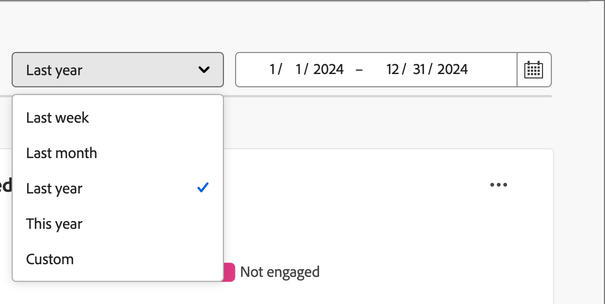
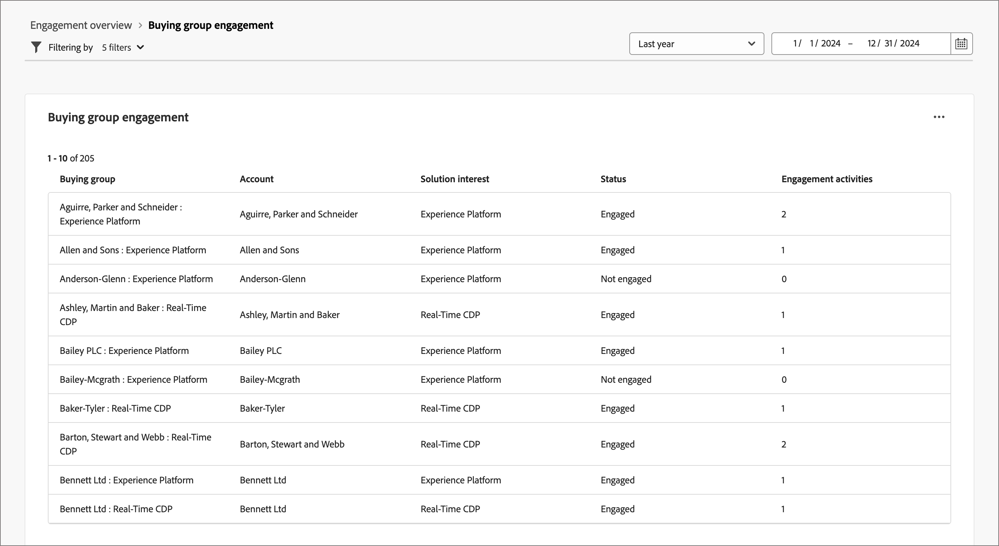

# 참여 개요 대시보드

이 대시보드는 참여를 포괄적으로 볼 수 있으며 시간에 따른 스냅샷 도넛 차트 및 트렌드를 보여 주는 선 차트를 통해 계정 및 개별 상호 작용에 대한 실시간 지표를 보여 줍니다. 참여 노력을 효과적으로 모니터링하고 전략화하는 데 도움이 됩니다.

_참여 대시보드_&#x200B;에 액세스하려면 왼쪽 탐색에서 **[!UICONTROL 대시보드]** 항목을 선택하십시오. 그런 다음 페이지 상단의 **[!UICONTROL 참여]** 탭을 선택합니다.

<!-- To generate a shareable PDF of your current view, click **[!UICONTROL Export]** at the top-right corner of the page. To engage with the data, use the action menu in the top-right corner. -->

{width="800" zoomable="yes"}

## 계정/구매 그룹/사람별 참여

원 차트는 계정, 구매 그룹 또는 사람을 참여 및 비참여 카테고리로 나눕니다. 중앙 그림은 각 카테고리 내의 총 수를 보여주며 전체적인 참여를 한눈에 파악할 수 있게 해 줍니다.

계정 및 사용자별 {width="500"}

## 계정/구매 그룹/시간이 지남에 따라 참여하는 사람

이 선 차트는 시간이 지남에 따라 계정 또는 직원의 참여 수준을 표시합니다. 타임스탬프가 지정된 가로 축과 함께 시각화된 &#39;참여&#39; 및 &#39;미참여&#39;에 대한 고유한 선을 사용하여 트렌드와 패턴을 정확하게 파악할 수 있습니다. 마우스를 라인 위로 가져가면 지정된 날짜에 대한 정확한 지표를 표시할 수 있습니다.

{width="500"}

## 데이터 필터링

날짜 범위 및 특성별로 표시된 데이터를 필터링할 수 있습니다.

### 날짜 범위 필터

오른쪽 상단의 _[!UICONTROL 날짜 범위 필터]_&#x200B;를 사용하여 날짜 범위에 따라 데이터를 필터링합니다.

{width="380"}

**[!UICONTROL Custom]** 범위의 경우 달력 도구를 사용하여 시작 날짜와 종료 날짜를 지정할 수 있습니다. 종료 일자는 기본적으로 현재 일자로 설정됩니다.

{width="380"}

### 속성 필터

다음 특성 중 하나를 사용하여 표시된 데이터를 필터링하려면 왼쪽 상단의 _필터_( ) 아이콘을 클릭하십시오.

* 솔루션 관심 분야
* 참여 유형
* 지역
* 업종
* 구매 그룹 멤버 역할

{width="500"}

데이터를 필터링하는 데 사용할 각 특성의 값을 선택하고 **[!UICONTROL 적용]**&#x200B;을 클릭합니다.

## 데이터 활용

데이터에 참여하려면 각 차트의 오른쪽 상단에 있는 **..** 메뉴를 사용하십시오.

{width="300"}

### 드릴스루

원 차트의 경우 개별 그룹 참여 데이터를 자세히 분석하려면 **[!UICONTROL 드릴스루]**&#x200B;를 선택하십시오.

대시보드에 적용된 전역 필터(데이터 범위 및 속성)는 이월됩니다. 드릴스루 보기에 대해 왼쪽 상단의 _필터_( ) 아이콘을 클릭하여 [특성 필터를 변경](#filter-the-data)합니다. 드릴스루 보기에 대해 [날짜 범위를 변경](#date-range-filter)하려면 오른쪽 상단의 날짜 범위 선택기를 사용하십시오.

{width="700" zoomable="yes"}

| 계정별 참여 | 구매 그룹별 참여 | 사용자별 참여 |
| ---------------------- | --------------------------- | -------------------- |
| <li>계정 이름 <li>상태 <li>참여 중인 사람(숫자)<li>참여 활동(숫자) <li>마지막 참여(날짜) | <li>구매 그룹 <li>계정 <li>솔루션 관심 분야 <li>상태 <li>참여 활동(숫자) | <li>이름 <li>상태 <li>이메일(주소) <li>참여 활동(숫자) <li>마지막 참여(날짜) |

상단 오른쪽에 있는 **..** 메뉴 아이콘을 클릭하고 **[!UICONTROL 자세히 보기]**&#x200B;를 선택하여 [확장 데이터 및 인사이트 보기](#view-more)를 선택할 수 있습니다.

### 더 보기

확장 데이터 및 인사이트를 보려면 **[!UICONTROL 자세히 보기]**&#x200B;를 선택하세요.

계정 및 사용자별 {width="700" zoomable="yes"}

차트에 따라 다음에 대한 확장 데이터가 있습니다.

| 계정/구매 그룹/사람별 참여 | 계정/구매 그룹/시간이 지남에 따라 참여하는 사람 |
| ----------------------------------------------- | -------------------------------------------------- | 
| <li>참여 <li>참여 안 함 | <li>일자 <li>계정 / 구매 그룹 / 인력 (숫자) <li>참여/미참여 |

확장 데이터를 복사하려면 오른쪽 상단의 **[!UICONTROL CSV 다운로드]**&#x200B;를 클릭합니다.
