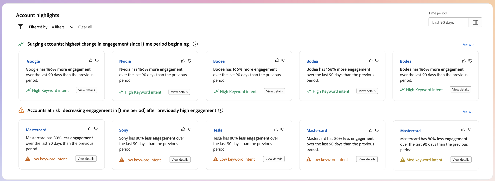

# 지능형 대시보드

지능형 대시보드는 구매 그룹 및 계정 지표에 대한 포괄적인 보기를 제공하여 마케팅 노력을 보다 효과적으로 모니터링하고 전략화하는 데 도움이 됩니다.

_지능형 대시보드_&#x200B;에 액세스하려면 왼쪽 탐색에서 **[!UICONTROL 대시보드]** 항목을 선택하십시오.

{width="800" zoomable="yes"}

지능형 대시보드는 다음 두 가지 유형의 생성 AI 기능을 포함하는 계정 및 구매 그룹 세부 사항 페이지에 대한 액세스도 제공합니다.

* 계정 및 구매 그룹에 대한 요약
* 개인, 구매 그룹 및 계정에 대한 의도 감지

{{intent-data-note}}

## 구매 그룹 단계 {#buying-group-stages}

>[!CONTEXTUALHELP]
>id="ajo-b2b_intelligent_dashboard_buying_group_stages"
>title="구매 그룹 단계"
>abstract="이 차트는 구성된 전환 규칙에 따라 다양한 단계에서 구매 그룹 진행의 개요를 제공합니다. 첫 번째 막대는 선택한 시간대의 마지막 일자와 비교하여 선택한 시간대의 첫 번째 일자에 특정 단계에 있는 구매 그룹의 수를 나타냅니다."

_[!UICONTROL 구매 그룹 단계]_ 차트는 여러 단계 간의 구매 그룹 진행에 대한 개요를 제공합니다([관리자가 설정한 전환 규칙에 따라](../buying-groups/buying-group-stages.md)).

>[!NOTE]
>
>구매 그룹 단계를 사용할 수 있으려면 구매 그룹 단계를 구성해야 합니다. 단계 및 구매 그룹의 단계를 정의하고 활성화하는 방법에 대한 자세한 내용은 [구매 그룹 단계](../buying-groups/buying-group-stages.md)를 참조하십시오.

{width="800" zoomable="yes"}

이 차트는 가장 최근에 게시된 버전의 구매 그룹 단계 모델에서 구매 그룹 단계를 사용합니다. 각 단계마다 두 개의 막대가 있습니다. 첫 번째 막대는 선택한 일정의 첫 번째 일자에 있는 구매 그룹의 수를 나타냅니다. 그리고 두 번째(비교)는 시간대의 마지막 날짜에 대한 구매 그룹 수입니다. 각 막대에 마우스를 가져다 대면 각 단계의 구매 그룹 수를 볼 수 있습니다.

{width="400"}

### 생성 AI 요약

선택한 기간 동안 해당 단계의 구매 그룹에 대한 생성 AI 요약을 표시하려면 막대를 클릭합니다.

{width="500"}

생성된 요약은 구성된 전환 규칙을 기반으로 여러 단계에서 구매 그룹 진행에 대한 개요를 제공합니다.

### 기간 {#time-period-stages}

오른쪽 상단의 날짜 필터를 사용하여 데이터 시각화에 대한 날짜 범위를 변경합니다. 아래쪽 화살표를 클릭하여 상대적 날짜 범위를 설정하거나 사용자 지정 시작 및 종료 날짜를 설정합니다.

<!-- {width="300"} -->

### 속성 필터 {#attribute-filter-stages}

다음 특성 중 하나를 사용하여 데이터 표시를 필터링하려면 왼쪽 상단의 _필터_(  ) 아이콘을 클릭하십시오.

* 솔루션 관심 분야
* 계정
* 단계 이름

<!-- Add screen when the UI is available {width="500"} -->

## 구매 그룹 하이라이트 {#buying-group-highlights}

>[!CONTEXTUALHELP]
>id="ajo-b2b_intelligent_dashboard_buying_group_highlights_engagement"
>title="참여별 상위 5개 구매 그룹"
>abstract="표준화된 참여 점수를 바탕으로, 가장 참여도가 높은 구매 그룹입니다."

>[!CONTEXTUALHELP]
>id="ajo-b2b_intelligent_dashboard_buying_group_highlights_velocity"
>title="속도 상위 5개 구매 그룹"
>abstract="각 단계를 거치는 속도를 바탕으로 한 구매 그룹입니다."

>[!CONTEXTUALHELP]
>id="ajo-b2b_intelligent_dashboard_buying_group_highlights_stagnant"
>title="정체된 상위 5개 구매 그룹"
>abstract="완성도 점수가 높음에도 단계가 진행되지 않는 정체된 구매 그룹입니다."

_[!UICONTROL 구매 그룹 하이라이트]_ 섹션은 세 행으로 구성되어 조직에 관심 있는 구매 그룹에 대한 정보를 표시합니다.

{width="800" zoomable="yes"}

* **참여별 상위 5개 구매 그룹** - 이 행에는 정규화된 참여 점수에 따라 상위 참여 구매 그룹이 표시됩니다.
* **상위 5개 고속 구매 그룹** - 이 행에는 구매 그룹 단계를 진행하는 속도에 따라 상위 구매 그룹이 표시됩니다.
* **상위 5개의 정체된 구매 그룹** - 이 행에는 높은 완성도 점수에도 불구하고 단계를 진행하지 않는 가장 정체된 구매 그룹이 표시됩니다.

각 카드에는 다음 데이터가 포함됩니다.

* **_그룹 이름 구매_**. 이름을 눌러 구매 그룹 세부 정보 페이지를 엽니다.
* **_계정 이름_**. 계정 세부 정보 페이지(계정 세부 정보 페이지에 하이퍼링크)를 열려면 이름을 클릭합니다.
* 구매 그룹에 대한 **_현재 단계_**.
* **_참여 점수_**(모든 구매 그룹에서 표준화됨). 모든 구매 그룹의 최상위 점수가 동일한 경우 마지막으로 업데이트된 점수가 표시됩니다.
* **_완전성 점수_**(1~100 범위). 모든 구매 그룹의 최상위 점수가 동일한 경우 마지막으로 업데이트된 점수가 표시됩니다.
* **_카테고리 의도_**. 의도 데이터를 보려면 _[!UICONTROL 세부 정보 보기]_&#x200B;를 클릭하십시오.

  {width="500" zoomable="yes"}

   * 세부 정보 팝업은 맨 위에 의도 수준이 있는 범주 이름을 표시합니다.
   * 각 행의 데이터는 제품 이름, 제품 의도 강도 및 의도 강도별 상위 키워드 등의 열로 구성됩니다.
   * 카테고리, 제품 및 키워드에 대한 정렬 순서는 높음에서 낮음 입니다. 각 유형 중 하나 이상에 동일한 의도 강도가 있는 경우 알파벳 순서를 사용합니다.

  {{intent-data-note}}

_구매 그룹 하이라이트_ 패널의 오른쪽 상단에서 **[!UICONTROL 모두 보기]**&#x200B;를 클릭하여 구매 그룹 목록 페이지로 이동합니다.

### 속성 필터 {#attribute-filter-bg-highlights}

다음 특성 중 하나를 사용하여 데이터 표시를 필터링하려면 왼쪽 상단의 _필터_(  ) 아이콘을 클릭하십시오.

* 솔루션 관심도
* 구매 그룹
* 계정

<!-- Add screen when the UI is available {width="500"} -->

### 기간 {#time-period-bg-highlights}

오른쪽 상단의 날짜 필터를 사용하여 데이터 시각화에 대한 날짜 범위를 변경합니다. 아래쪽 화살표를 클릭하여 상대적 날짜 범위를 설정하거나 사용자 지정 시작 및 종료 날짜를 설정합니다.

<!-- {width="300"} -->

## 급증하는 계정 {#account-surge}

>[!CONTEXTUALHELP]
>id="ajo-b2b_intelligent_dashboard_account_surge"
>title="계정 급증"
>abstract="선택된 시간대 내 참여 모멘텀에 상당한 변화가 발생한 계정입니다."

_[!UICONTROL 급증하는 계정]_ 섹션에는 선택한 기간 내에 참여 모멘텀이 크게 변경된 계정의 시각화가 표시됩니다.

>[!NOTE]
>
>계정 급증 데이터는 계정 여정 또는 구매 그룹을 통해 계정 대상의 Journey Optimizer B2B edition에서 수집한 계정으로 제한됩니다.

{width="800" zoomable="yes"}

각 막대에 마우스를 가져다 대면 각 카테고리의 계정 수를 볼 수 있습니다.

{width="400"}

선택한 기간에 대해 범주 내 계정의 생성 AI 요약을 표시하려면 막대를 클릭합니다.

{width="500"}

### 속성 필터 {#attribute-filter-acct-surge}

다음 특성 중 하나를 사용하여 데이터 표시를 필터링하려면 왼쪽 상단의 _필터_(  ) 아이콘을 클릭하십시오.

* 솔루션 관심도
* 산업
* 지역

<!-- Add screen when the UI is available {width="500"} -->

### 기간 {#time-period-acct-surge}

오른쪽 상단의 날짜 필터를 사용하여 데이터 시각화에 대한 날짜 범위를 변경합니다. 아래쪽 화살표를 클릭하여 상대적 날짜 범위를 설정하거나 사용자 지정 시작 및 종료 날짜를 설정합니다.

<!-- {width="300"} -->

## 계정 하이라이트 {#account-highlights}

>[!CONTEXTUALHELP]
>id="ajo-b2b_intelligent_dashboard_account_highlights_surging"
>title="급증하는 계정"
>abstract="선택된 시간대에서 참여 모멘텀에 상당한 증가가 발생한 계정입니다. "

>[!CONTEXTUALHELP]
>id="ajo-b2b_intelligent_dashboard_account_highlights_at_risk"
>title="위험 계정"
>abstract="선택된 시간대에서 참여 모멘텀에 상당한 감소가 발생한 계정입니다."

_[!UICONTROL 구매 그룹 하이라이트]_ 섹션은 두 행으로 구성되어 조직에 관심 있는 계정에 대한 정보를 표시합니다.

>[!NOTE]
>
>계정 강조 표시 데이터는 계정 여정 또는 구매 그룹을 통해 계정 대상의 Journey Optimizer B2B edition에서 수집한 계정으로 제한됩니다.

{width="800" zoomable="yes"}

* **계정 급증** - 이 행에는 선택한 기간 동안 참여 모멘텀이 크게 증가한 계정이 표시됩니다.
* **위험 계정** - 이 행에는 선택한 기간 동안 참여 모멘텀이 크게 감소한 계정이 표시됩니다.

각 카드에는 다음 데이터가 포함됩니다.

* **_계정 이름_**. 이름을 클릭하여 계정 세부 정보 페이지를 엽니다.
* 계정의 **_생성 AI 요약_**.
* **_키워드 의도_**. 의도 데이터를 보려면 _[!UICONTROL 세부 정보 보기]_&#x200B;를 클릭하십시오.

  {width="500" zoomable="yes"}

   * 세부 정보 팝업은 맨 위에 의도 수준이 있는 범주 이름을 표시합니다.
   * 각 행의 데이터는 제품 이름, 제품 의도 강도 및 의도 강도별 상위 키워드 등의 열로 구성됩니다.
   * 카테고리, 제품 및 키워드에 대한 정렬 순서는 높음에서 낮음 입니다. 각 유형 중 하나 이상에 동일한 의도 강도가 있는 경우 알파벳 순서를 사용합니다.

  {{intent-data-note}}
<!-- 
At the top right of the _Buying group highlights_ panel, click **[!UICONTROL View All]** to navigate to the Buying groups list page. -->

### 속성 필터 {#attribute-filter-acct-highlights}

다음 특성을 사용하여 데이터 표시를 필터링하려면 왼쪽 상단의 _필터_( ) 아이콘을 클릭하십시오.

* 솔루션 관심도
* 구매 그룹

<!-- Add screen when the UI is available {width="500"} -->

### 기간 {#time-period-acct-highlights}

오른쪽 상단의 날짜 필터를 사용하여 데이터 시각화에 대한 날짜 범위를 변경합니다. 아래쪽 화살표를 클릭하여 상대적 날짜 범위를 설정하거나 사용자 지정 시작 및 종료 날짜를 설정합니다.

<!-- {width="300"} -->

## 연락처 범위 {#contact-coverage}

>[!CONTEXTUALHELP]
>id="ajo-b2b_intelligent_dashboard_contact_coverage"
>title="연락처 범위"
>abstract="솔루션 관심 분야와 연관된 특정 역할이 있는 연락처 수를 표시합니다. 역할 및 솔루션 관심 분야 할당은 구매 그룹 템플릿을 바탕으로 합니다."

_[!UICONTROL 연락처 범위]_ 섹션에는 솔루션 관심 분야와 관련된 특정 역할을 가진 연락처 수의 시각화가 표시됩니다. 역할 및 솔루션 관심 분야 할당은 구매 그룹 템플릿을 바탕으로 합니다.

>[!NOTE]
>
>연락처 범위 데이터는 Journey Optimizer B2B edition 인스턴스에서 생성된 구매 그룹을 기반으로 합니다.

{width="800" zoomable="yes"}

각 셀 위로 마우스를 가져가면 역할/솔루션 관심 항목의 연락처 수를 볼 수 있습니다.

{width="400"}

역할/솔루션 관심 분야의 연락처에 대한 자세한 정보를 보려면 셀을 클릭합니다.

{width="700" zoomable="yes"}

### 속성 필터 {#attribute-filter-contact-coverage}

다음 특성을 사용하여 데이터 표시를 필터링하려면 왼쪽 상단의 _필터_( ) 아이콘을 클릭하십시오.

* 솔루션 관심도
* 계정

<!-- Add screen when the UI is available {width="500"} -->

## 연락처 중복 {#contact-overlap}

>[!CONTEXTUALHELP]
>id="ajo-b2b_intelligent_dashboard_contact_overlap"
>title="연락처 중복"
>abstract="여러 솔루션 관심 분야와 연관되어 두 개 이상의 구매 그룹에 속해 있는 연락처 목록입니다."

_[!UICONTROL 연락처 겹치기]_ 섹션에는 여러 솔루션 관심 분야와 연결된 결과 둘 이상의 구매 그룹에 속하는 연락처 목록이 표시됩니다.

>[!NOTE]
>
>연락처 중복 데이터는 Journey Optimizer B2B edition 인스턴스에서 생성되는 구매 그룹을 기반으로 합니다.

{width="800" zoomable="yes"}

_정보_(  )을 클릭하여 다음 세부 정보가 포함된 표를 표시합니다.

* 구매 그룹 이름(구매 그룹 세부 정보 페이지를 열려면 이름을 클릭하십시오.)
* 역할
* 솔루션 관심도
* 제품 의도
* 제품

{width="600" zoomable="yes"}

### 속성 필터 {#attribute-filter-contact-overage}

다음 특성을 사용하여 데이터 표시를 필터링하려면 왼쪽 상단의 _필터_( ) 아이콘을 클릭하십시오.

* 솔루션 관심도
* 역할
* 계정

<!-- Add screen when the UI is available {width="500"} -->
