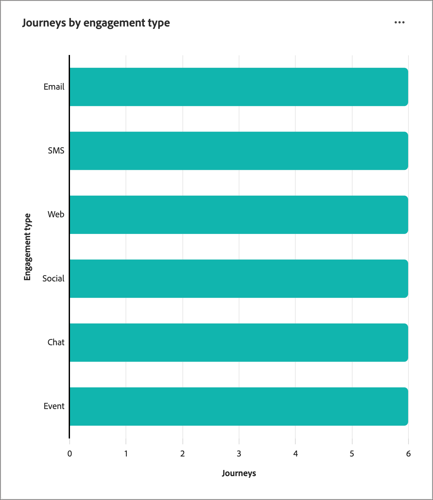

# 계정 여정 개요 대시보드

이 대시보드는 활성 계정 여정에 대한 포괄적인 개요를 제공하며, 완료를 범주화하고 수량화하는 원 및 막대 차트를 사용하여 계정 진행 상황과 참여 활동을 자세히 설명합니다. 이는 마케터가 주요 게재 및 참여 지표를 통해 이메일 및 SMS 채널의 효과를 평가하는 데 도움이 됩니다.

이 개요는 게시된 계정 여정에 대해 사용할 수 있으며, 차트와 표에 데이터를 채우는 데 약 4시간이 소요됩니다.

{width="700" zoomable="yes"}

## 여정 완료율 배포

이 차트는 완료율에 따른 여정 분포를 보여 주며 4개의 개별 점수 범위로 분류됩니다. 중앙 그림은 총 여정 수를 나타내며 전반적인 진행에 대한 빠른 스냅샷을 제공합니다. 세분화된 색상은 각 점수 범위 내 여정의 비율을 나타내므로 완료 트렌드를 한 눈에 파악할 수 있습니다.

자세한 정보를 보려면 오른쪽 상단의 **..** 메뉴 아이콘을 클릭합니다.

{width="500"}

## 참여 유형별 여정

이 막대 차트는 참여 유형에 따른 여정 분포를 표시하고 여정 간에 가장 많이 사용된 참여를 식별하는 데 도움이 됩니다. 각 막대는 특정 참여 유형을 나타내며, 해당 길이는 해당 유형의 활동이 있는 여정의 수를 나타냅니다. 이 시각화는 계정 여정 내의 참여 트렌드를 명확하고 즉시 이해할 수 있도록 제공합니다.

자세한 정보를 보려면 오른쪽 상단의 **..** 메뉴 아이콘을 클릭합니다.

{width="500"}

## 데이터 활용

데이터에 참여하려면 각 차트의 오른쪽 상단에 있는 **..** 메뉴를 사용하십시오.

### [!UICONTROL 드릴스루]

원 차트의 경우 데이터를 심층적으로 분석하려면 **[!UICONTROL 드릴스루]**&#x200B;를 선택하십시오.

{width="700" zoomable="yes"}

상단 오른쪽에 있는 _자세히_(**...**) 메뉴를 클릭하고 **[!UICONTROL 자세히 보기]**&#x200B;를 선택하여 [확장 데이터 보기](#view-more)를 선택할 수 있습니다.

### [!UICONTROL 자세히 보기]

확장된 데이터와 통찰력을 보려면 **[!UICONTROL 자세히 보기]**&#x200B;를 선택하세요.

{width="700" zoomable="yes"}

표시되는 팝업에는 여정 데이터의 분류를 보여 주는 차트 및 테이블이 포함됩니다.

데이터를 다운로드하려면 데이터 테이블 오른쪽 상단의 **[!UICONTROL CSV 다운로드]**&#x200B;를 클릭합니다. _개요_ 대시보드로 돌아가려면 **[!UICONTROL 닫기]**&#x200B;를 클릭합니다.
