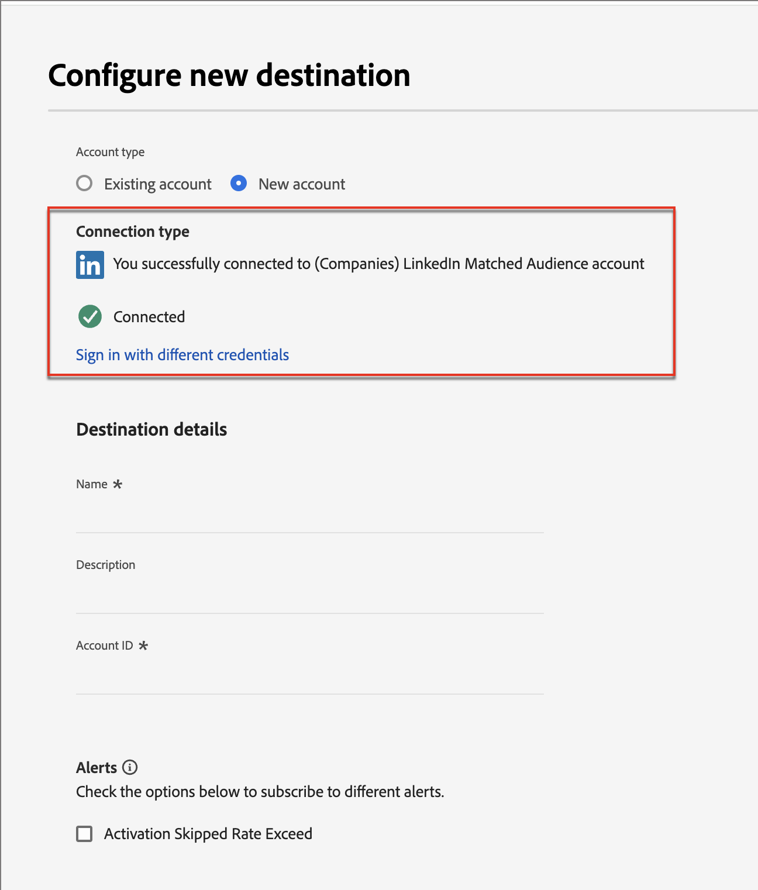

# LinkedIn 계정 일치 대상자

Journey Optimizer B2B edition은 Account Matched Audiences를 통해 LinkedIn 광고 대상을 생성하는 기능을 제공하며, 구매 그룹에서 빈 역할을 채울 수 있도록 설계되었습니다. 구매 그룹 필터 세트를 정의하여 LinkedIn 일치 대상을 유지 관리하여 구매 그룹 매개 변수와 일치하는 잠재 고객을 타깃팅할 수 있습니다. 이 기능은 Experience Platform 대상을 활용하여 통합의 일부 요소를 관리합니다. 데이터 흐름은 10개로 제한됩니다.

Journey Optimizer B2B edition에서 데이터 흐름을 시작하려면 Experience Platform 애플리케이션에 LinkedIn Campaign Manager 계정이 구성된 [(회사) LinkedIn 일치하는 대상 커넥터](https://experienceleague.adobe.com/ko/docs/experience-platform/destinations/catalog/social/linkedin#connect){target="_blank"}의 인스턴스가 하나 이상 있어야 합니다.

## 새 LinkedIn 계정 연결 구성 {#linkedin-destination-setup}

>[!CONTEXTUALHELP]
>id="ajo-b2b_linkedin_destination_setup"
>title="LinkedIn 대상 설정 필요"
>abstract="구매 그룹별로 필터링한 계정을 Linkedin 대상으로 보내 잠재적인 구매 그룹 멤버와 소통합니다. 10개의 필터링된 계정 그룹에 대해 최대 10개의 데이터 흐름을 생성할 수 있습니다. 이 기능을 시작하려면 먼저 Linkedin 대상을 추가하십시오."

1. Experience Platform에서 왼쪽 탐색의 **[!UICONTROL 연결]** > **[!UICONTROL 대상]**(으)로 이동한 다음 **[!UICONTROL 카탈로그]** 탭을 선택합니다.

1. 카탈로그에서 **[!UICONTROL (회사) LinkedIn 일치하는 대상]** 커넥터를 찾습니다.

   >[!TIP]
   >
   >검색 상자에 `LinkedIn`을(를) 입력하면 커넥터를 빠르게 찾을 수 있습니다.

1. 커넥터 카드에서 _자세히_(**...**) 아이콘을 클릭하고 **[!UICONTROL 새 대상 구성]**&#x200B;을 선택합니다.

   {width="800" zoomable="yes"}

1. **[!UICONTROL 새 계정]**&#x200B;을 선택하고 **[!UICONTROL 대상에 연결]**&#x200B;을 클릭합니다.

   {width="500"}

1. LinkedIn 자격 증명을 제공하고 로그인합니다.

   인증 후 LinkedIn 계정이 Experience Platform에서 대상으로 연결됩니다.

   {width="400"}

   >[!IMPORTANT]
   >
   >이 시점에서 **하지 않음** _[!UICONTROL 대상 세부 정보]_&#x200B;를 입력하십시오. 연결만 필요합니다.

## 계정 세부 정보 업데이트

LinkedIn 계정의 이름 및 설명은 Journey Optimizer B2B edition의 구매 그룹에 대해 표시됩니다. 구매 그룹으로 작업하는 마케터용으로 쉽게 식별할 수 있도록 이 정보를 업데이트하는 것이 좋습니다. Experience Platform 또는 Journey Optimizer B2B edition UI에서 계정 세부 사항을 변경할 수 있습니다.

1. 왼쪽 탐색에서 **[!UICONTROL 연결]** > **[!UICONTROL 대상]**(으)로 이동한 다음 **[!UICONTROL 계정]** 탭을 선택합니다.

1. 만든 새 계정의 경우 _자세히_(**...**) 메뉴를 클릭하고 **[!UICONTROL 세부 정보 편집]**&#x200B;을 선택하세요.

   {width="800" zoomable="yes"}

1. 대화 상자에서 이름과 설명을 업데이트합니다.

   {width="500"}

1. **[!UICONTROL 저장]**&#x200B;을 클릭합니다.

## 구매 그룹에 대한 계정 활성화

>[!NOTE]
>
>이미 데이터 흐름이 10개인 경우 다른 데이터 흐름을 만들 수 없습니다. 최대 수준인 경우 Experience Platform B2B edition에서 새 항목을 만들기 전에 Journey Optimizer에서 하나를 삭제하십시오.

1. Journey Optimizer B2B 에디션의 왼쪽 탐색 영역에서 **[!UICONTROL 계정]** > **[!UICONTROL 구매 그룹]**&#x200B;으로 이동합니다.

1. **[!UICONTROL 찾아보기]** 탭을 선택합니다.

1. 오른쪽 상단의 **[!UICONTROL LinkedIn 대상에 대한 활성화]**&#x200B;를 클릭합니다.

   {width="800" zoomable="yes"}

1. 데이터 흐름에 설명 이름과 설명을 지정합니다(선택 사항).

   저장하면 데이터 흐름에 지정하는 이름 앞에 _AJOB2B_&#x200B;이(가) 추가되어 Experience Platform에서 데이터 흐름을 식별하는 데 도움이 됩니다.

1. LinkedIn Campaign 관리자 계정의 [계정 ID](https://www.linkedin.com/help/lms/answer/a424270)를 입력하십시오.

   Campaign Manager UI에서 계정 이름으로 계정 ID를 찾을 수 있습니다.

   {width="700" zoomable="yes"}

1. **[!UICONTROL 구매 그룹 필터 선택]**&#x200B;을 클릭하고 계정 대상자의 매개 변수를 정의합니다.

   >[!IMPORTANT]
   >
   >현재 데이터 흐름이 활성화된 후에는 필터를 편집할 수 없습니다. 데이터 흐름을 활성화하기 전에 작업을 다시 확인하십시오.

   {width="400"}

   **[!UICONTROL 참여 점수]**&#x200B;의 경우 `Between` 연산자와 백분율 범위가 포함됩니다. 예를 들어 5.1과 5는 모두 5와 6 _사이_&#x200B;입니다.

   빈 조건은 `Is Any`과(와) 같이 처리됩니다.

   지정된 필터를 추가하려면 **[!UICONTROL 저장]**&#x200B;을 클릭하세요.

1. **[!UICONTROL LinkedIn 대상 선택]**&#x200B;을 클릭하고 사용할 구성된 LinkedIn 대상을 선택합니다.

   활성화 시 이 설정은 대상 구성 및 해당 가상 세그먼트를 사용하여 데이터 흐름을 만듭니다.

1. 설정을 다시 확인하고 오른쪽 상단의 **[!UICONTROL 활성화]**&#x200B;를 클릭합니다.

   확인 대화 상자에서 **[!UICONTROL 활성화]**&#x200B;를 다시 클릭합니다.

   데이터 흐름 레코드를 확인할 수 있도록 Experience Platform의 데이터 흐름 메뉴에 대한 링크가 배너에 표시됩니다.

## 유료 미디어 참여 오케스트레이션

LinkedIn 광고 대상과 같은 유료 미디어 채널을 통해 계정 구성원과 협력하여 고객을 확보하고, 육성하고, 영업 자격을 부여할 수 있습니다. 계정 여정에서 _작업 수행_ 노드를 사용하여 다른 계정 구성원에 가장 적합한 외부 채널을 통해 계정의 주요 구성원과 참여를 자동화합니다.

>[!VIDEO](https://video.tv.adobe.com/v/3448649/?learn=on)