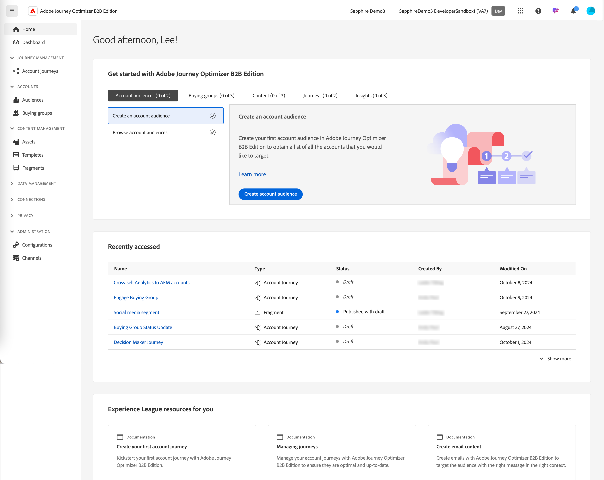

# 로그인 및 홈 페이지

Adobe Journey Optimizer B2B 에디션을 사용하면 기본 제공 생성형 AI와 업계 최고 수준의 자동화를 활용하여 계정 및 구매 그룹 여정을 조율하고, 마케팅 적격 구매 그룹을 사용하여 특정 오퍼에 대한 수요를 극대화할 수 있습니다.

<!-- Requirements?
-->
[!DNL Adobe Journey Optimizer B2B Edition]에 액세스하려면 Adobe ID로 Adobe Experience Cloud에 접속하고 [!DNL Journey Optimizer B2B Edition]을 선택합니다.

{width="800" zoomable="yes"}

Adobe Experience Platform에 로그인하고 Adobe Journey Optimizer B2B 에디션 앱을 선택하면 홈 페이지가 표시됩니다. 이 페이지에서는 관련 모듈에 대한<!-- refined insights and--> 바로 가기를 통해 Journey Optimizer B2B 이니셔티브의 현재 상태에 대한 개요를 제공합니다. <!-- It also provides information about the ideal next action to take and where to find the comprehensive set of tutorials and documentation. -->

{width="800" zoomable="yes"}

Journey Optimizer B2B 에디션에는 두 가지 주요 사용자 페르소나, 즉 _**마케터**_&#x200B;와 _**관리자**_&#x200B;가 있습니다. 각 페르소나는 성숙도 단계(신규 또는 고급)에 따라 특정 홈 페이지를 갖습니다. 페이지 내용은 각 페르소나가 필요로 하는 정보와 취해야 할 다음 조치를 기반으로 구성됩니다.

* **마케터 - 신규 사용자** -- 신규 사용자용 _마케터_ 홈 페이지는 신규 사용자가 Journey Optimizer B2B와 그 기능에 익숙해지는 데 도움이 됩니다. 여기에는 신규 마케터가 시스템의 미묘한 차이점을 이해하고 B2B 마케팅 전략과 이니셔티브를 효율적으로 개발할 수 있도록 온보딩 과정을 안내하는 가이드가 포함되어 있습니다.
* **마케터 - 고급 사용자** -- 고급 마케터용 _마케터_ 홈 페이지는 이니셔티브의 현재 진행 상황과 특정 액션 및 다음으로 취해야 할 최선의 다음 조치에 대한 정보를 보다 자세히 얻는 데 도움이 되며 관련 섹션에 빠르게 액세스할 수 있도록 도와줍니다.
* **관리자 - 신규 사용자** -- 신규 관리자용 _관리자_ 홈 페이지는 신규 관리자가 Journey Optimizer B2B 에디션과 그 기능에 익숙해지는 데 도움이 됩니다. 여기에는 신규 관리자가 시스템의 미묘한 차이점을 이해하고 B2B 마케팅 전략과 이니셔티브를 효율적으로 개발할 수 있도록 단계별 온보딩 과정을 안내하는 가이드가 포함되어 있습니다.
* **관리자 - 고급 사용자** -- 고급 관리자용 _관리자_ 홈 페이지는 고급 관리자가 인스턴스의 현재 상태에 대한 자세한 정보와, 마케터가 인스턴스를 보다 효율적이고 효과적으로 사용할 수 있도록 하기 위해 취해야 하는 특정 조치에 대한 정보를 얻는 데 도움이 됩니다.

_[!UICONTROL 최근에 액세스한 항목]_ 섹션에서는 마케터 또는 관리자가 가장 최근에 액세스한 자산 목록을 제공합니다. 이 목록을 사용하면 일련의 자산 페이지를 탐색하거나 검색하지 않고도 최근에 작업한 자산으로 바로 이동할 수 있습니다.

이 페이지에서는 사용자가 필요한 특정 질문이나 주제에 대한 정보를 빠르게 얻는 데 도움이 되는 [AI 어시스턴트](./ai-assistant/ai-assistant-overview.md)에 액세스할 수도 있습니다.<!-- and to obtain specific recommendations for their challenges or objectives-->

<!-- 

## Marketer - new user

The Marketer home page for a new user consists of three rows that assist the marketer in getting accustomed to Journey Optimizer B2B and its capabilities. It also provides a view of the latest journeys that have been created, which can serve as a starting point for a new user.

The first row consists of a guided walkthrough for the new marketer to obtain an onboarding walkthrough so that they can understand the nuances of the system and become efficient in developing B2B marketing strategies and initiatives.

The second row consists of the recent AJO B2B journeys that have been created across the platform so that the marketer can get inspiration for the best practices to create an account journey.

The third row consists of the learning resources that can help a marketer gain more information on a specific topic.

## Marketer - advanced user

The Marketer home page for an advanced marketer consists of four rows that assists the marketer in obtaining more information on the current progress of the initiatives and on specific actions and on the next best action to be taken along with quick access to relevant sections.

The first row consists of the next set of actions that a B2B marketer can take based on the previous actions taken and the current state of the initiative, which provides a prompt for the user to make the next move that would align to the objective of the initiatives and help them reach the goals quickly.

The second row consists of the most recent assets accessed by the marketer to make it easier for the marketer to locate them and make updates to the same.

The third row consists of the Key Performance Indicators that can help the marketer gauge the overall performance of the marketing initiatives.

The fourth row consists of the learning resources that can help a marketer gain more information on a specific topic.

## Administrator - new user

The _Admin_ home page for a new administrator consists of three rows that assists the administrator in getting accustomed to Journey Optimizer B2B Edition and its capabilities, and provides a view of the latest journeys that have been created that can serve as a starting point for a new user.

The first row consists of a guided walkthrough for the new marketer to obtain a step-by-step onboarding journey to understand the nuances of the system and become efficient in developing B2B marketing strategies and initiatives with AJO B2B.

The second row consists of the recent assets used by the B2B marketers in a single table to make it easier for the administrator to know which assets are currently under focus.

The third row consists of the learning resources that would help an administrator gain more information on a specific topic.

## Administrator - advanced user

The _Admin_ home page for an advanced administrator consists of four rows that assists the administrator in obtaining more information about the current status of the instance and on specific actions that can be taken to make it more efficient and effective for the marketers.

The first row consists of the next set of actions that an administrator can take based on the previous actions taken and the current state of the instance. It serves as a prompt for the administrator to make the necessary updates to the parameters of the instances such as user permissions or any specific module configurations.

The second row consists of the recent assets used by the B2B marketers in a single table to make it easier for the administrator to know which assets are currently under focus.

The third row consists of the Key Performance Indicators that would help the administrators gauge the progress of the instance in terms of operational parameters such as users and usage.

The fourth row consists of the learning resources that would help the administrator gain more information on a specific topic.

-->