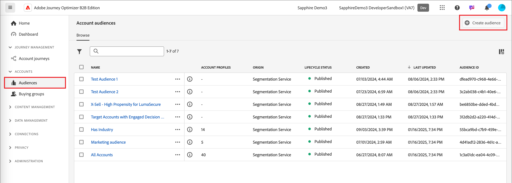

# 계정 대상자 여정 노드

여정 대상 노드는 계정에 대한 입력 계정을 정의합니다. [계정 여정을 만듭니다](./journey-overview.md#create-an-account-journey). 항상 여정 입력을 정의하는 _계정 대상자_ 노드로 시작합니다.

이 노드에 사용할 수 있는 두 가지 유형의 입력이 있습니다.

* **[계정 대상](../audiences/account-audience-overview.md)** - Experience Platform 세분화 서비스에서 동기화되는 기본 대상입니다.
* **[계정 목록](../accounts/account-lists.md)** - 대상 여정 오케스트레이션에 사용할 수 있는 명명된 계정 컬렉션입니다. 계정 목록에는 업종, 위치 또는 회사 규모 등 정의된 기준에 따라 계정이라는 이름이 지정됩니다.

_노드의 대상자를 설정하려면:_

1. **[!UICONTROL 계정 대상]** 노드를 클릭하여 오른쪽에 노드 속성을 표시합니다.

   {width="700" zoomable="yes"}

1. 계정의 입력 유형을 선택하여 여정을 입력합니다.

   * **[!UICONTROL 계정 대상자]**

     이 유형을 선택한 다음 **[!UICONTROL 계정 대상자 추가]**&#x200B;를 클릭합니다.

     _[!UICONTROL 대상 추가]_ 대화 상자에서 이전에 만든 대상 세그먼트를 선택한 다음 **[!UICONTROL 대상 추가]**&#x200B;를 클릭합니다.

     {width="700" zoomable="yes"}

   * **[!UICONTROL 계정 목록]**

     이 유형을 선택한 다음 **[!UICONTROL 계정 목록 추가]**&#x200B;를 클릭합니다.

     _[!UICONTROL 라이브 계정 목록 선택]_ 대화 상자에서 이전에 게시한 계정 목록을 선택하고 **[!UICONTROL 저장]**&#x200B;을 클릭합니다.

     {width="700" zoomable="yes"}

     계정 목록 만들기 및 게시에 대한 자세한 내용을 보려면 [계정 목록](../accounts/account-lists.md)(으)로 이동하십시오.

_대상 세그먼트를 만들려면:_

1. 왼쪽 탐색 영역에서 **[!UICONTROL 계정]** > **[!UICONTROL 대상자]**&#x200B;를 선택합니다.

1. 오른쪽 상단에서 **[!UICONTROL 대상자 만들기]**&#x200B;를 클릭합니다.

   {width="800" zoomable="yes"}

1. [세그먼테이션 서비스 안내서](https://experienceleague.adobe.com/ko/docs/experience-platform/segmentation/ui/account-audiences){target="_blank"}에 설명된 단계를 따릅니다.
