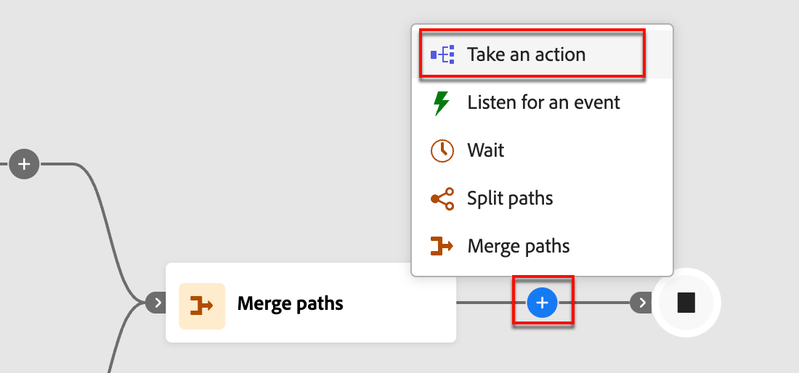

# 액션 취하기

계정 여정에서 _[!UICONTROL 작업 수행]_ 노드를 추가하여 전자 메일 보내기, 점수 변경, 구매 그룹에 할당 등의 작업을 실행할 수 있습니다. 작업은 일반적으로 이벤트나 이전 작업과 같은 일종의 트리거 결과로 발생하려는 작업입니다.

{width="30"} [개요 비디오 보기](#overview-video)

## 계정 작업

노드 경로의 계정에 속한 모든 사람에게 변경 사항을 적용하려면 계정에 대한 작업을 사용하십시오.

### 작업 및 제한 {#account-action-constraints}

| 작업 | 제한 |
| ------ | ----------- |
| [!UICONTROL 계정 변경 데이터 값] | 특성  새 값 선택 |
| [!UICONTROL 관심 있는 계정] | 유형(전자 메일, 마일스톤 또는 웹) 설명(선택 사항) |
| [!UICONTROL 여정에 계정 추가] | 라이브 계정 여정 선택 |
| [!UICONTROL 계정 목록에 추가] | 라이브 정적 계정 목록 선택 |
| [!UICONTROL 여정에서 계정 제거] | 라이브 계정 여정 선택 |
| [!UICONTROL 계정 목록에서 제거] | 라이브 정적 계정 목록 선택 |
| [!UICONTROL 판매 알림 보내기] | 솔루션 관심 항목 선택 전자 메일 보내기 |
| [!UICONTROL 구매 그룹 단계 업데이트] | 솔루션 관심 분야 선택 구매 그룹 단계 선택 |
| [!UICONTROL 구매 그룹 상태 업데이트] | 솔루션 관심 항목 선택 상태(필수, 최대 50자) |

### 계정 기반 작업 추가

1. 여정 맵으로 이동합니다.

1. 경로에서 더하기(**+**) 아이콘을 클릭하고 **[!UICONTROL 작업 수행]**&#x200B;을 선택합니다.

   {width="400"}

1. 오른쪽의 노드 속성에서 작업에 대해 **[!UICONTROL 계정]**&#x200B;을(를) 선택합니다.

1. 목록에서 작업을 선택하고 작업에 대한 값을 설정합니다.

   {width="700" zoomable="yes"}

## 사용자 작업

노드 경로의 모든 사람에게 변경 사항을 적용하려면 사람에 대한 작업을 사용하십시오. 이 노드 유형은 사람에 의한 분할 경로 또는 계정에 의한 분할 경로 내에서 사용할 수 있습니다.

### 작업 및 제한 {#people-action-constraints}

| 컨텍스트 | 작업 | 제한 |
| ------- | ------ | ----------- |
| [Journey Optimizer B2B](#journey-optimizer-b2b-actions) | [!UICONTROL 외부 고객 대상에 추가] | 외부 고객 대상자 선택 |
| | [!UICONTROL 구매 그룹에 할당] | 솔루션 관심 항목 선택 역할 선택 |
| | [!UICONTROL 데이터 값 변경] | 사용자 특성 선택 새 값 설정 |
| | [!UICONTROL 점수 변경] | 점수 이름 점수 변경 |
| | [!UICONTROL 즐거운 인물] | 유형 설명 |
| | [!UICONTROL 구매 그룹에서 제거] | 솔루션 관심 분야 선택 |
| | [!UICONTROL 전자 메일 보내기] | 새 전자 메일 만들기 Marketo Engage에서 전자 메일 선택 |
| | [!UICONTROL SMS 보내기] | SMS 만들기 |
| [Marketo Engage](#marketo-engage-actions) | [!UICONTROL 목록에 추가] | Marketo Engage 작업 공간 목록 이름 선택 |
| | [!UICONTROL Marketo Engage 요청 캠페인에 추가] | Marketo Engage 작업 공간 선택 요청 캠페인 선택 |
| | [!UICONTROL Marketo Engage에서 사람 파티션 변경] | 새 파티션 |
| | [!UICONTROL 목록에서 제거] | Marketo Engage 작업 공간 목록 이름 선택 |

### 사용자 기반 작업 추가

1. 여정 맵으로 이동합니다.

1. 경로에서 더하기(**+**) 아이콘을 클릭하고 **[!UICONTROL 작업 수행]**&#x200B;을 선택합니다.

1. 오른쪽의 노드 속성에서 작업에 대해 **[!UICONTROL 사람]**&#x200B;을(를) 선택합니다.

1. 목록에서 작업을 선택하고 작업에 대한 값을 설정합니다.

{width="700" zoomable="yes"}

### Journey Optimizer B2B 작업

Journey Optimizer B2B 사용자 기반 작업은 구성된 채널을 통해 통신을 관리하고 구매 그룹 및 계정 내에서 사용자 분류를 관리하도록 설계되었습니다. 이 여정은 개인 프로필이 있는 자격 있는 계정이 해당 노드에 도달하면 작업을 적용합니다.

+++[!UICONTROL 외부 고객 대상에 추가]

이 작업을 사용하여 구매 그룹의 구성원을 추가로 타겟팅하기 위해 유료 미디어 채널에서 활성화할 수 있는 외부 대상자로 사람들을 푸시할 수 있습니다. 이 작업은 Real-Time CDP B2B/P 에디션을 통해 실행됩니다.

>[!NOTE]
>
>개인 프로필이 있는 자격 있는 계정이 게시된 여정의 _외부 고객 대상에 추가_ 노드에 도달하면 해당 프로필이 외부 대상에 채워지는 데 최대 48시간이 걸릴 수 있습니다.

{width="300"}

이 사람 기반 작업을 선택하면 새 외부 대상을 만들거나 기존 외부 대상에서 선택할 수 있습니다. 기존 대상의 경우 Journey Optimizer B2B edition에서만 만든 외부 고객 대상 중에서 선택할 수 있습니다. 대상을 만들고 이 여정 작업에 사용할 때는 대상을 연결해야 합니다. 자세한 내용은 Experience Platform 설명서에서 [새 대상 연결 만들기](https://experienceleague.adobe.com/ko/docs/experience-platform/destinations/ui/connect-destination){target="_blank"} 및 [활성화 개요](https://experienceleague.adobe.com/ko/docs/experience-platform/destinations/ui/activate/activation-overview#activate-audiences-from-the-destinations-catalog){target="_blank"}를 참조하십시오.

{width="30"} [유료 미디어 오케스트레이션에 대한 비디오 개요 보기](../data/linkedin-account-matched-audiences.md#orchestrate-paid-media-engagement)

_외부 대상자를 만들려면:_

1. **[!UICONTROL 새로 만들기]**&#x200B;를 선택하세요.

1. **[!UICONTROL 외부 고객 대상 만들기]**&#x200B;를 클릭합니다.

1. 새 외부 대상에 대해 **[!UICONTROL 이름]**(필수)과 **[!UICONTROL 설명]**(선택 사항)을 입력하십시오.

   {width="300"}

1. **[!UICONTROL 만들기]**&#x200B;를 클릭합니다.

   시스템이 새 대상을 만들고 확인 메시지를 표시합니다. 그런 다음 계속 진행하여 노드 작업의 기존 대상자로 사용할 수 있습니다.

   >[!NOTE]
   >
   >Journey Optimizer B2B edition에서 새 외부 고객 대상을 만들면 더미 레코드(`test@email.com`)로 시드됩니다. 이 레코드는 첫 번째 실제 프로필이 여정에서 외부 대상에 추가되자마자 덮어쓰여집니다.

_기존 대상자를 사용하려면:_

1. **[!UICONTROL 외부 고객 대상 선택]**&#x200B;을 클릭합니다.

1. 대화 상자에서 사용할 대상자를 선택합니다.

   {width="700" zoomable="yes"}

1. **[!UICONTROL 대상 추가]**&#x200B;를 클릭합니다.

+++

+++[!UICONTROL 구매 그룹에 할당]

선택한 솔루션 관심 분야 및 역할을 기반으로 [구매 그룹](../buying-groups/buying-groups-overview.md)에 사용자 프로필을 추가하려면 이 작업을 사용하십시오.

{width="300"}

+++

+++[!UICONTROL 데이터 값 변경]

이 작업을 사용하여 [사람 프로필 특성](../data/field-mapping.md#xdm-business-person-attributes)의 값을 변경합니다. 속성을 선택한 다음 새 값을 설정합니다.

{width="300"}

+++

+++[!UICONTROL 점수 변경]

이 작업을 사용하여 Marketo Engage에서 개인 점수를 변경합니다. [자세히 알아보기](https://experienceleague.adobe.com/ko/docs/marketo-learn/tutorials/lead-and-data-management/lead-scoring-learn){target="_blank"}

{width="300"}

+++

+++[!UICONTROL 즐거운 인물]

이 작업을 사용하여 사용자 프로필에 대한 흥미로운 순간을 기록합니다. 유형(이메일, 마일스톤 또는 웹)을 선택하고 설명을 추가합니다(선택 사항).

{width="300"}

+++

+++[!UICONTROL 구매 그룹에서 제거]

선택한 솔루션 관심사를 기준으로 [구매 그룹](../buying-groups/buying-groups-overview.md)에서 사람 프로필을 제거하려면 이 작업을 사용하세요.

{width="300"}

+++

+++[!UICONTROL 전자 메일 보내기]

이 작업을 사용하여 이메일을 보냅니다. 노드에 대해 [전자 메일을 만들고](../content/add-email.md#add-an-email-to-your-journey)한 후에는 전자 메일 디자인 공간에서 전자 메일 메시지를 디자인하고, 개인화하고, 미리 볼 수 있습니다([전자 메일 작성](../content/email-authoring.md) 참조). Marketo Engage에서 [전자 메일](https://experienceleague.adobe.com/ko/docs/marketo/using/product-docs/email-marketing/general/creating-an-email/create-an-email){target="_blank"}을 보낼 수도 있습니다. Marketo Engage 작업 영역을 선택한 다음 전송할 이메일을 선택합니다.

{width="300"}

+++

+++[!UICONTROL SMS 보내기]

이 작업을 사용하여 SMS 메시지를 보냅니다. 비주얼 디자이너에서 SMS 메시지를 만들고 개인화하고 미리 볼 수 있습니다([SMS 작성](../content/sms-authoring.md) 참조).

{width="300"}

+++

### Marketo Engage 작업

Marketo Engage 사용자 기반 작업은 Journey Optimizer B2B edition에서의 계정 기반 마케팅 오케스트레이션과 Marketo Engage에서의 리드 기반 마케팅 노력을 조정하도록 설계되었습니다. 이러한 작업을 사용하여 목록 멤버십, 사용자 파티션 및 캠페인 요청을 조정합니다.

+++[!UICONTROL 목록에 추가]

Marketo Engage의 [스마트 목록](https://experienceleague.adobe.com/ko/docs/marketo/using/product-docs/core-marketo-concepts/smart-lists-and-static-lists/understanding-smart-lists){target="_blank"}에서 사용자를 제거하려면 이 작업을 사용하세요.

먼저 연결된 Marketo Engage 인스턴스에서 작업 영역을 선택합니다. 그런 다음 목록 이름을 선택합니다.

{width="300"}

+++

+++[!UICONTROL Marketo 요청 캠페인에 추가]

이 작업을 사용하여 Marketo Engage의 [요청 캠페인](https://experienceleague.adobe.com/ko/docs/marketo/using/product-docs/core-marketo-concepts/smart-campaigns/flow-actions/request-campaign){target="_blank"}에 사용자 프로필을 추가하십시오.

먼저 연결된 Marketo Engage 인스턴스에서 작업 영역을 선택합니다. 그런 다음 요청 캠페인 이름을 선택합니다.

{width="300"}

+++

+++[!UICONTROL Marketo Engage에서 사람 파티션 변경]

이 작업을 사용하여 Marketo Engage에서 [개인 파티션](https://experienceleague.adobe.com/ko/docs/marketo/using/product-docs/administration/workspaces-and-person-partitions/understanding-workspaces-and-person-partitions#person-partitions){target="_blank"}을(를) 변경할 수 있습니다.

{width="300"}

+++

+++[!UICONTROL 목록에서 제거]

Marketo Engage의 [스마트 목록](https://experienceleague.adobe.com/ko/docs/marketo/using/product-docs/core-marketo-concepts/smart-lists-and-static-lists/understanding-smart-lists){target="_blank"}에서 사용자를 제거하려면 이 작업을 사용하세요. 먼저 연결된 Marketo Engage 인스턴스에서 작업 영역을 선택합니다. 그런 다음 목록 이름을 선택합니다.

{width="300"}

개인 프로필이 스마트 목록의 멤버가 아닌 경우 작업이 무시됩니다.

+++

## 개요 비디오

>[!VIDEO](https://video.tv.adobe.com/v/3443207/?learn=on)
