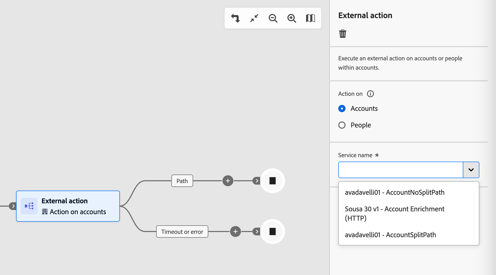

# 외부 노드

외부 노드를 사용하여 계정 여정을 외부 서비스에 연결합니다. 계정 대상이 이러한 노드 중 하나에 도달하면 Journey Optimizer B2B edition은 대상 속성 데이터를 외부 서비스에 비동기적으로 전송합니다. 이 서비스는 데이터를 처리하고 콜백을 사용하여 응답하며, 여정이 계속하기 위해 사용하는 대상 정보와 메타데이터를 반환합니다.

>[!NOTE]
>
>외부 작업 여정은 계정 노드에서만 사용할 수 있습니다. 직접 방문 여정은 지원되지 않습니다.
>
>마케터가 여정에서 이러한 노드를 추가하고 구현하기 전에 관리자가 [외부 작업을 구성하고 활성화](../admin/configure-external-actions.md)해야 합니다.

외부 작업 노드 유형에는 두 가지가 있습니다.

* **[외부 작업](#external-action)** - 외부 서비스를 호출하고 하나의 송신 경로를 따라 계속합니다. 외부 시스템에서 레코드를 업데이트하거나 다운스트림 서비스로 신호를 보내는 것과 같이 분기 논리 없이 외부 프로세스를 트리거하려면 이 노드를 사용합니다.
* **[외부 분할 경로](#external-split-paths)** - 외부 서비스를 호출하고 응답을 평가하여 여러 정의된 경로 중 하나를 따라 계정을 라우팅합니다. 외부 서비스가 여정의 다음 단계를 결정하는 점수, 계층 또는 분류와 같은 값을 반환하는 경우 이 노드를 사용합니다.

## 외부 작업 노드 {#external-action}

_외부 작업_ 노드는 외부 서비스를 호출하고 응답 내용과 관계없이 하나의 송신 경로를 따라 계속합니다. 외부 호출 후에 분기가 필요하지 않은 통합에 사용합니다.

1. 계정 여정 맵으로 이동합니다.

1. 경로에서 더하기(**+**) 아이콘을 클릭하고 **[!UICONTROL 외부 작업]**&#x200B;을 선택합니다.

   {width="400"}

1. 오른쪽의 노드 속성에서 외부 작업에 대한 **[!UICONTROL Action on]** 컨텍스트를 설정합니다.

   * 노드 경로의 계정에 속한 모든 사람에게 외부 작업을 적용하려면 **[!UICONTROL 계정]**&#x200B;을 선택하세요.
   * 노드 경로에 있는 모든 사람에게 변경 내용을 적용하려면 **[!UICONTROL 사람]**&#x200B;을 선택하세요.

1. 외부 **[!UICONTROL 서비스 이름]**&#x200B;을(를) 선택하십시오.

   {width="600" zoomable="yes"}

   목록에는 _외부 작업_ 형식 및 컨텍스트에 대해 활성화되고 지정된 구성된 모든 외부 작업이 포함되어 있습니다.

1. 서비스에 전역 속성이 있는 경우 서비스 이름 아래에 표시되는 필드에 필수 값을 입력합니다.

1. 노드의 송신 경로에서 여정을 계속 빌드합니다.

   _[!UICONTROL 시간 초과 또는 오류]_ 경로가 자동으로 만들어집니다. 응답이 수신되기 전에 시간 제한 기간(서비스에 구성된 대로)이 경과하면 계정 또는 사용자는 이 경로 아래로 진행됩니다. 오류 응답이 수신된 경우에도 마찬가지입니다. 이 경로에 여정 노드를 추가하여 이러한 시나리오를 처리할 수 있습니다. 그렇지 않으면 대상 구성원에 대한 여정이 종료됩니다.

## 외부 분할 경로 노드 {#external-split-paths}

외부 분할 경로 노드는 외부 서비스를 호출하고 응답을 사용하여 다음에 수행할 경로 계정을 결정합니다. 각 경로는 외부 서비스에서 반환한 변수(접근자)를 기반으로 한 조건으로 정의됩니다. 여정은 정의된 경로 조건에 대해 응답을 평가하고 첫 번째 일치하는 경로를 따라 각 계정을 라우팅합니다. 경로 조건은 하향식으로 평가됩니다. 각 계정은 조건이 외부 서비스에서 반환한 값과 일치하는 첫 번째 경로를 따라 진행합니다.

1. 계정 여정 맵으로 이동합니다.

1. 경로에서 더하기(**+**) 아이콘을 클릭하고 **[!UICONTROL 외부 분할 경로]**&#x200B;를 선택합니다.

   {width="400"}

1. 오른쪽의 노드 속성에서 **[!UICONTROL 다음 기준으로 경로 분할]** 유형을 선택합니다.

   * **[!UICONTROL 계정]** - 계정별로 분할된 경로의 경우 정의된 경로 내에 계정과 사용자 노드를 모두 추가할 수 있습니다.
   * **[!UICONTROL 사람]** - 사람별로 분할된 경로의 경우 정의된 경로 내에 사람 작업 노드만 추가할 수 있습니다. 사용자 기반 분할은 _[!UICONTROL 경로 병합]_ 노드를 사용하여 자동으로 닫히므로 모든 사용자가 계정 컨텍스트를 손실하지 않고 다음 단계로 이동할 수 있습니다.

1. **[!UICONTROL 서비스 이름]**&#x200B;을(를) 선택하십시오.

1. 서비스 구성에 _전역 특성_&#x200B;이 있는 경우 서비스 이름 아래에 나타나는 필드에 필요한 값을 입력하십시오.

1. _[!UICONTROL 경로 1]_&#x200B;에 대해 분기 조건을 정의합니다.

   * **[!UICONTROL Label]**&#x200B;의 경우 기본값을 더 설명적인 레이블로 바꾸십시오.
   * **[!UICONTROL 변수 선택]**&#x200B;에 대해 접근자를 선택하십시오. 접근자는 외부 서비스에 의해 반환되는 값이며 작업이 구성될 때 정의됩니다.
   * **[!UICONTROL 연산자 선택]**&#x200B;에 대해 연산자를 선택합니다.
   * **[!UICONTROL 값을 입력]**&#x200B;하려면 일치시킬 값을 입력하십시오.

   {width="600" zoomable="yes"}

   >[!NOTE]
   >
   >사용 가능한 조건 변수 및 지원되는 여정 컨텍스트(_계정_, _사용자_ 또는 _계정의 사용자_)는 외부 작업 구성에 의해 결정됩니다. 예상 서비스 또는 변수를 사용할 수 없는 경우 관리자에게 문의하십시오.

1. 경로를 더 추가하려면 **[!UICONTROL 경로 추가]**&#x200B;를 클릭하고 필요한 각 경로에 대한 조건을 정의합니다.

1. 노드의 각 송신 경로에서 여정을 계속 빌드합니다.

   _[!UICONTROL 시간 초과 또는 오류]_ 경로가 자동으로 만들어집니다. 응답이 수신되기 전에 시간 제한 기간(서비스에 구성된 대로)이 경과하면 계정 또는 사용자는 이 경로 아래로 진행됩니다. 오류 응답이 수신된 경우에도 마찬가지입니다. 이 경로에 여정 노드를 추가하여 이러한 시나리오를 처리할 수 있습니다. 그렇지 않으면 대상 구성원에 대한 여정이 종료됩니다.

1. _계정별로 분할_&#x200B;의 경우 [경로 병합 노드](./split-merge-paths-nodes.md#merge-paths)을 추가하여 필요에 따라 두 개 이상의 경로를 결합할 수 있습니다.
