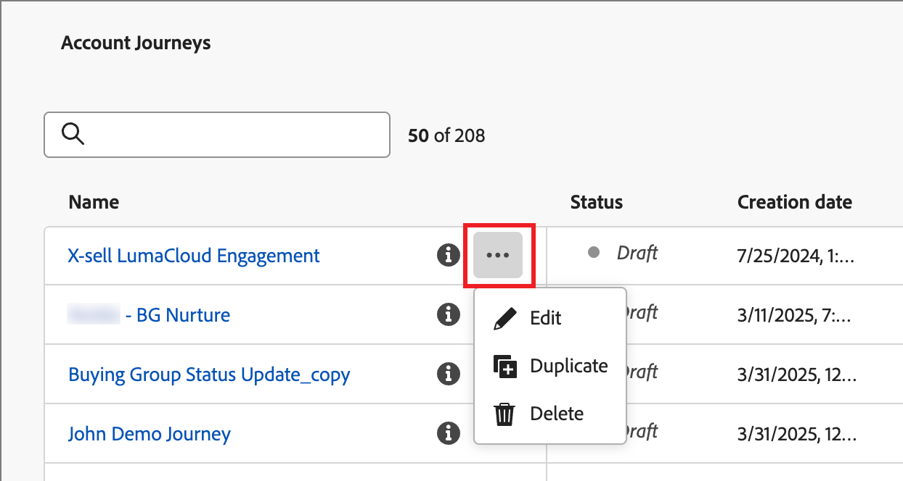

# 계정 여정

계정 여정을 통해 수요 창출과 구매 그룹 선별 과정을 간소화하고, 신규 고객 확보, 업셀/크로스셀 및 유지 프로그램을 위한 더 높은 품질의 수요를 유도할 수 있습니다. 이메일, SMS, 이벤트 등에서 자동화된 참여를 활용하여 각 구매 그룹 및 구매 그룹 멤버에 맞게 여정을 조정할 수 있습니다.

이메일, SMS 등의 내부 계정 여정을 포함하는 판매 중심 참여를 정의하여 각 구매 그룹 멤버의 인바운드 마케팅과 아웃바운드 판매 활동을 조정하십시오.

{width="30"} [개요 비디오 보기](#overview-video)

## 여정 시작

계정 여정을 시작하려면 다음 작업을 수행하십시오.

1. [여정을 만듭니다](./create-publish-journey.md#create-an-account-journey).
1. 여정 맵에 [노드를 추가](./create-publish-journey.md#add-a-node)하고 [여정 흐름을 정의](./create-publish-journey.md#add-and-delete-a-path)합니다.
1. [여정을 게시합니다](./create-publish-journey.md#publish-an-account-journey).

## 계정 여정 액세스 및 탐색

왼쪽 내비게이션에서 **[!UICONTROL 계정 관리]**&#x200B;를 펼치고 **[!UICONTROL 계정 여정]**&#x200B;을 클릭합니다.

목록 상단의 _검색_ 도구에 텍스트를 입력하면 표시된 목록을 이름으로 필터링할 수 있습니다.

{width="800" zoomable="yes"}

_[!UICONTROL 계정 여정]_ 목록 페이지에는 다음과 같은 열이 포함됩니다.

* [!UICONTROL 이름] (이름을 클릭하면 편집할 여정이 열림)
* [!UICONTROL 상태]
* [!UICONTROL 설명]
* [!UICONTROL 생성자]
* [!UICONTROL 마지막 업데이트일]
* [!UICONTROL 마지막으로 업데이트한 사람]
* [!UICONTROL 게시일]
* [!UICONTROL 게시자]

열 헤더를 클릭하면 _[!UICONTROL 상태]_&#x200B;별로 목록을 정렬할 수 있습니다.

오른쪽 상단에 있는 _표 사용자 정의_() 아이콘을 클릭하면 표에 표시되는 열을 사용자 정의할 수 있습니다. 대화 상자에서 확인란을 선택하거나 선택 취소하고 **[!UICONTROL 적용]**&#x200B;을 클릭합니다.

{width="800" zoomable="yes"}

## 계정 여정 구조

_[!UICONTROL 계정 여정]_&#x200B;목록에서 이름(링크로 표시됨)을 클릭하면 세부 정보를 검토하고, 변경하고, 액션을 취할 수 있습니다.

{width="800" zoomable="yes"}

각 계정 여정 맵의 헤더에는 다음이 포함됩니다.

* 여정 이름
* 여정 이름 편집 도구 ( _편집_ 아이콘)
* 여정 상태

여정 상태는 적용하는 액션에 따라 변경될 수 있습니다. 여정의 상태에 따라 헤더 오른쪽의 특정 액션이 사용 가능하거나 사용 불가할 수 있습니다.

| 상태 | 설명 | 사용 가능한 액션 |
| ------ | ----------- | ----------------- |
| _**초안**_ | 편집 가능한 게시되지 않은 여정입니다. | <li>[게시](./create-publish-journey.md#publish-an-account-journey)<li>[복제](#duplicate-journey) <li>[삭제](#delete-journey) |
| _**라이브**_ | 여정이 게시되면 여정 상태가 “초안”에서 “진행 중”으로 변경됩니다. 이 상태에서는 더 이상 편집할 수 없습니다. | <li>[복제](#duplicate-journey)<li>[새로운 참여 마감](#close-to-new-entries) <li>[중단](#abort-journey) |
| _**새로운 참여 마감됨**_ | 상단 탐색 영역에서 [!UICONTROL 새로운 참여 마감]을 클릭하면 여정 상태가 _진행 중_&#x200B;에서 _새로운 참여 마감됨_&#x200B;으로 변경됩니다. | <li>[복제](#duplicate-journey) <li>[중단](#abort-journey) |
| _**중단됨**_ | 여정을 중단하면 여정 상태가 _진행 중_ 또는 _새로운 참여 마감됨_&#x200B;으로 변경됩니다. 중단된 여정은 다시 시작할 수 없습니다. | <li>[복제](#duplicate-journey) <li>[삭제](#delete-journey) |
| _**완료됨**_ | 여정에 있는 모든 계정이 여정을 완료하면 상태가 _진행 중_ 또는 _새로운 참여 마감됨_&#x200B;에서 _완료됨_&#x200B;으로 변경됩니다. | <li>[복제](#duplicate-journey) <li>[삭제](#delete-journey) |

## 여정 관리

_계정 여정_ 목록에는 Journey Optimizer B2B Edition 인스턴스의 모든 여정이 포함됩니다.

### 여정 중단

진행 중 또는 예약된 여정을 중단하면 여정에 있는 계정의 진행이 즉시 중단되며 더 이상 여정에 참여할 수 없게 됩니다. 중단된 여정은 다시 시작할 수 없습니다.

>[!IMPORTANT]
>
>계정 여정이 _[!UICONTROL (다른) 여정에 계정 추가]_ 액션이 있는 _액션 취하기_ 노드에서 다른 여정으로 사용될 때 여정을 중단하면 해당 여정에서 해당 액션이 차단됩니다.

1. 여정 이름을 클릭하여 엽니다.

1. 오른쪽 상단의 **[!UICONTROL 자세히...]** 메뉴를 클릭하고 **[!UICONTROL 중단]**&#x200B;을 선택합니다.

   {width="450"}

1. 확인 대화 상자에서 **[!UICONTROL 중단]**&#x200B;을 클릭합니다.

### 새로운 참여 마감

진행 중인 여정을 마감하면 현재 여정에 있는 계정은 여정에서 경로를 계속 이어가며 더 이상 여정에 참여할 수 없게 됩니다. 마감된 여정은 다시 시작할 수 없습니다. 마감된 여정을 복제할 수 있습니다.

>[!IMPORTANT]
>
>계정 여정이 _(다른) 여정에 계정 추가_ 액션이 있는 _[!UICONTROL 액션 취하기]_ 노드에서 다른 여정으로 사용될 때 새로운 참여를 마감하면 해당 여정에서 해당 액션이 차단됩니다.

1. 여정 이름을 클릭하여 엽니다.

1. 오른쪽 상단의 **[!UICONTROL 자세히...]** 메뉴를 클릭하고 **[!UICONTROL 새로운 참여 마감]**&#x200B;을 선택합니다.

1. 확인 대화 상자에서 **[!UICONTROL 새로운 참여 마감]**&#x200B;을 클릭합니다.

### 여정 복제

복제 액션은 복제 함수와 유사하지만 복제된 여정에는 생성된 여정 콘텐츠 자산이 포함되지 않습니다. 계정 여정의 세부 정보를 복제하거나 흐름 및 경로 구조에 대한 간단한 _스켈레톤_&#x200B;을 복제할 수 있습니다.

1. 여정 이름 옆에 _자세히_ 아이콘(**...**)을 클릭하고 **[!UICONTROL 복제]**&#x200B;를 선택합니다.

   {width="450"}

   계정 여정의 상태에 따라 여정 세부 정보 또는 여정 맵에서 복제 액션에 액세스할 수도 있습니다.

   * 초안 여정의 경우 오른쪽 상단의 **[!UICONTROL 자세히...]** 메뉴를 선택하고 **[!UICONTROL 복제]**&#x200B;를 선택합니다.

   * 그 밖의 모든 여정 상태의 경우 오른쪽 상단의 **[!UICONTROL 복제]**&#x200B;를 클릭합니다.

     {width="450"}

1. _여정 복제_ 대화 상자에서 새로운 여정에 대한 **[!UICONTROL 이름]** 및 **[!UICONTROL 설명]**&#x200B;을 설정합니다.

   기본적으로 대화 상자는 __copy_&#x200B;가 붙은 복제된 여정의 이름을 사용합니다. 필요한 경우 여정에 대한 다른 고유한 이름을 입력합니다.

   {width="400"}

1. 복제 **[!UICONTROL 유형]** 선택:

   * **[!UICONTROL 일부 콘텐츠 복제]** - 이 유형을 사용하면 작성된 이메일이나 SMS 메시지를 제외한 여정의 모든 내용을 복사할 수 있습니다. Marketo Engage 이메일 또는 SMS 메시지를 참조하는 노드는 완전히 손상되지 않았습니다.

   * **[!UICONTROL 세부 정보 없이 복제]** - 이 유형을 사용하면 노드 구조와 경로만 복사합니다. 모든 노드 설정과 경로 조건은 정의되지 않으므로(기본값), 다양한 대상자, 작업 및 경로 분할 설정으로 기본 흐름을 재사용할 수 있습니다. 모든 _대기_ 노드는 기본값인 5일을 사용합니다.

1. **[!UICONTROL 복제]**&#x200B;를 클릭합니다.

   복제된 계정 여정은 여정 맵에서 열리며, 필요한 경우 세부 사항을 설정하고 여정 콘텐츠를 만들 수 있습니다.

### 여정 삭제

삭제 액션을 사용하여 여정을 영구적으로 삭제합니다. 진행 중이거나 예약된 여정은 삭제할 수 없습니다.

1. 여정 이름 옆에 _자세히_ 아이콘(**...**)을 클릭하고 **[!UICONTROL 삭제]**&#x200B;를 선택합니다.

   계정 여정의 상태에 따라 여정 세부 정보 또는 여정 맵에서 삭제 액션에 액세스할 수도 있습니다.

   * 초안 여정의 경우 오른쪽 상단의 **[!UICONTROL 자세히...]** 메뉴를 선택하고 **[!UICONTROL 삭제]**&#x200B;를 선택합니다.

   * 그 밖의 여정 상태, 예: _완료됨_ 또는 _중단됨_&#x200B;의 경우, 오른쪽 상단의 **[!UICONTROL 삭제]**&#x200B;를 클릭합니다.

1. 확인 대화 상자에서 **[!UICONTROL 삭제]**&#x200B;를 클릭합니다.

## 계정 진행 상황 검토

게시된 여정이 _라이브_, _새로운 참여 마감됨_, _중단됨_ 또는 _완료됨_ 상태인 경우 여정 맵을 열어 여정 노드에 대한 계정 진행 상황을 검토할 수 있습니다. 맵의 각 노드에는 해당 노드에 도달한 계정 수가 표시되며, 라이브 여정의 경우 현재 해당 노드에 있는 계정 수가 표시됩니다.

{width="400"}

노드를 선택하면 숫자를 클릭하여 노드에 진입했거나 현재 여정의 해당 단계에 있는 계정 목록을 볼 수 있습니다.

{width="700" zoomable="yes"}

## 개요 비디오

>[!VIDEO](https://video.tv.adobe.com/v/3443202/?learn=on)
