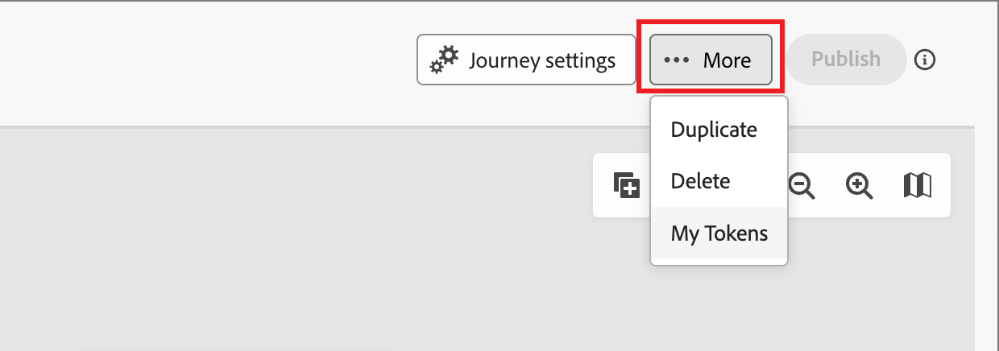

# 여정 재입력

_계정 여정 전용_

계정 여정에 대해 재입력을 활성화할 때, 계정이 동일한 여정에 재입력할 수 있는 시기와 빈도를 제어할 수 있습니다. 재입력 설정을 사용하여 통제된 방식으로 계정이 여정에 대해 재인증되도록 기준, 제한 및 대기 시간을 설정합니다.

다음 항목이 true인 경우 계정은 여정에 대해 재인증할 수 있습니다.

* 계정은 여정에 대해 허용되는 재입력 수 이내입니다.
* 계정이 대기 시간 임계값(다시 요청하기 전에 대기할 최소 시간)을 충족했습니다.
* 계정이 현재 여정에 없습니다.

## 계정 여정 재입력 활성화

여정이 _초안_ 상태일 때 다시 입력을 활성화하고 다시 입력 설정을 변경할 수 있습니다.

1. 초안 계정 여정을 엽니다.

1. 오른쪽 상단의 **[!UICONTROL 자세히..]** 메뉴를 클릭하고 **[!UICONTROL 다시 입력]**&#x200B;을 선택합니다.

   {width="450"}

1. _[!UICONTROL 여정 다시 입력]_ 대화 상자에서 **[!UICONTROL 다시 입력 사용]** 옵션을 전환합니다.

   이 기능이 활성화되면 시간, 지연 및 제한에 대한 옵션이 표시됩니다.

   기능이 활성화된 {width="450"}

1. **[!UICONTROL 다시 시작 시간]**&#x200B;에 대해 대기 계산 방법을 선택하십시오.

   * **[!UICONTROL 여정 끝에서 대기]** - 계정이 종료되거나 여정이 완료되면 대기 기간이 시작됩니다. 예를 들어 &quot;계정이 여정을 완료한 후 30일이 지나면 다시 입력할 수 있습니다.&quot;

   * **[!UICONTROL 여정 시작부터 대기]** - 대기 기간은 계정이 여정에 처음 입력된 시기를 기준으로 합니다. 예를 들어 &quot;계정이 여정을 시작한 후 30일이 지나면 다시 입력할 수 있습니다.&quot;

1. 대기 기간인 **[!UICONTROL 다시 입력 지연]**&#x200B;을(를) 시간 또는 일 단위로 설정합니다.

   이 설정은 여정을 종료하거나 시작한 후 계정이 다시 들어갈 수 있을 때까지 기다려야 하는 시간을 결정합니다.

1. **[!UICONTROL 시작 제한]**&#x200B;을(를) 설정하여 계정이 여정을 입력할 수 있는 최대 횟수를 정의합니다.

   여정이 한도에 도달하면, 한도를 재설정하거나 계정이 새 한도로 다시 게시될 때까지 더 이상 입력할 수 없습니다.

   이 제한은 해당 여정의 계정마다 적용됩니다.

1. **[!UICONTROL 저장]**&#x200B;을 클릭합니다.

## 계정 진행 및 활동

게시된 계정 여정의 경우 여정 맵에는 여정 노드에 대한 [계정 진행률](./journeys-overview.md#review-account-progression)이 표시됩니다. 맵의 각 노드에는 해당 노드에 도달할 계정의 수가 표시되며, 라이브 여정의 경우 현재 해당 노드에 있는 계정의 수가 표시됩니다. 계정이 여정을 다시 입력할 때마다 개별 항목으로 계산됩니다.
<!-- You can see how many times accounts have entered the journey. ?? -->

[계정 세부 정보](../accounts/account-details.md)(으)로 드릴인하면 계정이 여정에 들어갈 때마다 계정 활동이 표시됩니다. 여기에는 명시적 활동 및 반복 횟수가 포함되어 있으므로 재입력사항을 명확하게 볼 수 있습니다.
