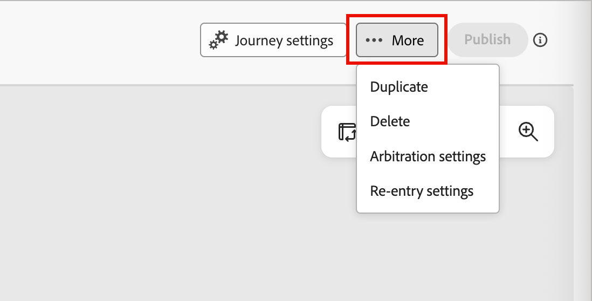

# 여정 재입력

여정 재입력을 활성화할 때 계정이나 개인이 동일한 여정을 재입력할 수 있는 시기와 빈도를 제어할 수 있습니다. 계정이나 사용자가 제어된 방식으로 여정을 다시 확인할 수 있도록 기준, 제한 및 대기 시간을 설정하려면 재입력 설정을 사용하십시오.

다음 항목이 참인 경우 계정 또는 사용자는 여정을 재인증할 수 있습니다.

* 계정 또는 개인이 여정에 대해 허용된 재입력 수 내에 있습니다.
* 계정 또는 사용자가 대기 시간 임계값(다시 요청하기 전에 대기할 최소 시간)을 충족했습니다.
* 계정이나 개인이 현재 여정에 없습니다.

## 여정 재입력 활성화

여정이 _초안_ 상태일 때 다시 입력을 활성화하고 다시 입력 설정을 변경할 수 있습니다.

>[!BEGINTABS]

>[!TAB 계정 여정]

1. 초안 계정 여정을 엽니다.

1. 오른쪽 상단의 **[!UICONTROL 자세히..]** 메뉴를 클릭하고 **[!UICONTROL 다시 입력]**&#x200B;을 선택합니다.

   {width="450"}

1. _[!UICONTROL 여정 다시 입력]_ 대화 상자에서 **[!UICONTROL 다시 입력 사용]** 옵션을 전환합니다.

   이 기능이 활성화되면 시간, 지연 및 제한에 대한 옵션이 표시됩니다.

   기능이 활성화된 계정 여정에 대한 {width="450"}

1. **[!UICONTROL 다시 시작 시간]**&#x200B;에 대해 대기 계산 방법을 선택하십시오.

   * **[!UICONTROL 여정 끝에서 대기]** - 계정이 종료되거나 여정이 완료되면 대기 기간이 시작됩니다. 예를 들어 &quot;계정이 여정을 완료한 후 30일이 지나면 다시 입력할 수 있습니다.&quot;

   * **[!UICONTROL 여정 시작부터 대기]** - 대기 기간은 계정이 여정에 처음 입력된 시기를 기준으로 합니다. 예를 들어 &quot;계정이 여정을 시작한 후 30일이 지나면 다시 입력할 수 있습니다.&quot;

1. 대기 기간인 **[!UICONTROL 다시 입력 지연]**&#x200B;을(를) 시간 또는 일 단위로 설정합니다.

   이 설정은 여정을 종료하거나 시작한 후 계정이 다시 들어갈 수 있을 때까지 기다려야 하는 시간을 결정합니다.

1. 계정이 여정을 입력할 수 있는 최대 횟수를 정의하려면 **[!UICONTROL 시작 제한]**&#x200B;을 설정하십시오.

   여정이 한도에 도달하면, 한도를 재설정하거나 계정이 새 한도로 다시 게시될 때까지 더 이상 입력할 수 없습니다.

   이 제한은 해당 여정의 계정마다 적용됩니다.

1. **[!UICONTROL 저장]**&#x200B;을 클릭합니다.

>[!TAB 개인 여정]

1. 초안 개인 여정을 엽니다.

1. 오른쪽 상단의 **[!UICONTROL 자세히..]** 메뉴를 클릭하고 **[!UICONTROL 다시 시작 설정]**&#x200B;을 선택합니다.

   {width="450"}

1. _[!UICONTROL 여정 다시 입력]_ 대화 상자에서 **[!UICONTROL 다시 입력 사용]** 옵션을 전환합니다.

   이 기능이 활성화되면 시간, 지연 및 제한에 대한 옵션이 표시됩니다.

   {width="450"}

1. **[!UICONTROL 다시 시작 시간]**&#x200B;에 대해 대기 계산 방법을 선택하십시오.

   * **[!UICONTROL 여정 끝에서 대기]** - 대기 기간은 사용자가 여정을 종료하거나 완료할 때 시작됩니다. 예를 들어 &quot;여정을 완료한 후 30일이 지나면 다시 입력할 수 있습니다.&quot;

   * **[!UICONTROL 여정 시작부터 대기]** - 대기 기간은 사용자가 여정에 처음 들어간 때를 기준으로 합니다. 예를 들어 &quot;여정을 시작한 후 30일이 지나면 다시 입력할 수 있습니다.&quot;

1. 대기 기간인 **[!UICONTROL 다시 입력 지연]**&#x200B;을(를) 시간 또는 일 단위로 설정합니다.

   이 설정은 사용자가 여정을 종료하거나 시작한 후 다시 입장하기 위해 기다려야 하는 시간을 결정합니다.

1. 여정에 대한 개인의 최대 입장 허용 횟수를 정의하려면 **[!UICONTROL 입장 제한]**&#x200B;을 설정하십시오.

   한도에 도달하면, 한도가 재설정되거나 여정이 새 한도로 다시 게시될 때까지 더 이상 시작할 자격이 없습니다.

   이 제한은 해당 여정에 대해 개인별로 적용됩니다.

1. **[!UICONTROL 저장]**&#x200B;을 클릭합니다.

>[!ENDTABS]

## 진행 및 활동

게시된 계정 또는 사용자 여정의 경우 여정 캔버스에는 여정 노드에 대한 [진행률](./journeys-overview.md#review-account-progression)이 표시됩니다. 각 노드에는 해당 노드에 도달할 계정 또는 사용자의 수가 표시되며, 라이브 여정의 경우 현재 해당 노드에 있는 수가 표시됩니다. 계정이나 사용자가 여정을 다시 입력할 때마다 개별 항목으로 계산됩니다.

<!-- 
You can see how many times accounts have entered the journey. ?? 

When you drill in to [account details](../accounts/account-details.md), the account activity shows each time the account entered the journey. It includes explicit activity and a recurrence count so that you can see re-entries clearly.
-->
