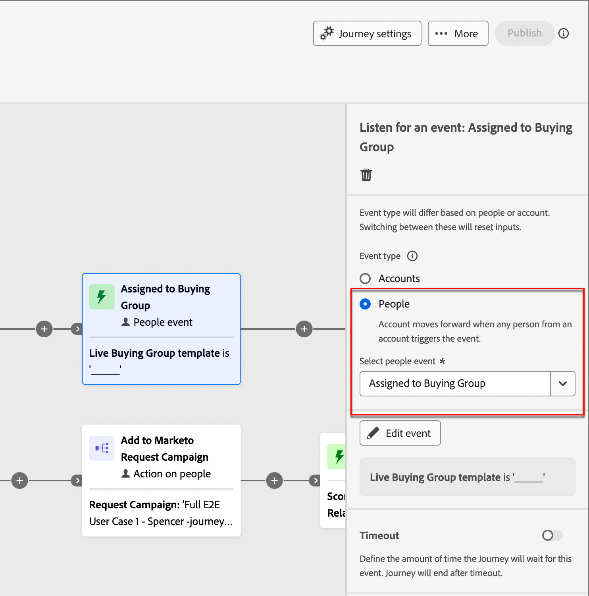

# 이벤트 듣기

이벤트가 발생할 때 대상을 [여정](./journeys-overview.md)의 다음 단계로 이동하려면 _이벤트 수신_ 노드를 추가하십시오. 여정 유형에 따라 이 노드를 사용하여 사람 또는 계정 이벤트에 따라 여정의 다음 노드를 트리거할 수 있습니다.

<!--
{width="30", vertical-align="middle"} [Watch the overview video](#overview-video)
-->

## 계정 여정 {#account-journeys}

>[!NOTE]
>
>계정 여정의 경우 사용자가 분할된 경로에 _[!UICONTROL 이벤트 수신]_ 노드 유형을 추가할 수 없습니다.

1. 계정 여정 캔버스를 엽니다.

1. 경로에서 더하기(**+**) 아이콘을 클릭하고 **[!UICONTROL 이벤트 수신]**&#x200B;을 선택합니다.

   {width="400"}

1. 오른쪽의 노드 속성에서 _이벤트 유형_ 선택기를 사용하여 **[!UICONTROL 계정]**&#x200B;과(와) **[!UICONTROL 사람]** 중에서 선택하십시오.

1. 목록에서 이벤트를 선택합니다.

   * _사람_ 이벤트 유형에 대해 트리거에 사용할 [사람 이벤트](#people-events)를 선택하십시오.

     {width="500" zoomable="yes"}

   * _계정_ 이벤트 유형의 경우 트리거에 사용할 [계정 이벤트](#account-events)를 선택하십시오.

     {width="500" zoomable="yes"}

1. **[!UICONTROL 이벤트 편집]**&#x200B;을 클릭하고 이벤트에 대한 세부 정보를 정의하십시오.

   선택한 이벤트 유형 및 이벤트에 따라 이벤트 일치 기준을 정의합니다.

   * [사용자 이벤트](#people-events)
   * [계정 이벤트](#account-events)

   이벤트에 [필터](#filters-people-event)를 포함할 수도 있습니다.

1. **[!UICONTROL 완료]**&#x200B;를 클릭합니다.

   이벤트 및 필터 정의는 노드 및 노드 속성에 표시됩니다.

   {width="500"}

### 계정 여정에 대한 사용자 이벤트 {#people-events}

계정 여정에서 사용자 활동에 의해 트리거된 이벤트에 따라 여정에서 계정을 앞으로 이동하려는 경우 사용자를 기반으로 이벤트를 수신할 수 있습니다. 이벤트 내역 및 사용자 속성에 따라 이벤트를 필터링할 수도 있습니다.

>[!TIP]
>
>경험 이벤트는 여정 입력 전 _이전_&#x200B;에 발생할 수 있습니다(예: 이전 이메일 클릭 또는 웹 인터랙션). 이러한 이벤트를 기반으로 사용자를 라우팅하려면 [사람별 경로 분할](./split-merge-paths-nodes.md#experience-event-history-filtering) 노드에서 [!UICONTROL 이벤트 기록] 필터를 사용합니다.

#### Journey Optimizer BB 이벤트 {#events-account-people}

| 이벤트 | 제한 |
| ----- | ----------- |
| [!UICONTROL 구매 그룹에 할당됨] | 솔루션 관심 영역(필수)  추가 제한(선택 사항): <li>역할</li><li>활동 날짜</li> 시간 초과(선택 사항) |
| [!UICONTROL 개인 프로필 변경] | 특성(필수) 활동 날짜(선택 사항) 새 값(선택 사항) 이전 값(선택 사항) 이유(선택 사항) Source(선택 사항) |
| [!UICONTROL 구매 그룹에서 제거됨] | 솔루션 관심 분야(필수) 활동 날짜(선택 사항) 시간 초과(선택 사항) |

1. 이벤트에 대해 필요한 값을 일치로 설정합니다.

   필요한 경우 평가를 위해 연산자를 설정합니다.

1. 이벤트 일치에 포함할 각 선택적 제약 조건에 대해 **[!UICONTROL 제약 조건 추가]**&#x200B;를 클릭하고 목록에서 제약 조건을 선택하십시오.

   {width="700" zoomable="yes"}

1. (선택 사항) **[!UICONTROL 필터]** 탭을 선택하여 [이벤트에 대한 필터를 추가](#filters-people-event)합니다.

1. **[!UICONTROL 완료]**&#x200B;를 클릭합니다.

#### 경험 이벤트 {#experience-events-account-people}

>[!PREREQUISITES]
>
>관리자는 [Adobe Experience Platform(AEP) 경험 이벤트](https://experienceleague.adobe.com/en/docs/experience-platform/xdm/classes/experienceevent){target="_blank"}를 구성하여 마케터가 이벤트에 반응하는 계정 및 개인 여정을 거의 실시간으로 만들 수 있도록 합니다.
>
>여정이 Experience Event를 사용할 수 있도록 하려면 제품 관리자가 먼저 [!DNL Journey Optimizer B2B Edition]에 [이벤트 유형 및 관심 필드를 추가](../admin/configure-aep-events.md#add-an-event)해야 합니다.

1. **[!UICONTROL 제약 조건 추가]**&#x200B;를 클릭하고 제약 조건에 사용할 필드를 선택합니다.

   사용 가능한 제약 조건은 이벤트 구성에 대한 관리 필드로 정의됩니다.

1. 제약조건에 대한 조건을 완료합니다.

   기본 **[!UICONTROL is]** 연산자를 사용하여 하나 이상의 필드 값을 일치시킬 수 있습니다. 또는 **[!UICONTROL is not]** 연산자를 사용하여 하나 이상의 지정된 값을 제외한 모든 값을 일치시킬 수 있습니다.

   {width="700" zoomable="yes"}

1. (선택 사항) **[!UICONTROL 필터]** 탭을 선택하여 [이벤트에 대한 필터를 추가](#filters-people-event)합니다.

1. **[!UICONTROL 완료]**&#x200B;를 클릭합니다.

### 계정 이벤트 {#account-events}

계정 여정에서 계정 활동에 의해 트리거된 이벤트에 따라 여정에서 계정을 앞으로 이동하려는 경우 계정을 기반으로 이벤트를 수신할 수 있습니다.

| 이벤트 | 제한 |
| ----- | ----------- |
| [!UICONTROL 계정에 흥미로운 시간이 있습니다] | 형식(전자 메일, 마일스톤 또는 웹) 추가 제한(선택 사항): <li>설명</li><li>소스</li><li>활동 날짜</li>  시간 초과(선택 사항) |
| [!UICONTROL 계정 데이터 값 변경] | 특성 추가 제약 조건(선택 사항): <li>새 값</li><li>이전 값</li><li>활동 날짜</li>  시간 초과(선택 사항) |
| [!UICONTROL 구매 그룹 단계 변경] | 솔루션 관심 추가 제약 조건(선택 사항): <li>새 단계</li><li>이전 단계</li><li>활동 날짜</li>  시간 초과(선택 사항) |
| [!UICONTROL 구매 그룹 상태 변경] | 솔루션 관심 추가 제약 조건(선택 사항): <li>새 상태</li><li>이전 상태</li><li>활동 날짜</li>  시간 초과(선택 사항) |
| [!UICONTROL 완성도 점수 변경] | 솔루션 관심 추가 제약 조건(선택 사항): <li>새 점수</li><li>이전 점수</li><li>활동 날짜</li>  시간 초과(선택 사항) |
| [!UICONTROL 참여 점수 변경] | 솔루션 관심 추가 제약 조건(선택 사항): <li>새 점수</li><li>이전 점수</li><li>활동 날짜</li>  시간 초과(선택 사항) |

1. 이벤트에 대해 일치시킬 필수 제약 조건을 설정합니다.

1. 이벤트 일치에 포함할 각 선택적 제약 조건에 대해 **[!UICONTROL 제약 조건 추가]**&#x200B;를 클릭하고 필드를 선택합니다.

   {width="700" zoomable="yes"}

   평가에 대한 연산자 및 값을 설정합니다.

1. **[!UICONTROL 완료]**&#x200B;를 클릭합니다.

<!--

Removed from AJO B2B people events 

| [!UICONTROL Clicks link in email] | Email  Additional constraints (optional): <li>Link</li><li>Link ID</li><li>Is mobile device</li><li>Device</li><li>Platform</li><li>Browser</li><li>Is predictive content</li><li>Is bot activity</li><li>Bot activity pattern</li><li>Browser</li><li>Date of activity</li><li>Min. number of times</li> Timeout (optional) |
| [!UICONTROL Clicks link in SMS] | Email  Additional constraints (optional): <li>Link</li><li>Device</li><li>Platform</li><li>Date of activity</li><li>Min. number of times</li> Timeout (optional) |
| [!UICONTROL Data value changes] | Person attribute  Additional constraints (optional): <li>New value</li><li>Previous value</li><li>Reason</li><li>Source</li><li>Date of activity</li><li>Min. number of times</li> Timeout (optional) |
| [!UICONTROL Opens email] | Email  Additional constraints (optional): <li>Link</li><li>Link ID</li><li>Is mobile device</li><li>Device</li><li>Platform</li><li>Browser</li><li>Is predictive content</li><li>Is bot activity</li><li>Bot activity pattern</li><li>Browser</li><li>Date of activity</li><li>Min. number of times</li> Timeout (optional) |
| [!UICONTROL Score is changed] | Score name  Additional constraints (optional):<li>Change</li><li>New score</li><li>Urgency</li><li>Priority</li><li>Relative score</li><li>Relative urgency</li><li>Date of activity</li><li>Min. number of times</li> Timeout (optional) |
| [!UICONTROL SMS Bounces]| SMS message  Additional constraints (optional): <li>Date of activity</li><li>Min number of times</li> Timeout (optional) |

### Listen for a Marketo Engage event {#listen-for-marketo-engage-event}

| Marketo Engage | [!UICONTROL Visits Web Page] | Web page   Select one or more Marketo Engage pages to match.   Additional constraints (optional): <li>Querystring</li><li>Client IP address</li><li>Referrer</li><li>User Agent</li><li>Search engine</li><li>Search query</li><li>Token</li><li>Browser</li><li>Platform</li><li>Device</li><li>Date of activity</li> |
| | [!UICONTROL Fills out form] | Form   Select one or more Marketo Engage forms to match.   Additional constraints (optional): <li>Date of activity</li><li>Querystring</li><li>Client IP address</li><li>Referrer</li><li>User agent</li><li>Platform</li><li>Device</li> Timeout (optional) |
| Adobe Experience Platform | [!UICONTROL Event definition] | Event type   Additional constraints (optional): <li>Fields</li>  Additional constraints (not supported): <li>Date of activity</li><li>Min. number of times</li>  Timeout (optional) |

If you have web pages in your connected Marketo Engage instance, you can trigger an event based on a visit/no visit to these web pages, as well as Marketo Engage forms that were/were not filled. 

1. Use the **[!UICONTROL Select people event]** selector and scroll the menu to the **[!UICONTROL Marketo Engage]** section.

1. Select a Marketo Engage activity type:

   * **[!UICONTROL Visits Web Page]**.
   * **[!UICONTROL Fills Out Form]**

   {width="700" zoomable="yes"}

1. Click **[!UICONTROL Edit event]** and define one or more web pages to match and any additional constraints for the event.

   * (Required) In the _[!UICONTROL Edit event]_ dialog, define the **[!UICONTROL Web page]** or **[!UICONTROL Fills out form]** constraint. Use **[!UICONTROL is]** (default) to match on one or more selected pages or forms. Use **[!UICONTROL is not]** to match on all page visits/forms with the exclusion of one or more selected pages/forms. Or, use the **[!UICONTROL is any]** operator to match on any Marketo Engage web page visit or filled form.

   * (Optional) Click **[!UICONTROL Add constraint]** and choose the field that you want to use for the constraint. Set the operator and the value for the field.

     {width="700" zoomable="yes"}

     To include additional field constraints as needed, repeat this action.

   * If needed, select the **[!UICONTROL Filters]** tab to [add filters for the event](#add-a-filter-to-the-people-event).

   * When the constraints and filters are defined, click **[!UICONTROL Done]**.

1. If needed, set the **[!UICONTROL Timeout]** option to limit the time period to listen for the event (see [Add a timeout to an event node](#add-a-timeout-to-an-event-node)). 

1. In the journey canvas, add the next node to execute when the event occurs.

-->

## 개인 여정 {#person-journeys}

1. 개인 여정 캔버스를 엽니다.

1. 경로에서 더하기(**+**) 아이콘을 클릭하고 **[!UICONTROL 이벤트 수신]**&#x200B;을 선택합니다.

   {width="350"}

1. 오른쪽의 노드 속성에서 **[!UICONTROL 이벤트 조건 추가]**&#x200B;를 클릭합니다.

   {width="450"}

1. 이벤트를 추가하고 트리거에 대해 일치시킬 제약 조건을 설정합니다.

   [경험 이벤트](#experience-events-person) 및 [개인 프로필 변경](#person-profile-changes)을 사용하여 이벤트 트리거를 정의할 수 있습니다.

   이벤트 트리거를 빌더 공간으로 끌어서 놓고 정의를 설정합니다. 이벤트 일치를 구체화하는 데 사용할 각 제약 조건에 대해 **[!UICONTROL 제약 조건 추가]**&#x200B;를 클릭합니다.

   일치시킬 여러 이벤트를 추가할 수 있습니다. 첫 번째 자격 이벤트는 여정에서 개인 프로필을 앞으로 진행합니다.

1. (선택 사항) **[!UICONTROL 필터]** 탭을 선택하여 [이벤트에 대한 필터를 추가](#filters-people-event)합니다.

1. **[!UICONTROL 완료]**&#x200B;를 클릭합니다.

   이벤트 및 필터 정의는 노드 및 노드 속성에 표시됩니다.

   {width="450"}

### 개인 여정에 대한 경험 이벤트 {#experience-events-person}

>[!PREREQUISITES]
>
>관리자는 [Adobe Experience Platform(AEP) 경험 이벤트](https://experienceleague.adobe.com/en/docs/experience-platform/xdm/classes/experienceevent){target="_blank"}를 구성하여 마케터가 이벤트에 반응하는 계정 및 개인 여정을 거의 실시간으로 만들 수 있도록 합니다.
>
>여정이 Experience Event를 사용할 수 있도록 하려면 제품 관리자가 먼저 [!DNL Journey Optimizer B2B Edition]에 [이벤트 유형 및 관심 필드를 추가](../admin/configure-aep-events.md#add-an-event)해야 합니다.

Experience Events를 사용하여 _[!UICONTROL 여정 편집]_ 대화 상자에서 직접 노드를 트리거할 수 있습니다.

1. 왼쪽의 _[!UICONTROL 트리거]_ 목록에서 **[!UICONTROL 사파이어 AEP 이벤트]**&#x200B;를 확장합니다.

1. 경험 이벤트를 이벤트 일치 빌더 공간으로 끌어서 놓습니다.

   _검색_ 필드를 사용하여 `email`과(와) 같은 이벤트 이름의 키워드를 필터링할 수 있습니다.

1. **[!UICONTROL 제한 추가]**&#x200B;를 클릭하고 이벤트 일치를 구체화하는 데 사용할 필드를 선택합니다.

   사용 가능한 제약 조건은 이벤트 구성에 대한 관리 필드로 정의됩니다.

   {width="700" zoomable="yes"}

1. 이벤트 필드에 대해 연산자 및 값을 일치시키려면 설정합니다.

1. (선택 사항) 다른 경험 이벤트 또는 [개인 프로필 변경](#person-profile-changes)을(를) 추가합니다.

   일치시킬 여러 이벤트를 추가하는 경우. 첫 번째 자격 이벤트는 여정에서 개인 프로필을 앞으로 진행합니다.

1. (선택 사항) **[!UICONTROL 필터]** 탭을 선택하여 [이벤트에 대한 필터를 추가](#filters-people-event)합니다.

1. **[!UICONTROL 완료]**&#x200B;를 클릭합니다.

### 사용자 프로필 변경 사항 {#person-profile-changes}

B2B 개인 여정 특성을 변경하여 _[!UICONTROL 이벤트 편집]_ 대화 상자에서 노드를 개인 프로필로 트리거할 수 있습니다.

1. _[!UICONTROL **]_ 목록에서 [!UICONTROL **개인 프로필 변경]을(를) 이벤트 일치 빌더 공간으로 끌어서 놓습니다.

1. **[!UICONTROL 제약 조건 추가]**&#x200B;를 클릭하고 이벤트 트리거에 사용할 특성 변경을 선택합니다.

   일치시킬 변경 내용에 따라 필드 값을 설정하십시오.

   {width="700" zoomable="yes"}

1. (선택 사항) 이벤트 트리거 또는 [경험 이벤트](#experience-events-person)로 사용할 다른 _개인 프로필 변경_ 특성을 추가합니다.

   일치시킬 여러 이벤트를 추가하는 경우. 첫 번째 자격 이벤트는 여정에서 개인 프로필을 앞으로 진행합니다.

1. (선택 사항) **[!UICONTROL 필터]** 탭을 선택하여 [이벤트에 대한 필터를 추가](#filters-people-event)합니다.

1. **[!UICONTROL 완료]**&#x200B;를 클릭합니다.

## 이벤트 필터 {#filters-people-event}

계정 여정의 [people 이벤트](#people-events) 또는 사용자 여정의 [이벤트](#person-journeys)를 정의하는 경우 다양한 기준에 따라 일치하는 이벤트 트리거를 제한하는 필터링을 포함할 수 있습니다.

| 필터 | 설명 |
| ------------ | ----------- |
| [!UICONTROL 이벤트 기록] | 관리자가 구성한 경험 이벤트. _[경험 이벤트 및 필드 선택](../admin/configure-aep-events.md)_&#x200B;을 참조하세요. |
| [!UICONTROL 사용자 특성] | 다음을 포함한 B2B 개인 프로필의 속성: <li>도시 <li>국가 <li>생년월일 <li>이메일 주소 <li>잘못된 이메일 <li>이메일 중단됨 <li>이름 <li>추정 주 지역<li>직위 <li>성 <li>휴대폰 번호 <li>개인 참여 점수 <li>전화번호 <li>우편번호 <li>주 <li>구독 취소 <li>구독 취소 이유 |
| [!UICONTROL 사용자 특성] | (개인 여정 전용) 속성 값 |
| [!UICONTROL 특수 필터] > [!UICONTROL 구매 그룹 구성원] | 개인이 다음 기준 중 하나 이상에 대해 평가된 구매 그룹 구성원이거나 구매 그룹 구성원이 아닙니다. <li>솔루션 관심 분야</li><li>구매 그룹 상태</li><li>완성도 점수</li><li>참여 점수</li><li>제거됨</li><li>역할</li> |

<!--
| [!UICONTROL Special filters] > [!UICONTROL Member of List] | The person is or is not a member of one or more Marketo Engage lists. |
| [!UICONTROL Special filters] > [!UICONTROL Member of Program] | The person is or is not a member of one or more Marketo Engage programs. |
-->

1. 이벤트 트리거를 정의한 후 _[!UICONTROL 이벤트 편집]_ 대화 상자에서 **[!UICONTROL 필터]** 탭을 선택합니다.

   {width="700" zoomable="yes"}

1. 이벤트에 대한 일치 항목을 필터링하려면 하나 이상의 필터 기준을 추가하십시오.

   * 왼쪽 탐색에서 필터를 드래그 앤 드롭한 다음 일치 정의를 완료합니다.

     >[!NOTE]
     >
     >Experience Platform의 계정 대상 스키마에 사용자 정의 개인 필드가 정의된 경우 **[!UICONTROL 특성]**&#x200B;에서도 이러한 필드를 사용하여 필터에서 개인 특성으로 사용할 수 있습니다.

   * 맨 위에 있는 **[!UICONTROL 필터 논리]**&#x200B;를 적용하여 필터링을 구체화합니다. 모든 필터 또는 모든 필터를 일치시키도록 선택할 수 있습니다.

     {width="600" zoomable="yes"}

1. 이벤트 및 필터 정의가 완료되면 **[!UICONTROL 완료]**&#x200B;를 클릭합니다.

## 이벤트 노드에 시간 초과 추가 {#timeouts}

필요한 경우 여정이 이벤트를 기다리는 시간을 정의합니다. 다른 노드를 추가할 수 있는 시간 제한 경로를 정의하지 않는 한 시간 제한 후 여정이 종료됩니다.

_이벤트 수신_ 노드에 대한 시간 제한을 지정하려면 노드 속성에서 **[!UICONTROL 시간 제한]** 옵션을 활성화하십시오.

1. 옵션을 활성화한 상태에서 _Type_&#x200B;을(를) 선택하고 시간 초과에 대한 매개 변수를 지정합니다.

   * **[!UICONTROL 기간]** - 이 형식을 사용하여 이벤트 트리거의 기간을 지정하십시오. 이벤트가 해당 기간 내에 트리거되지 않으면 개인 또는 계정이 여정에서 진행되지 않습니다.

     이벤트가 시간 초과되기 전에 발생할 때까지 여정이 기다리는 기간을 선택합니다. 분, 시간, 일, 주 또는 개월 수를 지정합니다.

     {width="500" zoomable="yes"}

     기간을 특정 요일에 종료하려면 **[!UICONTROL 종료해야 함]** 옵션을 사용하도록 설정하십시오. 기본적으로 **[!UICONTROL 모든 날]**&#x200B;이 선택됩니다. 모든 날이 선택됩니다. 확인란을 선택 취소한 다음 종료 날짜에 대해 하나 이상의 요일을 선택합니다. **시간**&#x200B;과 **[!UICONTROL 시간대]**&#x200B;를 선택합니다.

     {width="300"}에 끝나야 함

   * **[!UICONTROL 날짜]** - 이 형식을 사용하여 노드의 만료 날짜를 설정합니다. 이벤트가 지정된 날짜/시간까지 트리거되지 않으면 개인 또는 계정이 여정에서 진행되지 않습니다.

     _달력_ 아이콘을 클릭하여 시간 초과에 대한 날짜와 시간을 설정합니다.

     {width="500" zoomable="yes"}

1. 시간 제한 경로를 정의합니다.

   **[!UICONTROL 시간 제한 경로 설정]** 옵션이 기본적으로 선택됩니다. 이 경로를 사용하여 이벤트 노드 수신 시간이 초과된 경우 수행할 작업을 정의할 수 있습니다. 이벤트가 발생하지 않을 때 개인 프로필에 적용되는 대체 작업 및 이벤트를 추가할 수 있습니다.

   {width="600" zoomable="yes"}

   경로를 정의하지 않으려면 _[!UICONTROL 시간 초과 경로 설정]_ 확인란의 선택을 취소합니다.

<!--
 ## Overview video

>[!VIDEO](https://video.tv.adobe.com/v/3443219/?learn=on) 
-->
