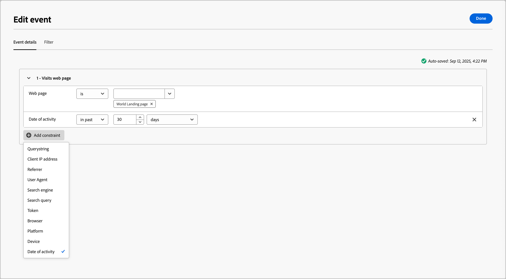
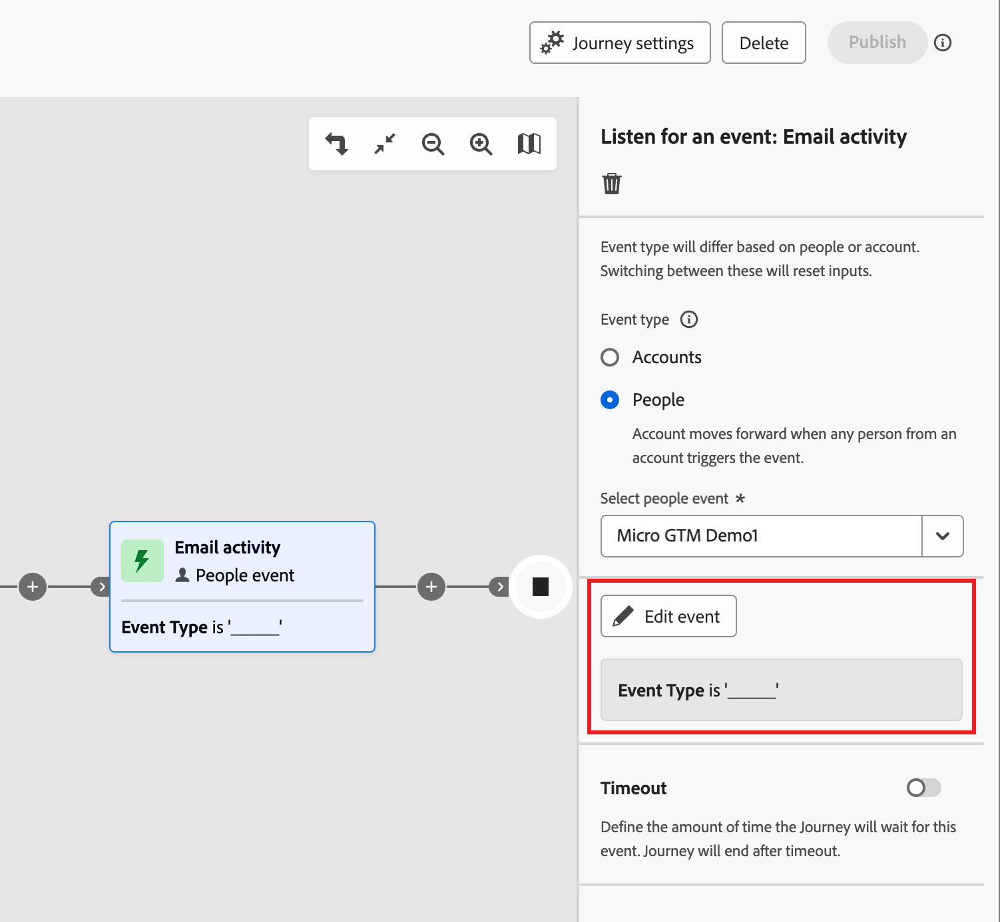
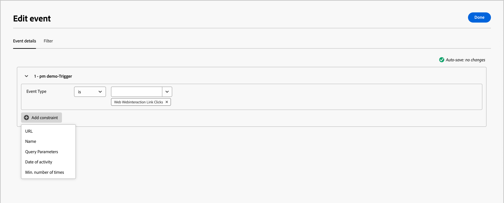

# 이벤트 듣기

이벤트가 발생할 때 대상을 계정 여정의 다음 단계로 이동하려면 _이벤트 수신_ 노드를 추가하십시오.

{width="30"} [개요 비디오 보기](#overview-video)

>[!NOTE]
>
>사람이 분할 경로에 이 노드 유형을 추가할 수 없습니다.

## 계정 이벤트

계정 활동으로 트리거된 이벤트에 따라 여정에서 계정을 앞으로 이동하려는 경우, 계정을 기반으로 이벤트를 수신합니다.

### 이벤트 및 제한

| 이벤트 | 제한 |
| ----- | ----------- |
| 계정에는 흥미로운 순간이 있었습니다. | 형식(전자 메일, 마일스톤 또는 웹) 추가 제한(선택 사항): <li>설명</li><li>소스</li><li>활동 날짜</li>  시간 초과(선택 사항) |
| 계정 데이터 값 변경 사항 | 특성 추가 제약 조건(선택 사항): <li>새 값</li><li>이전 값</li><li>활동 날짜</li>  시간 초과(선택 사항) |
| 구매 그룹 단계 변경 사항 | 솔루션 관심 추가 제약 조건(선택 사항): <li>새 단계</li><li>이전 단계</li><li>활동 날짜</li>  시간 초과(선택 사항) |
| 구매 그룹 상태 변경 사항 | 솔루션 관심 추가 제약 조건(선택 사항): <li>새 상태</li><li>이전 상태</li><li>활동 날짜</li>  시간 초과(선택 사항) |
| 완성도 점수 변경 사항 | 솔루션 관심 추가 제약 조건(선택 사항): <li>새 스코어</li><li>이전 점수</li><li>활동 날짜</li>  시간 초과(선택 사항) |
| 참여 점수 변경 사항 | 솔루션 관심 추가 제약 조건(선택 사항): <li>새 스코어</li><li>이전 점수</li><li>활동 날짜</li>  시간 초과(선택 사항) |

### 계정 이벤트 추가

1. 여정 맵으로 이동합니다.

1. 경로에서 더하기(**+**) 아이콘을 클릭하고 **[!UICONTROL 이벤트 수신]**&#x200B;을 선택합니다.

1. 오른쪽의 노드 속성에서 이벤트 유형으로 **[!UICONTROL 계정]**&#x200B;을(를) 선택합니다.

   {width="700" zoomable="yes"}

1. 목록에서 이벤트를 선택합니다.

1. **[!UICONTROL 이벤트 편집]**&#x200B;을 클릭하고 이벤트에 대한 세부 정보를 정의하십시오.

## 사용자 이벤트

사용자 활동에서 트리거된 이벤트에 따라 여정에서 계정을 앞으로 이동하려는 경우 사용자를 기반으로 하는 이벤트를 수신합니다.

### 이벤트 및 제한

| 입력 유형 | 이벤트 | 제한 |
| ---------- | ----- | ----------- |
| Journey Optimizer B2B | 구매 그룹에 할당됨 | 솔루션 관심  추가 제약 조건(선택 사항): <li>역할</li><li>활동 날짜</li> 시간 초과(선택 사항) |
| | 이메일의 링크를 클릭함 | 전자 메일  추가 제한(선택 사항): <li>링크</li><li>링크 ID</li><li>모바일 디바이스임</li><li>디바이스</li><li>플랫폼</li><li>브라우저</li><li>예측 콘텐츠</li><li>보트 활동임</li><li>보트 활동 패턴</li><li>브라우저</li><li>활동 날짜</li><li>최소. 횟수</li> 시간 초과(선택 사항) |
| | SMS의 링크를 클릭함 | 전자 메일  추가 제한(선택 사항): <li>링크</li><li>디바이스</li><li>플랫폼</li><li>활동 날짜</li><li>최소. 횟수</li> 시간 초과(선택 사항) |
| | 데이터 값 변경 | Person 특성  추가 제약 조건(선택 사항): <li>새 값</li><li>이전 값</li><li>이유</li><li>소스</li><li>활동 날짜</li><li>최소. 횟수</li> 시간 초과(선택 사항) |
| | 이메일을 열람함 | 전자 메일  추가 제한(선택 사항): <li>링크</li><li>링크 ID</li><li>모바일 디바이스임</li><li>디바이스</li><li>플랫폼</li><li>브라우저</li><li>예측 콘텐츠</li><li>보트 활동임</li><li>보트 활동 패턴</li><li>브라우저</li><li>활동 날짜</li><li>최소. 횟수</li> 시간 초과(선택 사항) |
| | 구매 그룹에서 제거됨 | 솔루션 관심 분야 활동 날짜(선택 사항) 시간 초과(선택 사항) |
| | 점수 변경됨 | 점수 이름  추가 제한(선택 사항):<li>변경</li><li>새 스코어</li><li>긴급도</li><li>우선순위</li><li>상대 스코어</li><li>상대 긴급도</li><li>활동 날짜</li><li>최소. 횟수</li> 시간 초과(선택 사항) |
| | SMS 반송 수 | SMS 메시지  추가 제약 조건(선택 사항): <li>활동 날짜</li><li>최소 횟수</li> 시간 초과(선택 사항) |
| Marketo Engage | 웹 페이지를 방문함 | 웹 페이지   일치시킬 Marketo Engage 페이지를 하나 이상 선택하십시오.   추가 제약 조건(선택 사항): <li>Querystring</li><li>클라이언트 IP 주소</li><li>레퍼러</li><li>사용자 에이전트</li><li>검색 엔진</li><li>검색 쿼리</li><li>토큰</li><li>브라우저</li><li>플랫폼</li><li>디바이스</li><li>활동 날짜</li> |
| | 양식 작성 | 양식   일치시킬 Marketo Engage 양식을 하나 이상 선택하십시오.    추가 제약 조건(선택 사항): <li>활동 날짜</li><li>Querystring</li><li>클라이언트 IP 주소</li><li>레퍼러</li><li>사용자 에이전트</li><li>플랫폼</li><li>디바이스</li> 시간 초과(선택 사항) |
| Adobe Experience Platform | 이벤트 정의 | 이벤트 유형   추가 제약 조건(선택 사항): <li>필드</li>  추가 제약 조건(지원되지 않음): <li>활동 날짜</li><li>최소. 횟수</li>  시간 초과(선택 사항) |

### 인물 이벤트 추가

1. 여정 맵으로 이동합니다.

1. 경로에서 더하기(**+**) 아이콘을 클릭하고 **[!UICONTROL 이벤트 수신]**&#x200B;을 선택합니다.

1. 오른쪽의 노드 속성에서 이벤트 유형으로 **[!UICONTROL 사람]**&#x200B;을(를) 선택합니다.

   {width="700" zoomable="yes"}

1. 목록에서 이벤트를 선택합니다.

1. **[!UICONTROL 이벤트 편집]**&#x200B;을 클릭하고 이벤트에 대한 세부 정보를 정의하십시오.

### Marketo Engage 이벤트 수신

연결된 Marketo Engage 인스턴스에 웹 페이지가 만들어져 있는 경우 채워지지 않았거나 채워지지 않은 Marketo Engage 양식은 물론 Marketo Engage 웹 페이지에 대한 방문/방문 없음에 따라 이벤트를 트리거할 수 있습니다.

1. 여정 맵에서 **[!UICONTROL 이벤트 수신]** 노드를 선택하십시오.

1. 오른쪽의 노드 속성에서 이벤트 유형으로 **[!UICONTROL 사람]**&#x200B;을(를) 선택합니다.

1. **[!UICONTROL 사람 이벤트 선택]** 선택기의 화살표를 클릭하고 메뉴를 **[!UICONTROL Marketo Engage]** 섹션으로 스크롤합니다.

1. Market Engage 활동 유형을 선택합니다.

   * **[!UICONTROL 웹 페이지 방문]**.
   * **[!UICONTROL 양식 작성]**

   {width="700" zoomable="yes"}

1. **[!UICONTROL 이벤트 편집]**&#x200B;을 클릭하고 일치시킬 하나 이상의 웹 페이지와 이벤트에 대한 추가 제약 조건을 정의합니다.

   * (필수) _[!UICONTROL 이벤트 편집]_ 대화 상자에서 **[!UICONTROL 웹 페이지]**&#x200B;를 정의하거나 양식 제한을 채웁니다. 하나 이상의 선택한 페이지 또는 양식에서 일치시키려면 **[!UICONTROL is]**(기본값)을 사용합니다. **[!UICONTROL 은(는) 하나 이상의 선택한 페이지/양식을 제외한 모든 페이지 방문/양식에서 일치시키려면]**&#x200B;이(가) 아닙니다. 또는 Marketo Engage 웹 페이지 방문 또는 채워진 양식에서 일치시키려면 **[!UICONTROL is any]**&#x200B;을(를) 사용하십시오.

   * (선택 사항) **[!UICONTROL 제약 조건 추가]**&#x200B;를 클릭하고 제약 조건에 사용할 필드를 선택합니다. 연산자 및 필드 값을 설정합니다.

     {width="700" zoomable="yes"}

     이 작업을 반복하여 필요에 따라 추가 필드 제약 조건을 포함할 수 있습니다.

   * 제약 조건을 정의하면 **[!UICONTROL 완료]**&#x200B;를 클릭합니다.

1. 필요한 경우 **[!UICONTROL 시간 초과]** 옵션을 설정하여 이벤트를 수신할 기간을 제한하십시오([이벤트 노드에 시간 초과 추가](#add-a-timeout-to-an-event-node) 참조).

1. 여정 맵에서 이벤트가 발생할 때 실행할 다음 노드를 추가합니다.

### 경험 이벤트 수신

관리자는 Adobe Experience Platform(AEP) 기반 이벤트 정의를 구성할 수 있으며, 이를 통해 마케터는 [AEP 경험 이벤트](https://experienceleague.adobe.com/ko/docs/experience-platform/xdm/classes/experienceevent){target="_blank"}에 반응하는 계정 여정을 만들 수 있습니다. 계정 여정에서 AEP 경험 이벤트 사용은 두 단계 프로세스입니다.

1. [AEP 이벤트 정의를 만들고 게시](../admin/configure-aep-events.md).

2. 계정 여정에서 _이벤트 수신_ 노드를 추가하고 사용자 기반 이벤트에 대한 Experience Platform 이벤트 정의를 선택합니다.

{width="30"} [비디오 개요 보기](../admin/configure-aep-events.md#overview-video)

_여정에 경험 이벤트를 포함하려면:_

1. 여정 맵에서 **[!UICONTROL 이벤트 수신]** 노드를 선택하십시오.

1. 오른쪽의 노드 속성에서 이벤트 유형으로 **[!UICONTROL 사람]**&#x200B;을(를) 선택합니다.

1. **[!UICONTROL 사람 이벤트 선택]** 선택기의 화살표를 클릭하고 메뉴를 **[!UICONTROL Adobe Experience Platform]** 섹션으로 스크롤합니다.

   {width="700" zoomable="yes"}

1. 이벤트를 선택합니다.

   이벤트 유형은 노드 세부 정보에 비어 있는 것으로 표시됩니다.

   {width="400" zoomable="yes"}

1. **[!UICONTROL 이벤트 편집]**&#x200B;을 클릭하고 이벤트 유형과 이벤트에 대한 추가 제약 조건을 정의합니다.

   * (필수) _[!UICONTROL 이벤트 편집]_ 대화 상자에서 이벤트 유형을 정의합니다. 기본 **[!UICONTROL is]** 연산자를 사용하여 하나 이상의 선택한 이벤트 유형을 일치시킬 수 있습니다. 또는 **[!UICONTROL is not]** 연산자를 사용하여 하나 이상의 선택한 이벤트 유형을 제외한 모든 이벤트 유형을 일치시킬 수 있습니다.

   * (선택 사항) **[!UICONTROL 제약 조건 추가]**&#x200B;를 클릭하고 제약 조건에 사용할 필드를 선택합니다. 연산자 및 필드 값을 설정합니다.

     {width="700" zoomable="yes"}

     >[!NOTE]
     >
     >_활동 날짜_ 및 _최소 횟수_&#x200B;에 대한 제약 조건은 지원되지 않습니다.

     이 작업을 반복하여 필요에 따라 추가 필드 제약 조건을 포함할 수 있습니다.

   * 제약 조건을 정의하면 **[!UICONTROL 완료]**&#x200B;를 클릭합니다.

1. 필요한 경우 **[!UICONTROL 시간 초과]** 옵션을 설정하여 이벤트를 수신할 기간을 제한하십시오([이벤트 노드에 시간 초과 추가](#add-a-timeout-to-an-event-node) 참조).

1. 여정 맵에서 이벤트가 발생할 때 실행할 다음 노드를 추가합니다.

1. 여정의 나머지 노드를 완료하고 [게시](./journey-overview.md)하십시오.

   여정이 라이브(게시)되고 _이벤트 수신_ 노드에 도달하면 AEP Experience Events 수신을 시작합니다.

## 이벤트 노드에 시간 초과 추가

필요한 경우 여정이 이벤트를 기다리는 시간을 정의합니다. 다른 노드를 추가할 수 있는 시간 제한 경로를 정의하지 않는 한 시간 제한 후 여정이 종료됩니다.

1. **[!UICONTROL 시간 초과]** 옵션을 활성화하십시오.

1. 이벤트가 시간 초과되기 전에 발생할 때까지 여정이 기다리는 기간을 선택합니다.

   여기서 경로를 종료하거나 다른 경로를 설정하여 다른 동작을 수행하도록 선택할 수 있습니다.

1. 이벤트가 발생하지 않을 때 여정에 적용할 수 있는 작업 및 이벤트를 추가할 수 있는 새 경로를 만들려면 **[!UICONTROL 시간 제한 경로 설정]** 확인란을 선택하십시오.

   {width="700" zoomable="yes"}

## 개요 비디오

>[!VIDEO](https://video.tv.adobe.com/v/3443241/?learn=on&captions=kor)
