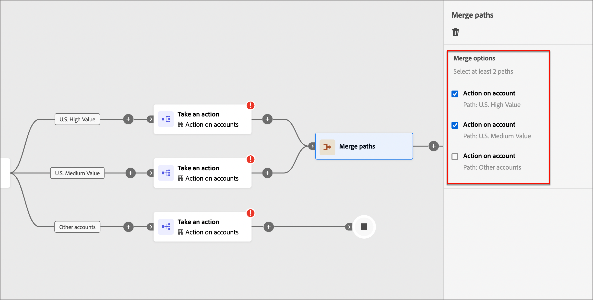

# 경로 분할 및 병합

계정 여정에서 분할 및 병합 경로 노드를 사용하여 계정 여정을 조정합니다. 세그먼트를 정의하고 결합하여 진행하는 조건에 따라 대상자를 세그먼트화할 수 있습니다.

{width="30"} [개요 비디오 보기](#overview-video)

## 경로 분할

_분할된 경로_ 노드를 추가하여 계정 또는 사용자 특성을 기준으로 하나 이상의 분할된 경로를 정의하십시오.

>[!NOTE]
>
>최대 25개의 경로가 지원됩니다.

**계정별로 경로 분할**: 계정별로 분할된 경로에는 계정과 사용자 작업 및 이벤트가 모두 포함될 수 있습니다. 이러한 경로는 추가로 분할할 수 있습니다.

_계정 노드별 분할 경로는 어떻게 작동합니까?_

* 추가하는 각 경로에는 각 에지에 노드를 추가할 수 있는 최종 노드가 포함되어 있습니다.
* 계정별 분할은 중첩될 수 있으며, 계정별로 경로를 반복적으로 분할할 수도 있습니다.
* 위에서 아래로 경로를 평가합니다. 계정이 첫 번째 및 두 번째 경로와 일치하는 경우 첫 번째 경로에서만 계속 진행됩니다.
* 병합 노드를 사용하여 두 개 이상의 경로를 결합할 수 있습니다.
* 정의된 세그먼트/경로 중 하나와 일치하지 않는 계정에 대해 작업 또는 이벤트를 추가할 수 있는 _[!UICONTROL 기타 계정]_ 경로의 정의를 지원합니다.

{width="700" zoomable="yes"}

**사람별로 경로 분할**: 사람별로 경로가 분할되며 사람 작업만 포함할 수 있습니다. 이러한 경로는 다시 분할하고 자동으로 다시 결합할 수 없습니다.

_people 노드별 분할 경로는 어떻게 작동합니까?_

* _그룹화된 노드_ 분할 병합 조합 내의 함수입니다. 분할된 경로는 대상자에 있는 모든 사람이 계정 컨텍스트를 잃지 않고 다음 단계로 이동할 수 있도록 자동으로 병합됩니다.
* 사용자별 분할 노드는 중첩할 수 없습니다. 이 그룹화된 노드에 있는 경로에 사용자에 대한 분할 경로를 추가할 수 없습니다.
* 위에서 아래로 경로를 평가합니다. 한 사람이 첫 번째 및 두 번째 경로에 대해 일치하는 경우 첫 번째 경로만 따라 진행합니다.
* _계정 사용자 관계_&#x200B;의 사용을 지원하며, 이를 통해 역할 템플릿에서 정의한 역할(예: 계약자 또는 상근 직원)을 기준으로 사용자를 필터링할 수 있습니다.
* 정의된 세그먼트/경로 중 하나와 일치하지 않는 사용자에 대해 작업 또는 이벤트를 추가할 수 있는 _[!UICONTROL 기타 사용자]_ 경로의 정의를 지원합니다.

{width="700" zoomable="yes"}

### 경로 조건 {#path-conditions}

| 노드 컨텍스트 | 경로 조건 | 설명 |
| ------------ | --------------- | ----------- |
| [계정](#add-a-split-path-by-account-node) | 계정 속성 | 다음을 포함한 계정 프로필의 속성: <li>연간 수익</li><li>구/군/시</li><li>국가</li><li>직원 규모</li><li>업종</li><li>이름</li><li>SIC 코드</li><li>주/도</li> |
| | [!UICONTROL 특수 필터] > [!UICONTROL 구매 그룹 있음] | 계정에 구매 그룹의 구성원이 있거나 없습니다. 다음 기준 중 하나 이상에 대해서도 평가할 수 있습니다. <li>솔루션 관심 분야</li><li>구매 그룹 상태</li><li>완성도 점수</li><li>참여 점수</li> |
| | [!UICONTROL 특수 필터] > [!UICONTROL 기회가 있음] | 계정이 영업 기회와 관련되거나 관련되지 않습니다. 다음 영업 기회 속성 중 하나 이상에 대해서도 평가할 수 있습니다. <li>금액<li>종료 날짜<li>설명<li>예상 수익<li>회계 분기<li>회계 연도<li>예측 범주<li>예측 범주 이름<li>닫힘<li>성공</li><li>마지막 활동 날짜</li><li>개인 소스<li>이름</li><li>다음 단계</li><li>가능성<li>수량<li>단계</li><li>유형 |
| [사용자](#add-a-split-path-by-people-node) > [!UICONTROL 사용자 특성만] | [!UICONTROL 사용자 특성] | 다음을 포함한 개인 프로필의 속성: <li>구/군/시</li><li>국가</li><li>생년월일</li><li>이메일 주소</li><li>잘못된 이메일</li><li>이메일 일시 중단됨</li><li>이름</li><li>상태 영역 유추</li><li>직위</li><li>성</li><li>휴대폰 번호</li><li>전화번호</li><li>우편번호</li><li>주/도</li><li>주소 삭제</li><li>구독 취소 이유</li> |
| | [!UICONTROL 활동 기록] > [!UICONTROL 전자 메일] | 여정과 연계된 이메일 활동: <li>[!UICONTROL 전자 메일에서 링크를 클릭함]</li><li>이메일 열림</li><li>게재됨 이메일</li><li>이(가) 이메일을 보냈습니다.</li> 이러한 조건은 여정 앞부분에서 선택한 이메일 메시지를 사용하여 평가됩니다. |
| | [!UICONTROL 활동 기록] > [!UICONTROL 데이터 값 변경됨] | 선택한 개인 속성의 경우 값이 변경되었습니다. 이러한 변경 유형은 다음과 같습니다. <li>새 값</li><li>이전 값</li><li>이유</li><li>소스</li><li>활동 날짜</li><li>최소. 횟수</li> |
| | [!UICONTROL 활동 기록] > [!UICONTROL 즐거운 시간이 있습니다] | 연결된 Marketo Engage 인스턴스에 정의된 관심 있는 순간 활동입니다. 제한 사항은 다음과 같습니다. <li>마일스톤</li><li>이메일</li><li>웹</li> |
| | [!UICONTROL 특수 필터] > [!UICONTROL 구매 그룹 구성원] | 개인이 다음 기준 중 하나 이상에 대해 평가된 구매 그룹 구성원이거나 구매 그룹 구성원이 아닙니다. <li>솔루션 관심 분야</li><li>구매 그룹 상태</li><li>완성도 점수</li><li>참여 점수</li><li>역할</li> |
| | [!UICONTROL 특수 필터] > [!UICONTROL 목록의 구성원] | 해당 사용자는 하나 이상의 Marketo Engage 목록에 속하거나 속하지 않습니다. |
| | [!UICONTROL 특수 필터] > [!UICONTROL 프로그램 구성원] | 해당 사용자는 하나 이상의 Marketo Engage 프로그램의 멤버이거나 멤버입니다. |
| [사용자](#add-a-split-path-by-people-node) > [!UICONTROL Account-person 특성만] | 계정 속성의 역할 | 계정에서 역할이 할당되었거나 할당되지 않았습니다. 선택적 제한: <li>역할 이름 입력</li> |

<!-- 

Add back for next release:

People:

| | [!UICONTROL Activity history] > [!UICONTROL SMS Message] | SMS activities associated with the journey: <li>[!UICONTROL Clicked link in SMS]</li><li>[!UICONTROL SMS Bounced]</li>These conditions are evaluated using a selected SMS message from earlier in the journey.  |

-->

### 계정 노드별 분할 경로 추가

1. 여정 편집기로 이동합니다.

1. 경로에서 더하기(**+**) 아이콘을 클릭하고 **[!UICONTROL 경로 분할]**&#x200B;을 선택합니다.

   {width="300"}

1. 오른쪽의 노드 속성에서 분할을 위해 **[!UICONTROL 계정]**&#x200B;을(를) 선택합니다.

1. _[!UICONTROL 경로 1]_&#x200B;에 적용할 수 있는 조건을 정의하려면 **[!UICONTROL 조건 적용]**&#x200B;을 클릭하십시오.

   {width="500"}

1. 조건 편집기에서 하나 이상의 필터를 추가하여 분할 경로를 정의합니다.

   * 왼쪽 탐색에서 필터 속성을 끌어서 놓고 일치 정의를 완료합니다.

   * 맨 위에 있는 **[!UICONTROL 필터 논리]**&#x200B;를 적용하여 조건을 미세 조정하십시오. 모든 속성 조건 또는 임의의 조건을 일치시키도록 선택합니다.

     {width="700" zoomable="yes"}

   * **[!UICONTROL 완료]**&#x200B;를 클릭합니다.

1. 경로를 더 추가하려면 **[!UICONTROL 경로 추가]**&#x200B;를 클릭하고 이전 단계를 반복하여 이 경로에 적용할 수 있는 조건을 추가합니다.

   이러한 조건을 기반으로 각 경로에 레이블을 지정하거나 기본 레이블을 사용할 수도 있습니다.

1. 필요한 경우 분할에 대해 원하는 우선 순위에 따라 경로 순서를 변경합니다.

   경로 필터링은 하향식으로 평가됩니다. 각 계정은 일치하는 첫 번째 경로를 따라 진행됩니다.

   각 경로 카드의 오른쪽 상단에 있는 위쪽 및 아래쪽 화살표를 클릭하여 경로 목록에서 위쪽 또는 아래쪽으로 이동합니다.

   {width="500" zoomable="yes"}

1. 정의된 세그먼트/경로와 일치하지 않는 계정의 기본 경로를 정의하려면 **[!UICONTROL 다른 계정]** 옵션을 활성화하십시오.

   이 옵션이 활성화되지 않으면 분할 내에서 정의된 여정/경로와 일치하지 않는 계정에 대해 세그먼트가 종료됩니다.

### 사람 노드별 분할 경로 추가

>[!NOTE]
>
>사람별로 경로를 분할하면 _분할된 경로 닫기_ 노드가 자동으로 삽입되어 분할이 종료됩니다. 사용자별 분할 경로는 사용자 노드에서 _작업 수행_&#x200B;만 허용합니다.

1. 여정 편집기로 이동합니다.

1. 경로에서 더하기(**+**) 아이콘을 클릭하고 **[!UICONTROL 경로 분할]**&#x200B;을 선택합니다.

   {width="300"}

1. 오른쪽의 노드 속성에서 분할을 위해 **[!UICONTROL 사람]**&#x200B;을(를) 선택합니다.

1. 조건에 사용되는 **[!UICONTROL 특성을 설정합니다]**.

   * 사용자 프로필 및 이벤트와 관련된 조건을 사용하려면 **[!UICONTROL 사용자 특성만]**&#x200B;을(를) 선택하십시오.
   * **[!UICONTROL Account-person 특성만]**&#x200B;을 선택하여 계정 내에서 해당 사용자의 역할 멤버십과 관련된 조건을 사용합니다.

1. _[!UICONTROL 경로 1]_&#x200B;에 적용할 수 있는 조건을 정의하려면 **[!UICONTROL 조건 적용]**&#x200B;을 클릭하십시오.

1. 조건 편집기에서 하나 이상의 필터를 추가하여 분할 경로를 정의합니다.

   * 왼쪽 탐색에서 사용자 속성을 끌어다 놓고 일치 정의를 완료합니다.

     >[!NOTE]
     >
     >Experience Platform의 계정 대상 스키마에 사용자 정의 개인 필드가 정의된 경우 해당 필드를 조건에서 개인 속성으로 사용할 수도 있습니다.

   * 맨 위에 있는 **[!UICONTROL 필터 논리]**&#x200B;를 적용하여 조건을 미세 조정하십시오. 모든 속성 조건 또는 임의의 조건을 일치시키도록 선택합니다.

     {width="700" zoomable="yes"}

   * **[!UICONTROL 완료]**&#x200B;를 클릭합니다.

1. 경로를 더 추가하려면 **[!UICONTROL 경로 추가]**&#x200B;를 클릭하고 이전 단계를 반복하여 이 경로에 적용할 수 있는 조건을 추가합니다.

   이러한 조건을 기반으로 각 경로에 레이블을 지정하거나 기본 레이블을 사용할 수도 있습니다.

1. 필요한 경우 분할에 대해 원하는 우선 순위에 따라 경로 순서를 변경합니다.

   경로 필터링은 하향식으로 평가됩니다. 각 사용자는 일치하는 첫 번째 경로를 따라 진행합니다.

   각 경로 카드의 오른쪽 상단에 있는 위쪽 및 아래쪽 화살표를 클릭하여 경로 목록에서 위쪽 또는 아래쪽으로 이동합니다.

   {width="500" zoomable="yes"}

1. 정의된 경로와 일치하지 않는 사람에 대한 기본 경로를 추가하려면 **[!UICONTROL 다른 사람]** 옵션을 활성화하십시오.

   이 옵션이 활성화되지 않으면 정의된 세그먼트/경로와 일치하지 않는 사람들이 분할을 지나 여정의 다음 단계로 이동합니다.

>[!BEGINSHADEBOX &quot;Marketo Engage 목록 구성원&quot;]

Marketo Engage에서 _스마트 캠페인_&#x200B;은(는) 프로그램 멤버십을 확인하여 리드가 중복 이메일을 받지 않고 동시에 여러 이메일 스트림의 멤버가 아닌지 확인합니다. Journey Optimizer B2B에서 사람들이 분할 경로에 대한 조건으로 Marketo Engage 목록 멤버십을 확인하여 여정 활동의 중복을 제거할 수 있습니다.

분할 조건에서 목록 멤버십을 사용하려면 **[!UICONTROL 특수 필터]**&#x200B;를 확장하고 **[!UICONTROL 목록의 멤버]** 조건을 필터 공간으로 끌어서 놓습니다. 필터 정의를 완료하여 하나 이상의 Marketo Engage 목록에서 멤버십을 평가합니다.

{width="700" zoomable="yes"}

>[!ENDSHADEBOX]

사용자 수준에서 대상을 분할하기 위해 각 경로에 대해 정의된 조건이 있는 경우 사용자에 대해 수행하려는 작업을 추가할 수 있습니다.

>[!NOTE]
>
>대상자를 사람별로 분할하면 경로가 닫히거나 병합될 때까지 사람 작업만 추가할 수 있습니다.

## 경로 병합

_여정 병합_ 노드를 추가하여 계정별로 다른 분할 경로를 결합하십시오.

1. 여정 편집기로 이동합니다.

1. 경로에서 더하기(**+**) 아이콘을 클릭하고 **[!UICONTROL 경로 분할]**&#x200B;을 선택합니다.

1. 분할 노드를 클릭하여 오른쪽에서 해당 속성을 엽니다.

1. 세 개의 경로를 만들려면 [!UICONTROL 경로 추가]를 클릭하십시오.

1. 각 경로에 작업과 이벤트의 조합을 추가합니다.

1. 이러한 경로 중 하나에 대한 더하기( **+**) 아이콘을 클릭하고 표시된 옵션에서 **[!UICONTROL 병합]**&#x200B;을(를) 선택합니다.

   {width="400"}

1. 경로 병합 노드 속성에서 병합할 경로를 선택합니다.

   {width="600" zoomable="yes"}

   이때 선택한 경로의 계정이 여정을 계속 진행할 수 있는 단일 경로로 결합되도록 경로가 병합됩니다.

1. 필요한 경우 경로 병합 노드 속성으로 다시 이동하고 제거할 경로에 대한 확인란을 선택 취소하여 경로 병합을 취소할 수 있습니다.

## 개요 비디오

>[!VIDEO](https://video.tv.adobe.com/v/3443231/?learn=on)
