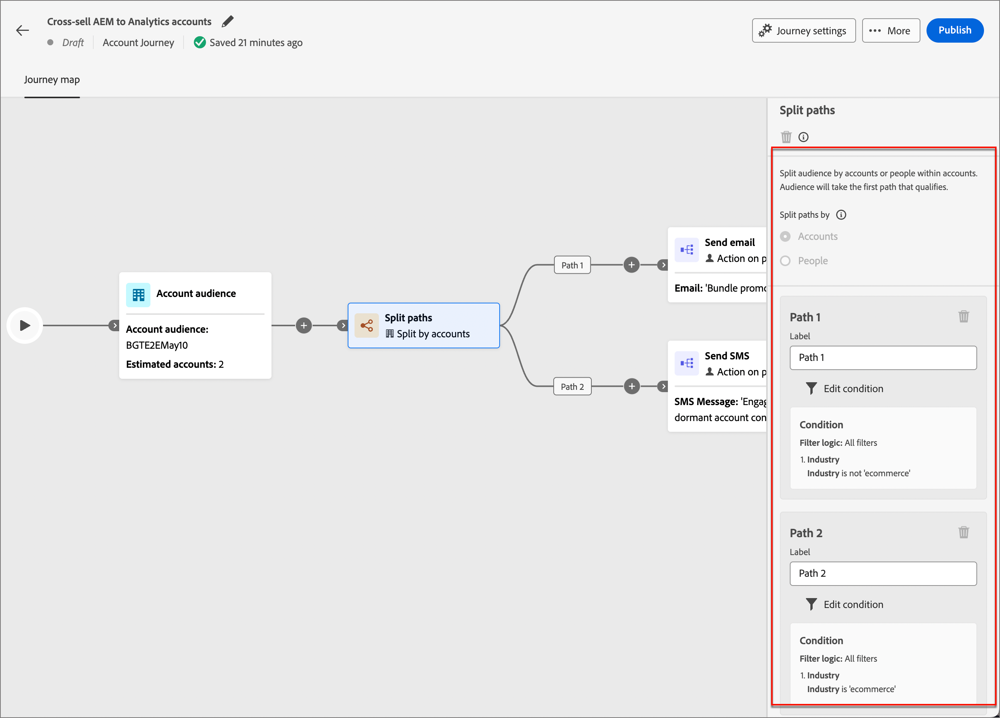
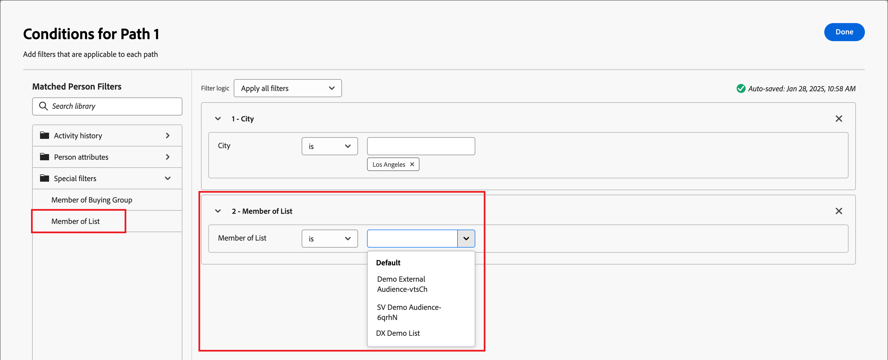

# 경로 분할 및 병합 {#split-paths}

분할 및 병합 경로 노드를 사용하여 정의한 조건에 따라 사람 또는 계정을 세그먼트화합니다. 조건에 따라 대상자 또는 계정 목록에 대한 경로를 만들고, 세그먼트에 대한 작업 및 이벤트 노드를 사용하여 각 경로를 정의한 다음, 경로를 결합하고 여정을 계속합니다.

{width="30"} [개요 비디오 보기](#overview-video)

_경로 분할_ 노드는 **_둘 중 하나_** 계정 또는 사람 필터를 기반으로 하나 이상의 세그먼트화된 경로를 정의합니다. 사람 필터를 기반으로 한 분할은 모든 사람이 계정 컨텍스트를 잃지 않고 다음 단계로 이동할 수 있도록 병합 경로 노드로 자동으로 닫힙니다.

>[!NOTE]
>
>최대 25개의 경로가 지원됩니다.

## 계정별 경로 분할 {#split-paths-by-accounts}

**_(계정 여정 전용)_**

계정별 분할 경로에는 계정과 사용자 작업 및 이벤트가 모두 포함될 수 있습니다. 이러한 경로는 추가로 분할할 수 있습니다.

_**계정 노드별 분할 경로 작동 방식**_

* 추가하는 각 경로에는 각 에지에 노드를 추가할 수 있는 최종 노드가 포함되어 있습니다.
* 계정 노드로 분할을 중첩시킬 수 있습니다(계정으로 경로를 반복적으로 분할할 수 있음).
* 각 경로의 평가는 위에서 아래로 내려옵니다. 계정이 첫 번째 및 두 번째 경로와 일치하는 경우 첫 번째 경로에서만 계속 진행됩니다.
* 병합 노드를 사용하여 두 개 이상의 경로를 결합할 수 있습니다.
* 노드는 정의된 세그먼트/경로 중 하나와 일치하지 않는 계정에 대해 작업 또는 이벤트를 추가할 수 있는 _[!UICONTROL 기타 계정]_ 경로의 정의를 지원합니다.

{width="700" zoomable="yes"}

### 계정 경로 조건 {#account-path-filters}

| 경로 조건 | 설명 |
| --------------- | ----------- |
| [!UICONTROL 계정 특성] | 다음을 포함한 계정 프로필의 속성: <li>연간 수익 <li>도시 <li>국가 <li>직원 규모 <li>업종 <li>이름 <li>SIC 코드 <li>주 |
| [!UICONTROL 사용자 지정 개체] > `<custom object>` 있음 | [!BADGE Beta]{type=Informative tooltip="Beta 기능"} 계정에 관계형 스키마 레코드가 없거나 없습니다. [XDM 관계형 스키마](../admin/xdm-field-management.md#relational-schemas)에 구성된 대로 선택한 사용자 지정 개체 기준에 대해 평가할 수도 있습니다. [사용자 지정 데이터 필터링](#custom-data-filtering)을 참조하세요. |
| [!UICONTROL 특수 필터] > [!UICONTROL 계정이 구매 그룹과 일치함] | 계정이 하나 이상의 구매 그룹과 일치합니다. 대응 구매 그룹에 대해 다음 제약 조건 중 하나 이상에 대해 평가할 수 있습니다. <li>솔루션 관심 분야 <li>구매 그룹 단계 <li>구매 그룹 상태 <li>참여 점수 <li>완성도 점수 <li> 구매 그룹 역할의 사용자 수 |

### 계정 노드별 분할 경로 추가

1. 여정 맵으로 이동합니다.

1. 경로에서 더하기(**+**) 아이콘을 클릭하고 **[!UICONTROL 경로 분할]**&#x200B;을 선택합니다.

   {width="300" zoomable="no"}

1. 오른쪽의 노드 속성에서 분할을 위해 **[!UICONTROL 계정]**&#x200B;을(를) 선택합니다.

1. _[!UICONTROL 경로 1]_&#x200B;에 적용할 수 있는 조건을 정의하려면 **[!UICONTROL 조건 적용]**&#x200B;을 클릭하십시오.

   {width="500" zoomable="yes"}

1. 분할 경로를 정의하려면 조건 편집기에 필터를 하나 이상 추가합니다.

   * 왼쪽 탐색에서 필터 속성을 끌어서 놓고 일치 정의를 완료합니다.

   * 맨 위에 있는 **[!UICONTROL 필터 논리]**&#x200B;를 적용하여 조건을 구체화합니다. 모든 필터 또는 모든 필터를 일치시키도록 선택합니다.

     {width="700" zoomable="yes"}

   * **[!UICONTROL 완료]**&#x200B;를 클릭합니다.

1. 경로를 더 추가하려면 **[!UICONTROL 경로 추가]**&#x200B;를 클릭하고 이전 단계를 반복하여 이 경로에 적용할 수 있는 조건을 추가합니다.

   이러한 조건을 기반으로 각 경로에 레이블을 지정하거나 기본 레이블을 사용할 수도 있습니다.

1. 필요한 경우 분할에 대해 원하는 우선 순위에 따라 경로 순서를 변경합니다.

   경로 필터링은 하향식으로 평가됩니다. 각 계정은 일치하는 첫 번째 경로를 따라 진행됩니다.

   각 경로 카드의 오른쪽 상단에 있는 위쪽 및 아래쪽 화살표를 클릭하여 경로 목록에서 위쪽 또는 아래쪽으로 이동합니다.

   {width="500" zoomable="yes"}

1. 정의된 세그먼트/경로와 일치하지 않는 계정의 기본 경로를 정의하려면 **[!UICONTROL 다른 계정]** 옵션을 활성화하십시오.

   이 옵션이 활성화되지 않으면 분할 내에서 정의된 여정/경로와 일치하지 않는 계정에 대해 세그먼트가 종료됩니다.

### 계정에 대한 구매 그룹 필터링 {#buying-group-filtering-accounts}

구매 그룹과 관련된 계정의 경로를 정의하고 구매 그룹 기준을 사용하여 경로를 필터링할 수 있습니다. **[!UICONTROL 거래처에 일치하는 구매 그룹이 있습니다]** 필터를 사용하여 일치하는 구매 그룹을 사용하는 경로 세그먼트를 정의합니다. 이 필터에는 일치하는 구매 그룹 내에서 할당된 역할의 수에 따라 계정을 식별하는 옵션도 포함됩니다.

예를 들어 3명의 의사 결정자와 2명의 인플루언서와 같이 다양한 역할에서 차지하는 깊이(인원 수)에 따라 구매 그룹 준비 상태를 평가할 수 있습니다. 이 경우, 최소 3명의 의사 결정자와 2명의 영향력 있는 사람을 일치하는 구매 그룹에 있는 계정을 타겟팅하도록 조건을 설정합니다.

1. **[!UICONTROL 필터 추가]**&#x200B;를 클릭하고 **[!UICONTROL 그룹 역할 구매 인원 수]** 필터를 선택합니다.

   {width="700" zoomable="yes"}

1. 첫 번째 역할 매개 변수를 정의합니다.

   * 사람 평가 횟수를 `at least`(값: `3`)로 설정합니다.
   * 역할 평가를 `is`(으)로 설정하고 역할 목록에서 `Decision Maker`을(를) 선택하십시오.

1. 1단계를 반복하여 다른 구매 그룹 역할 매개변수를 추가합니다.

1. 두 번째 역할 매개 변수를 정의합니다.

   * 사람 평가 횟수를 `at least`(값: `2`)로 설정합니다.
   * 역할 평가를 `is`(으)로 설정하고 역할 목록에서 `Influencer`을(를) 선택하십시오.

   {width="700" zoomable="yes"}

1. 경로에 대해 모든 조건이 정의된 경우 **[!UICONTROL 완료]**&#x200B;를 클릭합니다.

식별된 계정의 경우 경로에 작업 노드를 추가하여 구매 그룹 또는 단계의 상태를 업데이트하거나 판매 경고 이메일을 보낼 수 있습니다.

## 사람별 경로 분할

_(계정 및 사용자 여정)_

사람에 의해 나누기 경로에는 사람 작업만 포함될 수 있습니다. 이러한 경로는 다시 분할하고 자동으로 다시 결합할 수 없습니다.

_**people 노드별 분할 경로가 작동하는 방식**_

* _그룹화된 노드_ 분할 병합 조합 내에서 사람 노드로 분할 함수가 작동합니다. 분할된 경로는 모든 사람이 계정 컨텍스트를 잃지 않고 다음 단계로 이동할 수 있도록 자동으로 병합됩니다.
* 사람 노드로 분할을 중첩할 수 없습니다(이 그룹화된 노드에 있는 경로에 사람에 대한 분할 경로를 추가할 수 없음).
* 각 경로의 평가는 위에서 아래로 내려옵니다. 한 사람이 첫 번째 및 두 번째 경로와 일치하는 경우 첫 번째 경로만 따라 진행합니다.
* 노드는 _계정-사용자 관계_&#x200B;의 사용을 지원하며, 이를 통해 관계에 정의된 역할(예: 계약자 또는 정규직 직원)을 기준으로 사용자를 필터링할 수 있습니다.
* 노드는 정의된 세그먼트/경로 중 하나와 일치하지 않는 사용자에 대해 작업 또는 이벤트를 추가할 수 있는 _[!UICONTROL 기타 사용자]_ 경로의 정의를 지원합니다.

{width="700" zoomable="yes"}

### 사용자 경로 필터 {#people-path-filters}

| 필터 | 설명 |
| ------------ | ----------- |
| [!UICONTROL 사용자 지정 개체] > `<custom object>` 있음 | [!BADGE Beta]{type=Informative tooltip="Beta 기능"} 개인이 관계형 스키마 레코드를 가지고 있거나 가지고 있지 않습니다. [XDM 관계형 스키마](../admin/xdm-field-management.md#relational-schemas)에 구성된 대로 선택한 사용자 지정 개체 기준에 대해 평가할 수도 있습니다. ([사용자 지정 데이터 필터링](#custom-data-filtering) 참조) |
| [!UICONTROL 이벤트 기록] | 은 여정 입력 전에 발생한 경험 이벤트를 기반으로 사람을 나눕니다. 폴더를 확장하여 [관리자 > XDM 이벤트 구성](../admin/configure-aep-events.md)에 구성된 모든 이벤트 유형을 보고 필터로 추가할 이벤트 유형을 선택하십시오. 제한에는 선택한 이벤트의 필드, 여정에 들어갈 때 다시 측정된 전환 확인 기간 및 선택적 최소 횟수가 포함됩니다. |
| [!UICONTROL 사용자 특성] | 다음을 포함한 [개인 프로필](../admin/field-mapping.md#xdm-business-person-attributes)의 특성: <li>도시 <li>국가 <li>이메일 주소 <li>잘못된 이메일 <li>이메일 중단됨 <li>이름 <li>추정 주 지역 <li>직위 <li>성 <li>휴대폰 번호 <li>개인 참여 점수 <li>전화번호 <li>우편번호 <li>주 |
| [!UICONTROL 특수 필터] > [!UICONTROL 구매 그룹 구성원] | 개인이 다음 기준 중 하나 이상에 대해 평가된 구매 그룹 구성원이거나 구매 그룹 구성원이 아닙니다. <li>솔루션 관심 분야</li><li>구매 그룹 상태</li><li>완성도 점수</li><li>참여 점수</li><li>제거됨</li><li>역할</li> |
| [!UICONTROL 특수 필터] > [!UICONTROL 목록의 구성원] | (더 이상 사용되지 않음) 해당 사용자는 하나 이상의 [!DNL Marketo Engage] 목록에 속하거나 속하지 않습니다. |
| [!UICONTROL 특수 필터] > [!UICONTROL 프로그램 구성원] | (더 이상 사용되지 않음) 사용자가 하나 이상의 [!DNL Marketo Engage] 프로그램의 구성원이거나 구성원이 아닙니다. |

### 계정-사용자 경로 조건

| 경로 조건 | 설명 |
| --------------- | ----------- |
| [!UICONTROL 계정의 역할] | 계정에서 역할이 할당되었거나 할당되지 않았습니다. 선택적 제한: <li>역할 이름 |

### 사람 노드별 분할 경로 추가 {#add-a-split-path-by-people-node}

>[!NOTE]
>
>사람별로 경로를 분할하면 _분할된 경로 닫기_ 노드가 자동으로 삽입되어 분할이 종료됩니다. 사용자별 분할 경로는 사용자 노드에서 _작업 수행_&#x200B;만 허용합니다.

1. 여정 맵으로 이동합니다.

1. 경로에서 더하기(**+**) 아이콘을 클릭하고 **[!UICONTROL 경로 분할]**&#x200B;을 선택합니다.

   {width="300" zoomable="no"}

1. 오른쪽의 노드 속성에서 분할을 위해 **[!UICONTROL 사람]**&#x200B;을(를) 선택합니다.

1. (계정 여정 전용) 조건에 사용되는 **[!UICONTROL 특성]**&#x200B;을 설정합니다.

   * 사용자 프로필과 관련된 조건을 사용하려면 **[!UICONTROL 사용자 특성만]**&#x200B;을(를) 선택하십시오.
   * **[!UICONTROL Account-person 특성만]**&#x200B;을 선택하여 계정 내에서 해당 사용자의 역할 멤버십과 관련된 조건을 사용합니다.

1. _[!UICONTROL 경로 1]_&#x200B;에 적용할 수 있는 조건을 정의하려면 **[!UICONTROL 조건 적용]**&#x200B;을 클릭하십시오.

1. 조건 편집기에서 하나 이상의 필터를 추가하여 분할 경로를 정의합니다.

   * 왼쪽 탐색에서 사람 필터를 끌어다 놓고 일치 정의를 완료합니다.

     >[!NOTE]
     >
     >Experience Platform의 계정 대상자 스키마에 사용자 정의 개인 필드를 정의한 경우 이들 필드를 조건에서 개인 속성으로 사용할 수도 있습니다.

   * 맨 위에 있는 **[!UICONTROL 필터 논리]**&#x200B;를 적용하여 조건을 구체화합니다. 모든 속성 조건 또는 임의의 조건을 일치시키도록 선택합니다.

     {width="700" zoomable="yes"}

   * **[!UICONTROL 완료]**&#x200B;를 클릭합니다.

1. 경로를 더 추가하려면 **[!UICONTROL 경로 추가]**&#x200B;를 클릭하고 이전 단계를 반복하여 이 경로에 적용할 수 있는 조건을 추가합니다.

   이러한 조건을 기반으로 각 경로에 레이블을 지정하거나 기본 레이블을 사용할 수도 있습니다.

1. 필요한 경우 분할에 대해 원하는 우선 순위에 따라 경로 순서를 변경합니다.

   경로 필터링은 하향식으로 평가됩니다. 각 사용자는 일치하는 첫 번째 경로를 따라 진행합니다.

   각 경로 카드의 오른쪽 상단에 있는 위쪽 및 아래쪽 화살표를 클릭하여 경로 목록에서 위쪽 또는 아래쪽으로 이동합니다.

   {width="500" zoomable="yes"}

1. 정의된 경로와 일치하지 않는 사람에 대한 기본 경로를 추가하려면 **[!UICONTROL 다른 사람]** 옵션을 활성화하십시오.

   이 옵션이 활성화되지 않으면 정의된 세그먼트/경로와 일치하지 않는 사람들이 분할을 지나 여정의 다음 단계로 이동합니다.

   사용자 수준에서 대상을 분할하기 위해 각 경로에 대해 정의된 조건이 있는 경우 사용자에 대해 수행하려는 작업을 추가할 수 있습니다.

### 경험 이벤트 내역 필터링 {#experience-event-history-filtering}

사람에 의한 분할 경로의 경우, 여정이 경로에 들어가기 전에 발생한 경험 이벤트를 기반으로 경로를 정의할 수 있습니다. 조건 편집기에서 **[!UICONTROL 이벤트 기록]** 폴더를 확장하여 관리자가 구성한 모든 이벤트 유형의 목록을 확인합니다. 이벤트 유형을 선택하여 필터 조건으로 추가합니다.

여정 내역에 대한 전환 확인 기간은 사용자가 이벤트에 입장하는 순간부터 뒤로 측정됩니다. 예를 들어 30일 기간은 여정 입력 전 30일 이내에 자격 부여 이벤트가 발생했는지 여부를 평가합니다.

선택한 이벤트의 필드에 대한 제한을 사용하여 필터를 세분화할 수 있습니다. 선택적 **[!UICONTROL 최소 횟수]**&#x200B;와(과) **[!UICONTROL 활동 날짜]** 제약 조건은 모두 정의된 전환 확인 기간 내에서 평가됩니다. 이벤트 내역 데이터가 Adobe Experience Platform에서 동기화되므로, 최근에 발생한 이벤트가 이 필터에 표시되기 전에 잠시 지연될 수 있습니다.

>[!NOTE]
>
>[!UICONTROL 이벤트 기록] 폴더에서 사용할 수 있는 이벤트는 [경험 이벤트 및 필드 구성](../admin/configure-aep-events.md)에 의해 결정됩니다.

**예:** 여정을 입력하기 전에 마케팅 전자 메일에서 링크를 클릭한 사람을 라우팅하려면, [!UICONTROL 이벤트 기록] 폴더에서 전자 메일 클릭 이벤트를 선택하고, 관련 기간을 포함하도록 전환 확인 기간을 설정하고, 필요에 따라 필드 수준 제한(예: 특정 링크 URL)을 적용합니다.

{width="700" zoomable="yes"}

>[!BEGINSHADEBOX &quot;비활성 필터링&quot;]

각 _[!UICONTROL 이벤트 기록]_ 필터에 대해 **[!UICONTROL 비활성 필터로 전환]** 옵션을 활성화할 수 있습니다. 이 옵션은 해당 활동 유형이 없는 경우 필터를 평가로 변경합니다. 예를 들어, _**이메일을 열지 않은**_&#x200B;사람에 대한 경로를 만들려면 _[!UICONTROL 다이렉트 마케팅 이메일 열림]_ 필터를 추가하십시오. 비활성 옵션을 활성화하고 이메일을 지정합니다.

{width="700" zoomable="yes"}

>[!ENDSHADEBOX]

### 멤버십 필터링

_[!UICONTROL 특수 필터]_ 섹션 내에는 구매 그룹 또는 [!DNL Marketo Engage] 목록에서 개인의 멤버십을 평가하는 데 사용할 수 있는 여러 필터가 있습니다.

예를 들어, 구매 그룹의 구성원이며 특정 역할이 할당된 사용자에 대한 경로를 만들려면 _[!UICONTROL 특별 필터]_ > _[!UICONTROL 구매 그룹의 구성원]_ 필터를 추가합니다. 필터의 경우 멤버십을 _true_(으)로 설정하고 하나 이상의 구매 그룹과 연결된 _[!UICONTROL 솔루션 관심 분야]_&#x200B;를 선택한 다음 일치시킬 _[!UICONTROL 역할]_&#x200B;을(를) 설정하십시오.

{width="700" zoomable="yes"}

추가 구매 그룹 멤버십 제한을 포함할 수도 있습니다.

* _[!UICONTROL 그룹 단계 구매]_
* _[!UICONTROL 그룹 상태 구매]_
* _[!UICONTROL 완성도 점수]_
* _[!UICONTROL 참여 점수]_
* _[!UICONTROL 제거됨]_

>[!TIP]
>
>구매 그룹에서 제거된 구성원을 제외하려면 `false`(으)로 설정된 _[!UICONTROL 제거됨]_ 제약 조건을 사용하십시오. 이 제약 조건을 `true`(으)로 설정하여 제거된 멤버를 명시적으로 포함할 수도 있습니다.

>[!BEGINSHADEBOX &quot;Marketo Engage 목록 및 프로그램 멤버십&quot;]

[!DNL Marketo Engage]에서 _스마트 캠페인_&#x200B;은(는) 프로그램 멤버십을 확인하여 잠재 고객이 중복 이메일을 받지 않고 동시에 여러 전자 메일 스트림의 구성원이 아닌지 확인합니다. Journey Optimizer B2B에서 사람들이 분할 경로에 대한 조건으로 [!DNL Marketo Engage] 목록 멤버십을 확인하여 여정 활동에서 중복을 제거할 수 있습니다.

분할 조건에서 목록 멤버십을 사용하려면 **[!UICONTROL 특수 필터]**&#x200B;를 확장하고 **[!UICONTROL 목록의 멤버]** 또는 **[!UICONTROL 프로그램의 멤버]** 조건을 필터 공간으로 끌어서 놓습니다. 하나 이상의 [!DNL Marketo Engage] 목록에서 구성원 자격을 평가하려면 필터 정의를 완료하십시오.

[!DNL Marketo Engage] 목록 구성원 자격에 대한 {width="700" zoomable="yes"}
 

>[!NOTE]
>
>**기능 사용 중단**  
>
>현재 Journey Optimizer B2B edition 릴리스에서는 Marketo Engage 인스턴스의 목록 또는 프로그램 구성원을 기반으로 하는 필터링이 지원되지 않습니다.

>[!ENDSHADEBOX]

## 사용자 정의 데이터 필터링 {#custom-data-filtering}

[!BADGE Beta]{type=Informative tooltip="Beta 기능"}

관계형 스키마(모델 기반 클래스)를 사용하여 계정 또는 사람별로 경로를 분할할 수 있습니다. 사용자 지정 개체는 _관계형 스키마_ 내에 정의되어 있으며 제품 관리자는 [!DNL Journey Optimizer B2B Edition]에서 [관계형 스키마 필드를 구성](../admin/xdm-field-management.md#relational-schemas)할 수 있습니다. 선택한 스키마 필드는 조건 편집기에서 _계정별 경로 분할_ 및 _사람별 경로 분할_ 노드에서 사용할 수 있습니다.

**[!UICONTROL 계정별 경로 분할]** 또는 **[!UICONTROL 사람별 경로 분할]** 조건의 경우 _[!UICONTROL 사용자 지정 개체]_&#x200B;를 확장합니다. 조건을 추가하고 값을 `true` 또는 `false`(으)로 설정합니다. 필터링에 필드 값을 사용하려면 **[!UICONTROL 제약 조건 추가]**&#x200B;를 클릭하십시오.

{width="600" zoomable="yes"}

## 경로 병합 {#merge-paths}

_여정 병합_ 노드를 추가하여 계정별로 다른 _분할된 경로_&#x200B;을(를) 결합하세요.

1. 세 개 이상의 경로가 있는 분할된 노드가 있는 여정 맵에서 각 경로에 작업과 이벤트의 조합을 추가합니다.

1. 이러한 경로 중 하나에 대한 더하기( **+**) 아이콘을 클릭하고 표시된 옵션에서 **[!UICONTROL 병합]**&#x200B;을(를) 선택합니다.

   {width="400" zoomable="no"}

1. 경로 병합 노드 속성에서 병합할 경로를 선택합니다.

   {width="600" zoomable="yes"}

   이때 선택한 경로의 계정이 여정을 계속 진행할 수 있는 단일 경로로 결합되도록 경로가 병합됩니다.

1. 필요한 경우 경로 병합 노드 속성으로 다시 이동하고 제거할 경로에 대한 확인란을 선택 취소하여 경로 병합을 취소할 수 있습니다.

## 개요 비디오 {#overview-video}

>[!VIDEO](https://video.tv.adobe.com/v/3443231/?learn=on)
