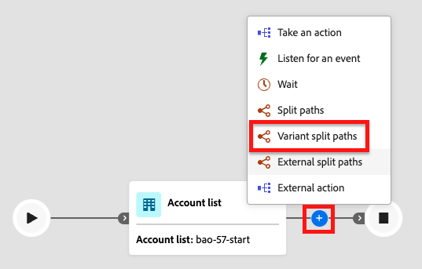

# 변형 분할 경로

_Variant 분할 경로_ 노드를 사용하여 정의한 비율 할당에 따라 둘 이상의 여정 경로에 계정을 임의로 분배합니다. 이 노드는 조건부 규칙을 적용하지 않고 계정 대상자의 세그먼트 간에 다양한 메시징, 타이밍 또는 참여 전술을 탐색적으로 테스트하는 데 유용합니다. 계정당 경로 할당이 일관되게 필요한 제어된 A/B 실험에는 적합하지 않습니다.

>[!AVAILABILITY]
>
>현재 **_계정 여정 전용_**&#x200B;에 대해 제한된 베타 릴리스로 고객을 선택할 수 있는 변형 분할 경로 노드를 사용할 수 있습니다. 개인 여정에 대한 지원은 향후 릴리스에서 제공될 예정입니다. 액세스하려면 Adobe 담당자에게 문의하십시오.

## 분할 경로와 비교 {#compare-split-paths}

_[경로 분할](./split-merge-paths-nodes.md)_&#x200B;과(와) _경로 변형 분할_&#x200B;은(는) 계정을 여러 여정 분기로 나누지만, 서로 다른 메커니즘을 사용합니다.

| Aspect | 경로 분할 | 변형 분할 경로 |
| -------- | ----------- | ------------------- |
| **할당 논리** | _조건부 규칙 기반_ - 각 계정은 정의된 조건에 대해 평가되며 일치하는 첫 번째 경로를 따라 진행됩니다. | _백분율 기반 무작위 할당_ - 계정은 필터링 조건 없이 구성된 백분율에 따라 경로에 배포됩니다. |
| **결정론** | _Deterministic_ - 동일한 계정이 동일한 조건과 일치하는 경우 항상 동일한 경로를 따릅니다. | 결정적이지 않음 — 동일한 계정이 재입력 시 다른 경로를 따를 수 있습니다. |
| **사용 사례** | 알려진 계정 또는 구매 그룹 속성별 세그먼트, 우선순위 평가. | 테스트 메시지, 타이밍 또는 전술을 위한 계정을 계정 대상 전체에 임의로 배포합니다. |
| **다른 계정 경로** | _지원됨_ - 정의된 경로와 일치하지 않는 계정은 기본 경로로 라우팅할 수 있습니다. | _적용할 수 없음_ — 모든 계정은 정의된 경로 중 하나에 할당됩니다. |

## 계정별 분할 {#split-by-account}

계정이 변형 분할 경로 노드에 도달하면 노드는 구성된 백분율을 기준으로 해당 계정을 정확히 하나의 경로에 할당합니다. 할당에서는 각 경로에 할당된 계정 수를 추적하고 구성된 비율을 유지하기 위해 시간이 지남에 따라 조정되는 할당량 기반 알고리즘을 사용합니다.

* 각 계정은 정확히 하나의 경로에 할당됩니다.
* 할당은 무작위적이며 할당량을 기반으로 합니다. 알고리즘은 할당을 동적으로 조정하여 전체 모집단에서 구성된 백분율에 접근합니다.
* 노드는 2~20개의 경로를 지원합니다. 각 경로에는 구성 가능한 이름과 1~99의 정수 비율이 있습니다. 모든 경로 백분율의 합은 정확히 100%여야 합니다.

>[!IMPORTANT]
>
>**할당량 기반 알고리즘: 결정적이지 않음**
>
>배포 알고리즘은 할당량 기반 무작위 할당을 사용합니다. 이 알고리즘은 **_결정적이지 않음_**: 여정에 들어가거나 다시 들어갈 때마다 동일한 계정을 다른 경로에 할당할 수 있습니다. 경로 할당은 고정 계정 속성이 아니라 평가 시점의 현재 할당량 상태에 따라 다릅니다. 영향을 받는 사용 사례에 대한 자세한 내용은 [제한 사항](#limitations)을 참조하세요.

### 배포 알고리즘 {#distribution-algorithm}

변형 분할 경로 노드가 **_할당량 기반 무작위 할당_** 알고리즘을 사용합니다. 계정이 노드에 도달하면 시스템은 각 경로에 대한 기존 계정 할당을 평가하고 구성된 할당량 이하의 경로로 계정을 라우팅합니다. 알고리즘에는 두 가지 주요 속성이 있습니다.

* 배포는 모든 계정 볼륨에서 구성된 백분율을 면밀히 추적합니다. 알고리즘이 할당량 수를 적극적으로 관리하기 때문에 합계가 균일하게 나누어지지 않는 경우 반올림으로 인해 실제 분포는 경로당 최대 하나의 계정만 달라집니다.
* 이 알고리즘은 할당 평가 중에 비관적 잠금을 사용하여 할당을 직렬화하므로 동시 실행 시 정확한 카운트 추적을 보장합니다.

### 제한 사항 {#limitations}

여정에서 변형 분할 경로를 사용하기 전에 이러한 제한 사항을 검토하십시오.

>[!CAUTION]
>
>**경로 할당이 결정적이지 않습니다.**
>
>할당량 기반 알고리즘은 동일한 계정이 항상 동일한 경로를 따르도록 보장하지 않습니다. 계정이 종료되었다가 다시 여정으로 들어오는 경우, 다시 들어올 때의 할당량 상태에 따라 다른 경로로 할당될 수 있습니다. 여정 인스턴스 간에 계정당 경로를 일관되게 할당해야 하는 사용 사례에 대해서는 변형 분할 경로를 사용하지 마십시오.

| 제한 사항 | 설명 |
| ---------- | ----------- |
| **통제 실험에 적합하지 않음** | 경로 할당이 결정적이지 않으므로 지정된 계정이 일관되게 동일한 처리를 받아야 하는 A/B 실험 또는 속성 시나리오에 변형 분할 경로가 **적합하지 않습니다**. 응답률 측정이나 특정 경험에 대한 결과 기여도 분석과 같이 계정별 일관성에 의존하는 사용 사례는 신뢰할 수 없는 결과를 초래할 수 있습니다. |
| **작은 반올림 드리프트** | 총 계정 수를 구성된 백분율로 균등하게 나눌 수 없는 경우 분배가 경로당 최대 하나의 계정까지 해제될 수 있습니다. 이는 반올림 동작이 예상되며 오류가 아닙니다. |
| **경로 할당이 idempotent가 아닙니다** | 여정을 다시 입력하면 동일한 계정에 대해 다른 경로 할당이 생성될 수 있습니다. 여정 디자인에서 계정이 분할 노드 뒤에 항상 동일한 경로를 따른다고 가정하는 경우 이 가정은 적용되지 않습니다. |
| **계정 여정 전용** | 변형 분할 경로는 계정 여정에서만 지원됩니다. 개인 여정은 현재 지원되지 않습니다. |
| **조건부 필터링 안 함** | _분할 경로_&#x200B;와 달리 변형 분할 경로는 조건을 적용하지 않습니다. 노드에 도달하는 모든 계정은 경로에 할당됩니다. |

## 사람에 의해 나누기 {#split-by-people}

계정 여정에서 변형 분할 경로 노드를 사용하여 _계정 내 사용자_&#x200B;를 백분율 기반 경로에 무작위로 배포할 수도 있습니다. 이 분할 유형은 여정이 계속 이동할 때 개인 수준에서 다른 콘텐츠 또는 경험을 테스트하려는 경우 유용합니다. 사람 노드별 분할 경로 변형은 다음 보호 기능과 함께 작동합니다.

* 노드는 분할 병합 조합인 _그룹화된 노드_(으)로 작동합니다. 분할된 경로는 해당 병합 노드에서 자동으로 닫히므로 모든 사람이 계정 컨텍스트를 손실하지 않고 앞으로 이동할 수 있습니다.
* 계정의 각 사용자는 구성된 백분율을 기준으로 정확히 하나의 경로에 할당됩니다.
* 계정에 사용되는 것과 동일한 할당량 기반 알고리즘이 사용자에게 적용됩니다. 경로 지정은 결정적이지 않으며 동일한 사람이 재입력 시 다른 경로를 따를 수 있습니다.
* 경로에 사용자에 대한 _[!UICONTROL 작업 수행]_ 노드만 지원됩니다. 경로는 더 이상 분할할 수 없습니다.

>[!BEGINSHADEBOX &quot;사람 간 배포 동작&quot;]

계정 내의 사람은 배치로 처리됩니다. 각 경로에 할당된 숫자는 `floor(percentage / 100 × people_in_account)`(으)로 계산되며, **마지막으로 구성된 경로에서 나머지 모든 사용자를 받습니다**. 이것은 다음을 의미합니다.

* 계정에 홀수의 사람이 있는 경우 마지막 경로가 이전 경로보다 한 명 더 많은 사람을 받습니다.
* 한 사람이 있는 계정의 경우 구성된 백분율과 관계없이 해당 사람이 항상 첫 번째 경로에 할당됩니다.
* 사용자가 매우 적은 계정(10명 미만)의 경우 계정당 분포가 구성된 백분율과 눈에 띄게 다를 수 있습니다. 분배는 여러 계정에서 측정할 때 구성된 비율로 수렴합니다.

>[!NOTE]
>
>이 반올림 동작은 여정의 모든 계정에 적용되지 않고 계정 배치별로 적용됩니다. 마지막 경로는 계정 크기가 홀수인 경우 구성된 사람보다 약간 더 많은 사람을 체계적으로 받습니다. 이는 예상되는 비헤이비어입니다.

>[!ENDSHADEBOX]

## 변형 분할 경로 노드 추가 {#add-variant-split-paths-node}

1. 여정 맵으로 이동합니다.

1. 경로에서 더하기(**+**) 아이콘을 클릭하고 **[!UICONTROL 변형 분할 경로]**&#x200B;를 선택합니다.

   {width="300" zoomable="no"}

   추가된 노드에는 시작할 두 개의 경로가 있습니다.

1. 오른쪽의 노드 속성에서 분할을 위해 **[!UICONTROL 계정]** 또는 **[!UICONTROL 사람]**&#x200B;을 선택합니다.

   _[!UICONTROL People]_ 형식을 사용하는 경우 _변형 분할 경로 닫기_ 노드가 자동으로 삽입되어 그룹화된 분할을 닫습니다.

   {width="700" zoomable="yes"}

1. 각 경로에 대한 **[!UICONTROL Label]**&#x200B;을(를) 검토하거나 업데이트하십시오.

   경로 레이블은 여정 캔버스에서 가장자리 레이블로 표시되며, 여정 분석에서 경로를 구분하는 데 도움이 됩니다.

   {width="600" zoomable="yes"}

1. 각 경로에 대해 **[!UICONTROL 백분율]**&#x200B;을(를) 설정합니다.

   값은 1에서 99 사이의 정수여야 합니다.

   {width="500" zoomable="yes"}

   총 실행 지표는 모든 경로 백분율의 합계를 보여 줍니다. 합계는 정확히 100%여야 여정을 게시할 수 있습니다. 합계가 100%가 아닌 경우 오류 상태가 표시됩니다.

   {width="500" zoomable="yes"}

   모든 경로에 균등하게 백분율을 분포시키려면 **[!UICONTROL 균등하게 분포]**&#x200B;를 클릭합니다. 이 시스템은 동일한 점유율을 계산하고 합계가 100%가 되도록 반올림을 조정합니다.

1. 추가 경로를 정의하려면 각 경로에 대해 **[!UICONTROL 경로 추가]**&#x200B;를 클릭합니다.

   노드는 최대 20개의 경로를 지원합니다. 경로를 더 추가할 때 합계가 100%가 되도록 _[!UICONTROL 백분율]_&#x200B;을 조정하세요.

   경로 카드에서 _삭제_( ) 아이콘을 클릭하여 경로를 제거할 수 있습니다. 두 개 이상의 경로가 남아 있을 때만 경로를 제거할 수 있습니다.

### 유효성 검사 규칙 {#validation-rules}

다음 규칙은 변형 분할 경로 구성에 적용됩니다. 위반은 여정 게시를 차단합니다.

| 규칙 | 요구 사항 |
| ---- | ----------- |
| 최소 경로 | 2 |
| 최대 경로 | 20 |
| 경로당 백분율 | 1 - 99 사이의 정수 |
| 총 백분율 | 정확히 100%여야 합니다. |
